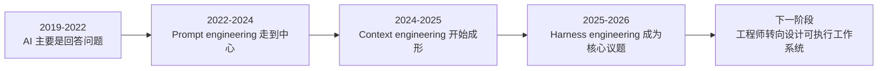
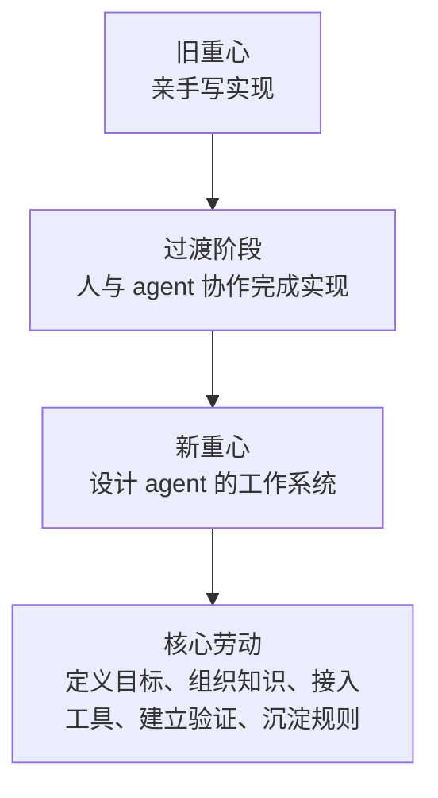

# 序章：不再亲手写代码之后，工程师还剩下什么

## 1. 一个今天已经绕不过去的问题

本章图示见图 0-1、图 0-2。

过去十年，软件工程师的自我理解大体稳定。我们通过写实现、读系统、修 bug、做重构、拉齐团队协作来证明价值。

哪怕岗位分工越来越细，这个核心想象并没有变：工程师首先是把复杂问题亲手做出来的人。

但在 agent 开始进入真实开发流程之后，这个想象被悄悄撬动了。代码实现、测试脚手架、文档补写、简单回归、故障复现、局部修补，越来越多过去依赖人类亲手完成的步骤，开始交给模型执行。

变化并不平均，也远未彻底，但方向已经很清楚。

把两个公开现场并排看，这种变化会显得尤其尖锐。

OpenAI 在 2026 年初描述了一支小团队怎样在近乎极端的约束下，用 Codex 做出内部 beta 产品，很多应用逻辑和基础设施代码都不再手写。

与此同时，METR 对熟悉自己仓库的资深开源开发者做随机对照实验，却得到反方向结果：在真实项目里使用 2025 年初的 AI 工具，开发者平均反而慢了 `19%`。

这两个场景重要，不是因为谁对谁错，而是因为它们把问题从“模型会不会写代码”推到了“什么样的工程环境会把模型放大成生产力，什么样的环境又会把它变成额外摩擦”（见参考文献[1]、[11]）。

于是，一个越来越难回避的问题出现了：如果代码本身越来越多地由 agent 产出，那么工程师还剩下什么。

**图 0-1 提示词工程、上下文工程与 harness engineering 的迁移**

这条时间轴表达的，不只是术语更新，而是工作重心迁移：从“模型会不会回答”，到“怎么把问题问对”，再到“如何让模型在复杂环境中真正做事”。

harness engineering 正是在这一迁移中进入中心位置的（见参考文献[1]、[6]、[7]、[8]）。

## 2. 先看一个会贯穿全书的小案例

为了让后面讨论不只停在抽象命题，本书会反复回到一个合成案例。它不是某家公司的真实内部记录，而是综合 OpenAI、Anthropic、LangChain、METR 等公开材料抽象出的典型团队场景。

想象一个二十人左右的 SaaS 团队，维护一套企业协作产品。他们准备让 agent 接手一个看上去不算大的任务：重做登录与邀请流程。业务要求并不复杂，但约束很多：

- 新增 `magic link` 登录
- 保留现有 SSO 兼容
- 不能碰计费模块
- 必须补齐端到端测试
- 两周内上线

团队的第一反应很自然：给 agent 一段尽可能完整的 prompt。结果并不意外。第一轮，agent 改对了页面，却漏掉了邀请链路里的一个边界条件；第二轮，它补上了逻辑，却没有把回归测试接进来；第三轮，它终于跑通了主流程，却误碰了不该改的共享鉴权模块。每次都像“差一点就对了”，但每次都要有人出来补位。

这个案例的意义在于，它足够小，小到像一个普通团队今天就会遇到的任务；同时又足够完整，几乎能把本书后面所有问题带出来。

任务目标怎么写清，背景信息放在哪里，agent 能用哪些工具，什么地方不能动，做完后如何证明它真的做完了，工作跨多轮执行时如何交接，踩过的坑如何不再重复，这些问题都会在这个小案例里依次出现。

如果把它压成一句最短的话，那就是：让一个系统开始工作并不难，真正困难的是让它稳定地把事做成。

## 3. 为什么旧问题已经不够用了

很多公众讨论至今仍把焦点放在“AI 会不会替代程序员”上。这个问题当然抓人，因为它直接碰到职业焦虑、产业叙事和时代想象。

但从工程角度看，它越来越像一个问错方向的问题。

真正有分量的变化，从来不只是“多了一个会写代码的模型”，而是“任务本身开始被重组”。

当模型开始阅读仓库、调用工具、运行测试、修改文件并持续接收反馈时，软件工程里最关键的劳动会向上迁移。它不再只体现在某段代码写得多漂亮，而越来越体现在：目标是否定义清楚，知识是否可发现，工具是否形成闭环，边界是否被编码，验证是否足够快，失败是否能沉淀成规则。

所以，今天最值得讨论的问题，不再是“模型会不会写”，而是“系统能不能让它可靠地写”。

这也是本书采用 harness engineering 作为总框架的原因。它关注的不是一句提示词，而是围绕提示词存在的整个工作现场。

如果一定要把区别说得足够短，那么可以这样记：

- `prompt` 是交代一句
- `context` 是递一摞资料
- `harness` 是把人、资料、权限、工具、验证和升级路径一起组织成工作现场

也正因为如此，只靠一句吩咐管理一个新同事是不够的，只靠一段 prompt 管理一个 agent 也不够。

## 4. 工程师并没有消失，只是在上移

这个判断最容易引发误会。很多人一听到“工程师角色迁移”，第一反应是：以后是不是只剩写提示词和审 AI 稿的人。

这种理解太浅了。

工程师没有消失，反而更像系统设计者。过去，工程师主要把判断写进实现；现在，越来越多判断要写进环境。

过去你通过一段代码体现品味；现在你也许通过任务模板、目录结构、知识入口、结构规则、评估脚本、测试链路和回滚路径体现品味。技术没有退场，只是从局部实现迁移到工作系统整体。

这也是为什么 OpenAI、Anthropic、LangChain 这些公开材料真正让人警觉的，不是产能数字，而是它们共同指向的一件事：一旦团队开始认真建设文档、任务模板、默认路径、评分器、progress log 和 cleanup 机制，工程师的影响力就不再只体现为“这次我亲手把它写对了”，而体现为“下次系统更容易自己写对”（见参考文献[1]、[9]、[10]）。

工程师开始更多地布置工作现场，而不只是亲自把每一步做完。

**图 0-2 工程师角色从“亲手实现”到“设计工作系统”的迁移**

## 5. 本书接下来怎么展开

接下来的路径其实很简单：先把语言坐标立住，再把结构拆开，然后进入工程现场、控制系统和组织现实，最后回到外溢条件与最终判断。

这本书试图回答的，不是“怎么把提示词写得更漂亮”，而是当 agent 真正进入工作流之后，软件工程会怎样被重新组织。

## 本章小结

序章只做了一件事：把问题立住。今天最重要的问题已经不是“模型会不会写代码”，而是“什么样的工作环境能让它稳定地产生产物”。

接下来的第一篇会先把这套变化的语言坐标建立起来，让后面的结构、案例和判断都不至于落回旧词里。
