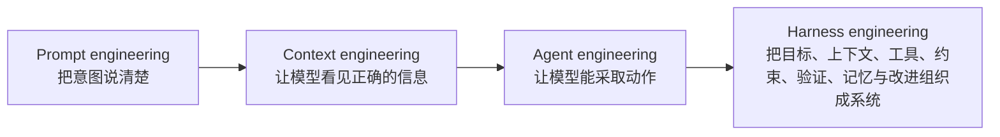
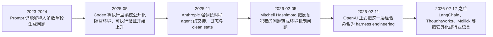
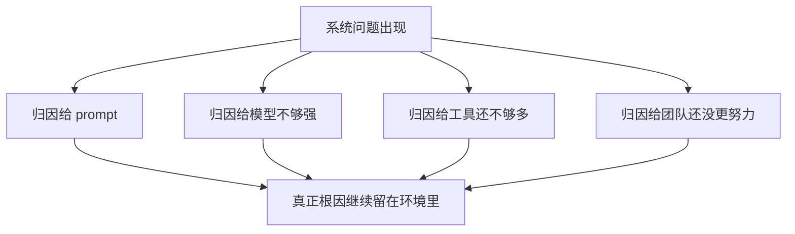
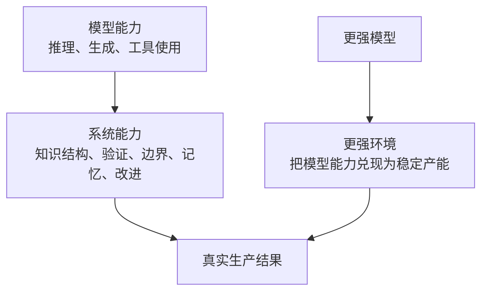

# 第一篇：术语、起源与范式迁移

一场变化真正开始深入现实，往往不是先改工具，而是先改语言。

旧语言还在，人们却越来越频繁地感觉到它不够用了：明明问题出在知识入口、验证回路、交接结构和责任边界，团队却还在用 prompt、工具数量和模型强弱来解释成败。语言一旦落后，解法就会跟着落后。

问题就在这里：旧词为什么开始失效，新词为什么会被逼出来，问题重心又为什么会从模型单点表现转向系统组织方式。

在方法出现之前，坐标必须先被立起来。

本篇图示见图 1-1 至图 1-4。

**图 1-1 Prompt、Context、Agent、Workflow、Harness 的关系图**

这张图里最关键的不是“先后顺序”，而是问题范围的扩大。Prompt engineering 主要解决表达问题；context engineering 处理可见性问题；agent engineering 让模型拥有行动能力；harness engineering 则试图把前面这些能力放进一个可运行、可验证、可治理的整体之中。

## 本篇证据骨架

| 本篇核心命题 | 主要证据 | 反向证据或边界 | 本篇要得出的判断 |
| --- | --- | --- | --- |
| prompt 已不足以解释 agent 成败 | OpenAI、Anthropic、LangChain 都把问题重心放在环境、验证、交接与工具上，而不只是 prompt | METR 提醒我们，即使有 AI 工具，真实生产也可能先变慢 | 争论正在从“怎么问”转向“怎么建系统” |
| harness 先在工程现场里发生，再被术语命名 | Mitchell Hashimoto 的经验总结、OpenAI 的内部实践都先有踩坑，再有抽象 | 如果只看术语史，容易把它误写成“某篇文章发明一个词” | harness engineering 是被现实逼出来的工程语言 |
| 同一模型会因系统差异而表现悬殊 | LangChain 在固定模型下只改 harness 就显著提分 | METR 显示真实熟悉仓库里的隐性知识会削弱增益 | 模型能力重要，但系统能力开始主导生产结果 |

## 1. 当旧词开始失效

Prompt engineering 在今天仍然重要，但它的解释力已经开始收缩。它擅长处理的是表达问题：如何让模型更准确地理解意图，如何减少歧义，如何通过 few-shot 示例把输出拉近目标。只要任务停留在单轮问答、一段代码补全或一次性生成的边界内，这些技巧就足以解释大部分成败。

真实工作却不是这样。真实工作总是一个多步骤过程：理解目标、寻找背景、调用工具、修改对象、观察反馈、验证结果、必要时跨多个阶段继续推进。只要任务跨越了这些步骤，prompt 就会迅速从“主变量”退回到“众多变量之一”。

原因很简单。prompt 只能回答“我要你做什么”，却无法单独回答另外几个更难的问题：你看见了什么，你能动什么，你怎么知道自己做对了，你失败后该如何恢复。前者属于 context 和 tool 的问题，后者属于 verification、memory 和 improvement 的问题。它们合在一起，才是 agent 的真实工作系统。

这也是为什么很多团队会出现一种共同感受：继续打磨 prompt，边际收益开始下降；但一旦重做知识入口、任务模板、测试链路和反馈回路，整体质量却明显上升。这里并不是语言不再重要，而是语言被纳入了更大的结构。

所以，说 prompt engineering “过时”并不准确；更准确的说法是，它已经不再足以独立解释 agent 时代的生产问题。它仍然是入口的一部分，却不再能够单独构成全部解释（见参考文献[1]、[9]、[10]）。

## 2. 一条更清楚的时间线

术语史最容易被写错的地方，是把它写成“某一天某个人发明了一个词”。真正推动术语变化的，通常不是发明，而是失配。旧词还能解释局面时，新词不会真正站稳；只有当现实反复溢出旧词边界，新术语才会从口头感受慢慢长成可共享的工程语言。

这也是为什么第一篇不能只做定义表。它还必须交代：在什么时间点上，工程团队开始持续感觉到 prompt 已经不够，tool use 已经不够，workflow 这个词也不够。因为只有这条时间线立起来，读者才会明白 harness engineering 不是一个“更潮的说法”，而是一组工程压力长期积累后的命名结果。

如果把过去几年最关键的公开材料排成一条线，大致会看到下面的迁移：

**图 1-2 从 prompt 到 harness 的压力时间线**

这条时间线里最值得注意的，不是最后那个名字，而是前面的压力如何一点点累积。2025 年 Codex 等系统公开以后，工程团队第一次大规模遇到一种新现实：模型不只是在回答问题，而是在读仓库、调工具、跑验证、跨文件改动、进入带状态的运行环境。这时，很多过去可以被一句 prompt 掩盖的问题都浮出来了，比如目录信息是否可发现、默认命令是否正确、测试是否足够快、失败后能否恢复、权限和边界是否被写清楚（见参考文献[2]）。

到了 2025 年底，Anthropic 讨论长时程 agent 的文章把另一层问题推到台前：即使模型单次任务表现不错，只要任务持续时间够长，系统就会很快暴露出 handoff、progress log、clean state 和 thread continuity 的重要性。问题已经不再是“模型会不会做”，而是“系统有没有办法让它持续做、交接做、恢复做”（见参考文献[9]）。

2026 年初，Mitchell Hashimoto 用一种更接地气的语言把这种变化说透了：当 agent 反复犯同一种错，真正值得做的不是重复抱怨模型，而是把“防止它下次再错”的机制写进环境。这一步看似朴素，却完成了一次重要转向：错误第一次不只被理解成模型失误，而被理解成环境没有把经验沉成机制（见参考文献[6]）。

几天之后，OpenAI 把这层变化明确命名，并公开展示它在团队内部已经长到什么程度：不只是 prompt 和工具，而是 repo 结构、文档布局、评估回路、worktree、可观测性、background cleanup 和默认路径，全部一起被当成一个工作系统来设计（见参考文献[1]）。再往后，LangChain 用 benchmark 证据说明固定模型只改 harness 也能显著提分，Thoughtworks 则把它重新拆解为 context、constraints 和 garbage collection，Mollick 又把 harness 推到更广泛的 agent 使用讨论里（见参考文献[7]、[8]、[10]）。

所以，术语史如果写得准确，应该不是“谁发明了 harness engineering”，而是：**工程现场先持续撞上一类旧词解释不了的问题，后来才终于找到一个更能容纳这些问题的词。** 这也是为什么本书要把“术语、起源与范式迁移”写成同一篇，而不是拆开来分别讨论。它们本来就是同一件事。

## 3. harness engineering 是怎么被逼出来的

重要概念很少是先由理论家发明，再由工程团队照着执行的。Harness engineering 的生成过程恰好相反：工程团队先在真实工作里撞上了同一类问题，才逐渐需要一个更大的词，把这些分散动作收拢在一起。

这些问题都很具体。模型单轮看起来很聪明，一进真实仓库就容易失焦；单次输出看起来不错，一跨会话就开始失忆；一开始像在帮忙，规模一上来却不断复制坏模式。工程团队慢慢意识到，问题不只是模型，而是“围绕模型的东西”：知识是不是可发现，工具是不是闭环，测试是不是够快，边界是不是够清楚，错误信息是不是足够有用，系统是否能观察到 agent 的中间行为。

Mitchell Hashimoto 在 2026 年初回顾自己的 AI 使用历程时，把这种直觉说得很朴素：当 agent 反复犯同一种错，真正值得做的不是继续抱怨模型，而是把“防止它下次再错”的机制写进环境里。这个机制可以是 `AGENTS.md`，可以是验证脚本，也可以是目录说明和边界约束。这个表述的力量，不在于抽象，而在于它来自工程现场反复踩坑后的反应（见参考文献[6]）。

OpenAI 随后把这类反应推进到更极端的位置。2026 年 2 月那篇文章里，他们描述的不是一个“提示词技巧合集”，而是一支几乎不手写代码的团队，如何被迫把文档、规则、工具、测试、可观测性和 repo 结构全部重写成 agent 能工作的环境。文章最值得注意的，不只是那些惊人的产能数字，而是他们明确承认：一份越写越长的 `AGENTS.md` 很快会失效，真正起作用的是把知识拆进仓库、让 worktree 可运行、把日志和 DevTools 暴露给 agent、再用评分系统和 background cleanup 持续收敛质量（见参考文献[1]）。

因此，harness engineering 的传播速度本身就在说明一件事：它命中了一个已经普遍存在、却还没有被清楚命名的问题。这个词的价值，不在于替代所有旧概念，而在于给工程团队一个更高一层的观察视角。

## 4. 几次典型误判，是怎样把系统问题重新讲回旧语言的

一门新工程语言真正站稳之前，总会先经历一段误判密集期。大家已经感觉到旧解法不够用了，却还没有完全承认问题已经换层，于是会本能地把新问题重新翻译回旧语言。第一篇如果不把这些误判写出来，后面的方法论就很容易显得只是换了一套名词。

最典型的误判至少有四类。

第一类误判，是把一切失败都继续归因于 prompt 不够好。一个 agent 找错目录、漏掉关键上下文、在错误路径上持续推进，团队最容易做的动作仍然是“再改一版 prompt”。但很多时候，真正缺的不是表达，而是知识入口、目录地图、默认命令、退出条件和快速验证。继续只在 prompt 层打磨，等于在错误层级上投入越来越多精力。

第二类误判，是把工具数量当成 agent 成熟度。工具当然重要，没有工具，agent 很难进入真实工作；但工具一多并不自动等于更强。太多团队在早期会把“接了浏览器、接了 shell、接了数据库、接了外部 API”理解成能力升级，却忽略了更难的问题：这些工具之间有没有清晰默认路径，授权带是否明确，错误是否可观察，失败后有没有足够快的恢复手段。工具扩张和系统成熟，不是同一件事。

第三类误判，是把局部成功当成普遍规律。OpenAI、Anthropic 或 LangChain 这样的前沿案例很容易制造一种错觉：似乎只要把模型接进工作流，所有团队都会自然获得高吞吐。METR 的结果恰好提醒我们，现实并不会这么顺滑。真实熟悉仓库里那些隐性知识、局部默契、未文档化边界和脆弱验证，会让 agent 的增益大幅缩水，甚至先表现为摩擦（见参考文献[11]）。因此，成功案例不能直接当通用规律，反例也不能直接当全面否定，两者都必须被放回“环境条件”之内理解。

第四类误判，是把 harness engineering 看成“老工程常识换个名字”。这个误判之所以顽固，是因为它表面上很像对的：文档、规则、测试、日志、模板、平台，这些东西过去本来就重要。问题在于，过去它们首先服务人；现在它们还必须服务 agent。对象一旦变化，很多旧实践就不再只是“原样延续”，而是被迫进入新的组织方式。不能被机器发现的知识、不能被系统执行的规则、不能被自动回路使用的验证，都会在 agent 时代暴露出新缺口。

把这几类误判放在一起看，就会发现一个很稳定的模式：**每当新问题出现，团队总会先尝试用旧词解释它；而 harness engineering 之所以必要，正是因为旧词已经无法持续容纳这些问题。**

**图 1-3 典型误判如何把系统问题重新讲回旧语言**

因此，术语不是修辞装饰，而是一次根因重分配。它逼迫团队承认：不是所有失败都发生在输出层，也不是所有成功都来自模型层。很多真正决定结果的变量，早已上移到环境、控制和组织层。

## 5. 从“模型能力”到“系统能力”

在纯生成场景中，把性能主要归因于模型能力是有道理的。模型更强，系统通常更强；模型更弱，系统通常更弱。进入 agent 场景之后，这种理解开始显得粗糙。

同一个模型，在两个团队手里可能表现出完全不同的生产力。原因不在模型参数，而在系统能力。一个团队有清晰的知识入口、快速测试、明确边界、稳定工具链和持续改进回路；另一个团队的事实散落在会议、聊天记录和个人脑中，验证脆弱，目录混乱，错误信息含糊，权限设计粗放。两者即使使用同一模型，也几乎不在一个竞争平面上。

LangChain 在 2026 年给出的实验，把这件事讲得很直白：使用同一个模型 `gpt-5.2-codex`，只改 harness，不改模型，就把 Terminal Bench 2.0 的分数从 `52.8` 拉到了 `66.5`。这当然不能直接外推到所有真实工作，但它至少提供了一个清楚证据：系统设计本身就足以改变上限（见参考文献[10]）。

另一方面，METR 的研究又提醒我们，系统能力不是“给 agent 加更多能力”这么简单。在熟悉自己仓库、依赖大量隐性知识的真实项目里，2025 年初的 AI 工具让资深开发者平均慢了 19%。这说明系统能力还包括另一层判断：什么任务形态适合 agent，什么环境整理程度足以支撑 agent，什么场景里人类专家仍然占据明显上下文优势（见参考文献[11]）。

把这两个结果放在一起看，结论就比较稳了：模型能力仍然重要，但真正决定产出能否被兑现的，已经越来越是整套系统能力。知识组织、验证链路、边界清晰度、记忆结构和改进回路，这些东西第一次从“辅助条件”上升成了更接近主导变量的位置。

**图 1-4 从模型能力到系统能力的转移**

## 6. 术语不是名词游戏，而是解题路径

这个领域最大的噪声之一，就是术语混乱。很多时候，人们用不同的词在说同一件事；也常常用同一个词指代完全不同的东西。对工程团队而言，这不是学术问题，而是解题路径问题。词一旦用错，解决方案就会错配。

下面这个区分，是本书后续讨论的坐标系：

| 名词 | 它首先解决什么问题 | 典型误判 |
| --- | --- | --- |
| Prompt engineering | 如何把意图说清楚 | 把所有失败都归为“prompt 不够好” |
| Context engineering | 模型究竟看见什么 | 以为“多给一点信息”就等于更好 |
| Agent engineering | 模型怎样拥有行动能力 | 以为工具越多越强 |
| Workflow automation | 多步骤怎么被串成流程 | 以为流程存在就等于系统可靠 |
| Harness engineering | 如何把目标、上下文、工具、约束、验证、记忆与改进组织成系统 | 把系统问题重新讲回单点工具问题 |

这个分层之所以重要，是因为它能帮助团队识别问题到底在哪一层。一个 agent 明明拥有正确工具，却总从错误文件开始改，很可能是 context 问题；一个 agent 输出格式正确却行为错误，更像 verification 问题；一个 agent 单次任务表现不错，跨会话后持续退化，则大概率是 memory 和 improvement 的问题。

如果没有清楚的分层，团队就很容易陷入一种昂贵模式：发现问题后，下意识去改 prompt、换模型、加工具，结果却始终没有碰到根因。术语看似只是语言，实际上决定了解法。

## 7. 为什么本书坚持用“harness engineering”

本书选择“harness engineering”作为总框架，不是为了追赶热词，而是因为它最能容纳这组变化。它允许我们在一个统一视角下同时讨论：

- 目标如何被定义
- 知识如何被组织
- 工具如何被接入
- 边界如何被编码
- 验证如何被运行
- 记忆如何被延续
- 经验如何被改进

也只有在这个视角下，我们才不至于把所有新问题都重新说回“prompt 怎么写”或“模型够不够强”。

问题先在这里被校准。再往下走，讨论就不能只停在命名上了；那个“登录与邀请流程改造”的小案例，也会在下一篇里被真正拆开，变成一条能反复照见结构的贯穿线。

## 本篇小结

这一章的意义，不在于再发明一个术语，而在于把观察角度从模型单点表现推向系统组织方式。

旧词为何失效，新词为何出现，压力如何从表达问题一路传到验证、交接与责任问题，坐标到这里才算真正立稳。下一篇会把这些压力继续拆开，落到一套可设计、可修补的七层系统上。
