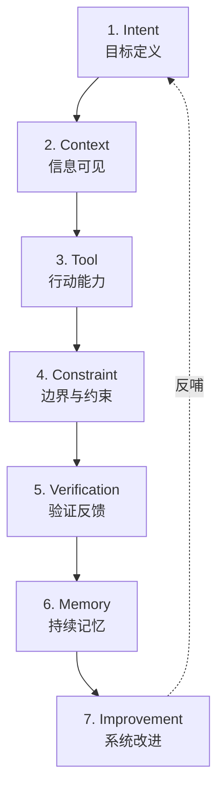

# 第二篇：Harness 的七层结构

把语言坐标立起来之后，问题很快会变得更具体：harness 到底由哪些部分构成，系统坏掉时先坏在哪一层，团队又该从哪一层开始补。

真正困难的，从来不是承认 harness 很重要，而是把它从一个容易被误抄成口号的总称，拆成一套可讨论、可设计、可改进的工程结构。只有结构被拆开，失败才会开始变得可定位、可修补。

本篇图示见图 2-1、图 2-2。

**图 2-1 Harness 的七层结构总图**

这七层不是静态清单，而是一个带反馈的回路。目标定义决定系统要去哪里，上下文决定系统看见什么，工具决定系统能做什么，约束决定系统不该做什么，验证决定系统如何发现偏差，记忆决定系统如何延续，改进决定系统是否会越跑越好。

先别急着背七个名字。第二篇最有用的读法，不是先把框架完整记下来，而是先看一个真实任务怎样在不同层上出错，再回头看这七层为什么会稳定反复出现。

## 贯穿案例：一次“登录与邀请流程改造”如何逼出七层

为了让七层结构不是概念清单，本篇沿用序章里的合成案例。

一个二十人左右的 SaaS 团队，准备让 agent 接手一次“登录与邀请流程改造”。任务要求看似不大，但约束很硬：

- 新增 `magic link` 登录
- 保留 SSO 兼容
- 不能动计费模块
- 必须补齐端到端测试
- 两周内上线

团队一开始只有一句模糊命令，后来才慢慢意识到：这个任务之所以反复返工，不是因为 agent “总差一点智商”，而是因为系统没有把正确路径写清楚。下面七层，就是这条路径被逐层补出来的过程。

如果要用一个更容易记住的比喻，本篇还可以并行使用另一个小例子：给新同事开工位。七层结构并不神秘，它只是把“怎样让一个新人能稳定接手工作”这套老工程常识，重新翻译成 agent 时代的语言。这个案例之所以适合作为第二篇的贯穿线，也是因为它不宏大，反而更接近大多数团队第一次真正感受到 harness 必要性的时刻：不是平台迁移，而是这种“看起来不大、但一直返工”的真实任务。

## 1. Intent Layer：先把任务变成工程对象

智能体最常见的失败之一，不是不会执行，而是不知道什么叫完成。人类擅长在模糊语境中工作，我们会自动补足背景、推断优先级、揣摩业务上下文，也会在推进过程中不断重写自己的目标。agent 并不天然拥有这种能力。

在“登录与邀请流程改造”这个案例里，最初那句任务说明如果只是“把登录改好”，几乎注定会出问题。因为这里真正重要的信息并不在“登录”两个字上，而在那些默认被省略的约束里：SSO 兼容必须保留，计费模块不能碰，端到端测试必须补齐，两周内上线意味着不值得大规模重构。

因此，intent layer 的作用不是把一句口语命令写得更长，而是把任务变成工程对象。一个工程对象至少要回答：这次到底解决什么问题，输出产物是什么，哪些地方可以调整，哪些地方不能碰，什么叫完成，什么情况必须升级给人。

Anthropic 的经验非常能说明这一层的重要性。他们后来要求 agent 按 feature list 推进，而且通常一轮只推进一个 feature，不是因为模型“听不懂大任务”，而是因为如果意图层不先被拆成可验证的小对象，后面的会话就会在模糊目标里不断漂移，甚至过早宣布完成（见参考文献[9]）。

意图层如果失效，就很像新同事上岗第一天只听见一句“你先看着办”。人类在这种情况下还能靠观察、试探和补问勉强推进，agent 往往只会把模糊执行得很认真。

因此，一个最小可用的 intent layer，通常至少要把四样东西写清楚：

- 任务对象：这次到底改哪条链路，不改哪条链路
- 完成收据：什么证据出现时，系统才允许自己说“做完了”
- 禁止项：哪些目录、模块、接口或动作默认不能碰
- 升级条件：哪些情况一出现就必须交还给人

如果这四样东西没有被写出来，后面六层就很容易都在替意图层还债。团队常以为自己在补更多上下文、更多工具、更多测试，实际却是在为一开始没把任务写成工程对象付代价。

一个典型的失败现场往往是这样的：团队只在 issue 里写了“把登录改成 magic link，同时别影响原有流程”。agent 读到“别影响原有流程”，却不知道这里指的是保留 SSO 兼容、不能碰计费联动、邀请链接不能失效，于是它从最显眼的共享鉴权入口下手，改完后单点登录在灰度环境里开始异常。表面看像改坏了代码，根上却是任务对象从一开始就没有被写成工程对象。

## 2. Context Layer：把事实变成系统能找到的事实

目标写清楚之后，第二个问题不是“agent 聪不聪明”，而是“它到底看到了什么”。在登录改造案例里，真正影响成败的背景信息很多：登录与邀请链路各自在哪个目录，SSO 兼容为什么不能破，计费模块为什么绝对不能碰，以前这里出过什么事故，现有测试覆盖到哪里。这些信息如果不进入可发现、可检索、可引用的工作系统，对 agent 来说就等于不存在。

context layer 的核心，不是“多塞一点背景”，而是让事实能够被逐步找到。入口要足够小，导航要足够清楚，文档要有明确来源和更新时间，细节要按需展开。对 agent 来说，一张清楚的地图往往比一份巨大的说明书更有用。

OpenAI 在内部使用 Codex 时，很快发现一份不断膨胀的 `AGENTS.md` 并不能真正解决问题，于是才把说明文档拆进 repo，把计划、架构说明、评分和任务状态做成可发现结构。这个案例说明，上下文层的核心从来不是“多塞一点背景”，而是把事实变成 agent 真能找到的工作面（见参考文献[1]）。

对新同事来说也是一样。堆给他一百页资料，不等于他真正知道从哪一页开始看；给他一张办公室地图、几个门牌和一份当天任务单，反而更接近有效支持。

所以，一个最小可用的 context layer，也通常至少需要四样工件：

- 入口文件：告诉系统从哪里开始，而不是把全部知识平摊
- 知识地图：目录、模块、服务与文档之间的对应关系
- 事实来源：哪份说明是当前有效的，哪份只是历史背景
- 新鲜度信号：更新时间、版本、负责人，避免旧知识冒充现状

很多团队的问题不在“没有文档”，而在“有很多文档，却没有工作面”。文档一旦不能被系统逐步找到，它在 agent 世界里就仍然近似于不存在。

上下文层失效时，现场也很熟悉。仓库里同时躺着一份两年前的邀请流程 ADR、一份半更新的 README 和一组没有主人维护的脚本说明。agent 先读到了过期文档，于是顺着旧目录去找邀请逻辑，改完一个已经快废弃的 handler，还以为自己完成了任务。人类工程师看起来会说“它怎么连目录都找不对”，真正的问题却是系统没有把“当前事实”做成可发现的入口。

## 3. Tool Layer：让理解真正变成行动

即使目标清楚、资料齐全，agent 如果不能读代码、改文件、跑测试、看日志、开页面、查状态，它也仍然只是一个会推理的文本接口。tool layer 的问题，从来不是“工具越多越好”，而是“是否形成了任务闭环”。

回到登录改造案例。这个任务至少需要几类行动能力：搜索鉴权与邀请相关代码、修改逻辑、运行单测、跑端到端测试、打开页面验证用户路径、读取失败日志。如果其中任何一个环节必须频繁靠人类中途补一手，说明系统还没有真正给到 agent 可闭环的工具面。

OpenAI 让每个 worktree 都能启动应用，并把日志、指标和 Chrome DevTools Protocol 暴露给 agent；App Server 则进一步把线程、工具调用和审批交互做成统一运行时。这两步恰好说明，工具层真正要解决的不是“agent 能不能点更多按钮”，而是它能否在一条稳定接口链路中完成工作（见参考文献[1]、[3]）。

因此，工具层最该避免的两个极端是：一边把所有接口一股脑暴露出来，制造巨大的搜索空间；另一边只给最少能力，让 agent 永远停留在“会建议、不能闭环”的状态。工具层不是能力展厅，而是行动接口。

这也意味着，工具层的设计问题不只是“接哪个工具”，更是“按什么顺序接、接到什么深度”。一个更成熟的工具层通常会先保证三种闭环能力：

- 发现闭环：能查到要改什么
- 执行闭环：能真的改动对象
- 验证闭环：能立即看到改动后发生了什么

如果只有前两样，系统很容易一路推进到看似完成；如果只有发现和验证而不能执行，系统又会退化成建议机。工具层之所以是第三层，不是因为工具比约束或验证更高级，而是因为没有行动能力，后面的控制也无从谈起。

工具层出问题时，失败常常比想象中更隐蔽。团队给了 agent 搜索和改文件的能力，却没给它稳定跑端到端测试和读取灰度日志的能力。于是它能一路把代码改得很像样，也能把单测补齐，却始终不知道邀请邮件点击后的重定向在 staging 上已经进入死循环。到最后人类接手时，看到的是一堆“看起来很努力”的改动，而不是一个可以闭环的系统。

## 4. Constraint Layer：把偏好写成边界

很多团队引入 agent 时的第一反应是“尽量放开手脚”。听上去先进，结果却常常相反：空间越大，试错越多，漂移越严重。约束层的作用，就是把原本存在于资深工程师脑中的偏好，转成系统可执行的边界。

在登录改造案例里，最关键的约束其实非常具体：

- 不能碰计费模块
- 共享鉴权模块只能局部调整
- 登录文案改动必须同步测试
- 邀请链路要保留旧接口兼容

这些约束如果只存在于会议口头结论里，agent 每一轮都可能重新踩坑。只有当它们被写成结构规则、lint、目录边界、模板、审批门槛和测试条件，边界才真正进入系统。

OpenAI 公开提到他们会把品味与结构要求继续沉进 custom lints、评分器和后台清理任务，这正是约束层机械化的典型形式。规则如果只存在于资深工程师脑中，就只能靠人工纠偏；一旦写进 lint、评分和清理机制，边界才真正进入 agent 的搜索空间（见参考文献[1]）。

速度不是来自无约束，而是来自可预测。对 agent 来说，规则不是束缚，而是导航。

很多团队在这里会有一个反直觉的发现：约束层越成熟，系统反而越像在变快。这是因为高质量约束并不是给系统加更多阻力，而是在帮系统排除无意义搜索。哪些目录默认不能碰，哪些接口必须先看兼容文档，哪些修改一旦触及就必须升级，哪些命令必须先跑，这些边界一旦被机械化，agent 的行动空间虽然变小了，但有效空间反而变大了。

因此，constraint layer 的最低限度通常不是“一份规则文档”，而是一组真正能进系统回路的东西：

- 结构边界：目录、模块、依赖方向
- 策略边界：哪些动作默认禁止，哪些动作需要审批
- 质量边界：哪些检查不过，系统就不能继续
- 升级边界：触发什么信号时必须停下

约束层失效时，最容易出现的不是戏剧化崩溃，而是那种“本来不该碰，却顺手碰了”的错误。登录链路改着改着，agent 发现用户状态判断在共享鉴权模块里，于是顺手把那里的公共逻辑也重构了一下。局部看很合理，系统里却没人把“共享鉴权只能局部调整、计费联动模块默认禁改”写成硬边界。最后触发的不是单点 bug，而是一串不必要的连锁修改。

## 5. Verification Layer：没有收据，系统就不会停

如果说前四层决定了 agent 能否启动，那么验证层决定它能否落地。一个不被验证的 agent 系统，本质上只是自动生成器，而不是工程系统。

登录改造案例最容易出的问题，就出在这里。页面跑通了，并不等于登录链路真的完成；主流程可用，也不等于邀请边界没坏；单测通过，更不等于端到端体验和回归条件都成立。团队如果没有把“做完”写成收据，agent 就会反复在“看起来差不多”的地方停下。

验证层之于 agent，就像师傅对新同事说的那句老话：做完不是你觉得差不多，而是系统证明差不多。

LangChain 的提升和 Anthropic 的修正都清楚说明了这一层。前者用 build-self-verify、middleware 和 traces 把验证推回 agent 工作流内部，后者则要求浏览器自动化测试像真实用户一样端到端验证，目的都不是“让测试更漂亮”，而是防止系统在看起来差不多时过早停下（见参考文献[9]、[10]）。

所以，本篇和全书都坚持一个更短的判断：没有验证，就没有 agent 工程。

但验证层最容易被误写成“多跑一点测试”。这还不够。验证真正难的地方，是把“做对了什么”写得足够接近真实目标。一个更完整的 verification layer 往往至少包含三层：

- 结构验证：代码、接口、配置、模式是否符合要求
- 行为验证：主流程、边界路径、回归条件是否成立
- 生产验证：系统是否真的知道自己可以停下，而不是只是暂时没报错

第四篇会把这一层进一步展开成控制问题，但在第二篇里，读者至少要先抓住一件事：**没有验证，前面的目标、上下文、工具和约束都只是在增加行动能力；验证层第一次把行动能力变成工程能力。**

验证层失败时，现场通常最让人沮丧。登录页面能打开，magic link 能发出，单测全绿，PR 也过了；可是真实用户从邀请邮件进入时，先创建组织再回跳登录的那条边界链路却直接断了。团队回看后发现，系统从头到尾都没有拿到一张真正的“完成收据”，只有一组不足以覆盖真实路径的局部信号。

## 6. Memory Layer：下一轮接手的不能是残局

很多团队把长时程问题理解成“模型记忆不够”。这只是表层。更深的原因通常是：系统没有设计出外化记忆。聊天历史不是可靠记忆，海量笔记也不是可靠记忆。可靠记忆必须是可恢复、可继承、可引用的结构。

回到登录改造案例。如果这个任务要跨多个会话执行，那么下一轮 agent 至少需要知道：

- 哪些功能已经完成
- 哪些测试已经通过
- 当前风险是什么
- 下一个最小目标是什么

如果这些东西没有被写进 progress log、任务状态、决策记录和版本化历史，那么下一轮面对的就不是连续工作，而是半失忆残局。

Anthropic 把 `init.sh`、progress log、feature list 和 git 提交历史视作长时程 agent 的基本骨架，就是因为他们已经踩到这个很硬的问题：没有外化记忆，下一轮 agent 面对的不是连续工作，而是残局。App Server 的线程持久化也在另一层说明了同一件事，记忆不是聊天记录附件，而是工作连续性的基础设施（见参考文献[3]、[9]）。

长时程 agent 最怕的不是能力不够，而是交不了班。

从组织角度看，memory layer 其实在回答一个更现实的问题：系统有没有办法把今天做的工作，交给明天的系统或明天的人。也正因为如此，一个最小可用的记忆层通常不是“保留全部历史”，而是保留那些决定连续性的最小状态：

- 当前完成到哪里
- 哪些假设已经被验证，哪些还没
- 哪些风险仍在打开
- 下一轮应该从哪里继续，而不是从哪里重猜

很多团队把记忆理解成“多存一点上下文”；真正可靠的记忆更像交班单，而不是聊天记录。

记忆层失灵时，团队最常说的一句话是：“上一轮不是已经改过了吗？”前一天的 agent 已经把邀请失效的边界 bug 修掉，还补了两个测试；第二天新的会话启动，因为没有 progress log，也没有把“哪些假设已被验证、哪些风险仍在打开”写下来，新一轮 agent 又从旧入口重新搜索，甚至把昨天的局部修复覆盖掉。看上去像模型健忘，实际上是系统根本没有设计交班。

## 7. Improvement Layer：把错误写回环境

如果失败只带来重试，而不带来系统升级，那么 agent 只是在重复消耗人类注意力。改进层的作用，就是把偶发经验转成长期机制。

登录改造案例一旦跑过几轮，团队通常会发现一些高频失败：

- agent 总从错误目录开始找代码
- 邀请链路的一个边界条件反复被漏掉
- 端到端测试经常被忘
- 共享鉴权模块总被误碰

这些问题如果每次都靠人类临时纠偏，系统永远长不大。只有把它们写成模板、规则、测试、清单、评分器和默认路径，下次运行才会真的不一样。

LangChain 通过 traces 识别失败模式，再把这些失败模式改写成 middleware、budget 控制和 loop detection；OpenAI 则通过评分系统和 background cleanup 持续回收坏模式。这两个案例从不同方向证明，改进层的本质不是“多复盘一次”，而是把复盘产物写回环境，让下一次更容易成功（见参考文献[1]、[10]）。

好的 harness 不靠“这次终于没出错”取胜，而靠“这次出的错，下次更不容易再出”取胜。

因此，improvement layer 的成熟度，往往取决于团队是否完成了从“人记住”到“系统记住”的转变。一次事故、一次返工、一次灰度险情，最终有没有变成新的模板、检查项、默认命令、结构测试或审批规则，决定了系统到底是在积累，还是只是在原地重复学习。

这一层也是为什么七层必须被当作闭环来理解。没有改进层，前六层每一次都像第一次；有了改进层，系统才会开始拥有复利。

改进层缺失时，系统的失败会有一种令人疲倦的重复感。每次改登录链路，agent 都会先忘记补端到端测试；每次涉及邀请流程，团队都得再提醒一遍“不要从旧 handler 开始找”；每次复盘大家都说“下次注意”，但下一次仍然从同一个坑起步。真正缺的不是更多提醒，而是把这些提醒沉成模板、默认命令和检查项，让系统自己记住。

## 回看七层：为什么它们会稳定地反复出现

到这里再回头看，七层就不再像一张抽象图，而更像一张故障定位图。OpenAI、Anthropic、LangChain 的公开实践之所以能被压回这七层，不是因为作者先画出了一张框架，再去硬找材料往里塞，而是因为真实系统反复在这几个位置上出问题。

### 证据骨架

| 本篇核心命题 | 主要证据 | 反向证据或边界 | 本篇要得出的判断 |
| --- | --- | --- | --- |
| harness 不是抽象口号，而是可拆的工程结构 | OpenAI、Anthropic、LangChain 的公开实践都能被拆回目标、上下文、工具、约束、验证、记忆和改进这些层 | 如果只看产能数字或单轮输出，七层结构会被误读成概念体操 | 七层结构的价值，在于帮助团队定位系统到底差在哪一层 |
| agent 的失败大多不是单点能力问题，而是层间失配 | Anthropic 暴露了 handoff 与 verification 的缺口，LangChain 暴露了 verification 与 control 的缺口，OpenAI 暴露了 context、constraint 与 cleanup 的缺口 | METR 提醒我们，环境不成熟时，人类隐性知识优势会压过 agent 收益 | 真正的工程任务不是“再换一个模型”，而是找到失配层并修它 |
| 七层必须形成闭环，而不是分别“做一点” | LangChain 的 traces、middleware 与 self-verify 形成闭环；OpenAI 的 docs、worktree、评分与清理形成闭环 | 单层优化往往只会把问题向后传导 | harness engineering 的重点是系统耦合，而不是部件清单 |

## 为什么是七层，而不是更多或更少

任何分层法都有任意性。把 harness 拆成五层、六层，甚至十层，都不是做不到。之所以在这里坚持七层，不是因为七这个数字本身有神秘意义，而是因为它刚好把三个常见错误同时避开了。

第一种错误，是把太多问题都压回 prompt。这样写起来最省事，却会让目标、知识、工具、边界、验证和复盘全部挤成一句话，最后除了“提示词没写好”什么也说不清。第二种错误，是只分“上下文、工具、评估”三大块。这样的粗粒度分层在讲原理时够用，在排障时却不够用，因为意图、约束、记忆和改进会被重新塞回模糊的大盒子里。第三种错误，则是把系统切得过细，细到每一层都像产品模块说明。分得太碎，阅读时看似完整，落地时反而没人知道哪几层才是真正要先动的骨架。

七层之所以合适，是因为它恰好对应了一个工作系统最稳定的七类问题：

- 目标是否被写成工程对象
- 事实是否被写成系统可发现的事实
- 行动能力是否能形成闭环
- 边界是否被机械化
- 完成是否可验证
- 连续性是否可交接
- 错误是否会沉成系统资产

再少，这些问题就会重新互相覆盖；再多，章节会变成术语增殖。七层不是对世界的终极描述，而是一套足够稳定、足够经济的工程语言。它的价值不在于数字本身，而在于一个团队终于可以把“系统为什么总在这里坏”说得比“模型今天不行”更精确。

## 七层总览：每一层到底在回答什么

| 层 | 它回答的核心问题 | 这一层缺失时最常见的症状 | 最低限度要写进系统的工件 | 在贯穿案例里最先表现为什么 |
| --- | --- | --- | --- | --- |
| Intent | 我们到底要完成什么 | 任务漂移、过早收工、返工反复 | 任务描述、完成标准、禁止项、升级条件 | agent 把“改登录”理解成大改鉴权系统 |
| Context | 系统到底看见了什么 | 找错目录、漏关键约束、重复搜寻 | 入口文档、知识地图、事实来源、更新时间 | 不知道邀请链路与计费模块的真实边界 |
| Tool | 系统到底能做什么 | 只能建议、不能闭环；或工具过多四处乱试 | 搜索、编辑、运行、验证、观测接口 | 能改代码却不能跑关键测试或看日志 |
| Constraint | 系统到底不该做什么 | 越权修改、误碰高风险区域、搜索空间失控 | 目录边界、lint、审批点、策略规则 | 误改共享鉴权或计费逻辑 |
| Verification | 系统怎么知道自己做对了 | “看起来差不多”就停、带着错上线 | 测试、grader、回归门、运行证据 | 登录主流程能跑，但邀请边界没覆盖 |
| Memory | 下一轮怎么接着做 | 每轮从头猜、半成品残局、handoff 断裂 | progress log、状态记录、决策记录 | 下一轮忘记哪些测试已过、哪些风险未解 |
| Improvement | 错误怎样变成系统资产 | 同类错误反复发生、人类反复提醒 | 模板、规则、检查项、清理任务 | 总从错目录开始改、总忘端到端测试 |

这张表最值得反复回看的地方，是第三列和第四列。第三列告诉读者：如果一层缺失，系统最容易表现成什么样；第四列则逼团队承认：如果不把这些最小工件写进系统里，所谓“我们知道这个问题很重要”其实没有多大意义。七层的价值，不在于命名更多抽象层，而在于迫使团队把抽象担忧落成可执行工件。

## 8. 七层不是平均用力：一个团队通常先补哪几层

虽然七层缺一不可，但绝大多数团队并不是七层一起成熟。真实情况更像这样：先有一些零散工具，再有少量背景文档，然后在反复返工里被迫补意图和验证，最后才慢慢补到记忆与改进。因此，理解七层时还必须避免另一种误解：好像一个系统只要把七层都“做一点”，就算搭起来了。

事实恰恰相反。七层的成熟，不是平均主义工程，而是有先后顺序的。对大多数第一次认真引入 agent 的团队来说，最先该补的通常不是 improvement layer，而是前三个更靠前的问题：

- 意图层：否则系统一开始就在替模糊目标还债
- 上下文层：否则系统会在错误工作面里高速前进
- 验证层：否则系统即使改对了一部分，也不知道何时该停

工具层常常会被最先想到，因为它最显眼；真正决定试点成败的却常常是意图、上下文和验证。很多团队第一阶段接了不少工具，却始终觉得 agent 产出“不稳定”，真正缺的往往不是能力，而是没有把目标写清、把入口理顺、把完成标准写成收据。

约束层通常在第二阶段变得重要。系统一旦能在局部任务上真正跑起来，漂移、越权和误碰高风险区域的问题就会变得更突出。这时约束层不是保守，而是保护吞吐的手段。记忆层和改进层则更像第三阶段的问题：当团队开始追求多轮连续性和长期复利时，才会真正痛感“每次从头来”和“同样错误反复出现”的成本。

这也是为什么一个团队不该问“我们七层都做了吗”，而该问“我们现在最贵的错误，首先是从哪一层冒出来的”。第二篇提供的不是一张平均用力表，而是一张排优先级的地图。

## 9. 常见误判：表面像模型问题，其实是哪一层坏了

团队第一次用七层结构排障时，最大的收益往往不是多学了七个名词，而是开始发现：很多原本被归类成“模型问题”的东西，其实是更早一层或更后一层的问题。下面这张表把最常见的误判压缩在一起。

| 表面现象 | 最容易被误判成什么 | 更可能先坏掉的层 | 第一个该补的动作 |
| --- | --- | --- | --- |
| agent 改了一堆不该改的文件 | 模型不够稳、工具太危险 | Context / Constraint | 缩小入口文件，写明禁区和目录边界 |
| agent 总在“差不多可用”时停下 | 模型偷懒、智能不足 | Intent / Verification | 写出完成收据，补行为验证而不是只补单测 |
| 每一轮都要重新解释任务背景 | 模型记不住、上下文窗口太短 | Memory | 用 progress log 和决策记录替代聊天历史 |
| 同类错误改过又犯 | 模型随机性太高 | Improvement | 把错误写成模板、规则、检查项或默认命令 |
| agent 花很多步在找代码、找文档 | 检索能力不够 | Context | 给明确入口和知识地图，而不是继续喂更多资料 |
| agent 明明有工具却还是推进很慢 | 模型推理链不够强 | Tool / Constraint | 缩减无关工具面，给更短的有效行动路径 |

这张表之所以重要，是因为它直接改变团队的讨论方式。过去一遇到问题，团队很容易把所有成本都重新解释成模型能力问题；有了七层语言之后，团队第一次能把“模型今天不行”进一步展开成“这次其实是上下文入口不清”“这次其实是完成标准没写出来”“这次其实是没有外化记忆”。一旦问题被重新命名，修法就会跟着变。

这也是第二篇真正的现实意义。它不是为了帮读者记住一个漂亮框架，而是为了让团队少走一些重复弯路。框架最有价值的时候，不是被拿去做演讲，而是被拿去开复盘会。

## 10. 七层如何协同

这七层并不是彼此独立的模块，而是一个闭环。登录改造案例如果失败，往往也不是只坏在一层。

- 目标写得模糊，后面就很难定义完成
- 资料入口混乱，工具就会被误用
- 边界不清，验证结果也会失去解释力
- 没有记忆，改进就无法沉淀

很多团队失败的原因，并不是完全没有这些层，而是层与层之间没有形成稳定耦合。于是每一层看上去都做了一点，整体却仍然不稳。

这也是为什么第二篇必须写得比“七个定义”更重。七层的真正价值，不在于帮助读者记住七个英文名，而在于给团队一套排障语言。系统失败时，团队终于可以不再只说“模型今天不行”“prompt 还得再调”，而能更精确地说：

- 这次问题先坏在意图层，后面全在替它还债
- 这次上下文入口不清，工具被误用只是结果
- 这次验证层太弱，系统在“看起来差不多”时就停了
- 这次记忆和改进没沉下来，所以同类错又犯了一遍

一旦组织开始这样说话，它其实就已经从“用 agent 做事”，往“设计 agent 工作系统”迈了一步。

**图 2-2 七层失衡如何层层传导**

如果把 OpenAI、Anthropic、LangChain 和 METR 放在一起看，这种层间传导会更清楚。OpenAI 主要暴露的是 context、tool、constraint 与 improvement 的耦合；Anthropic 暴露的是 intent、memory 与 verification 的耦合；LangChain 暴露的是 verification、observability 与 control 的耦合；METR 则提醒我们，一旦这些层没有形成闭环，人类专家的隐性知识优势和切换成本就会把 agent 收益吃掉（见参考文献[1]、[9]、[10]、[11]）。

因此，理解 harness 的最佳方式，不是把它当成一个零件清单，而是把它当成一台机器。机器运转靠的不是部件存在，而是部件之间形成稳定耦合。

## 11. 一张给团队使用的诊断清单

读完这一章，更有用的不是记住七层的定义，而是把它变成团队的例行诊断清单。任何一次失败、返工、灰度险情或评估失真，都至少可以顺着下面五个问题往回追：

1. 这次任务对象到底有没有被写清楚，还是大家都在凭常识脑补？
2. 系统失败前看到的工作面，是否就是我们希望它看到的工作面？
3. 它手上的工具，是不是足以闭环，还是只足以做半套动作？
4. 边界是否被写进了系统，还是仍然主要靠资深工程师口头提醒？
5. 这次错误最终有没有变成新的工件，还是只变成了一次情绪化复盘？

这张清单听上去简单，真正难的是团队有没有纪律反复用它。一个组织开始稳定使用七层语言时，常常会出现一个很重要的转变：复盘会不再围绕“谁又没看清楚”“模型今天怎么这么蠢”这类情绪句展开，而是开始围绕“先坏在哪一层”“下次把什么写进系统”展开。前者会制造更多临时性经验，后者才会制造可积累的方法。

## 本篇小结

这一章把 harness 从抽象概念拆成了七个相互作用的层次：意图、上下文、工具、约束、验证、记忆与改进。

更重要的是，“登录与邀请流程改造”这个贯穿案例说明：七层不是概念堆叠，而是一条从任务到系统的修补路径；每一层真正值钱的，也不是定义本身，而是它最低限度必须写进系统的工件。再往下看，讨论会进入仓库、架构、review 和默认路径这些更具体的工程现场。
