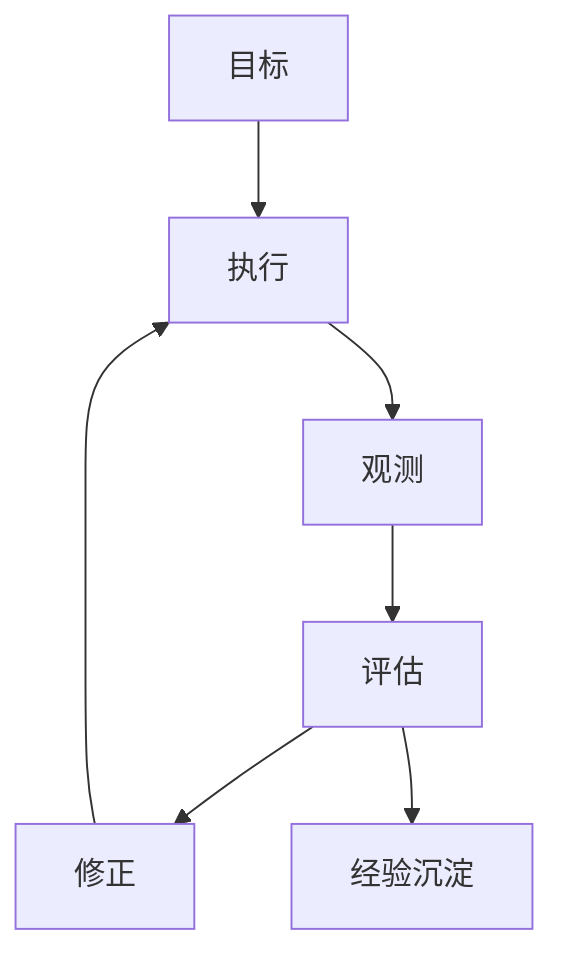
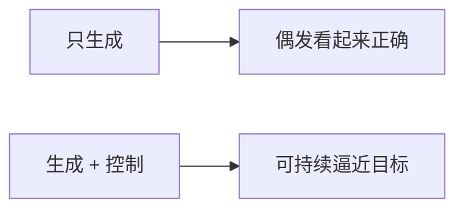
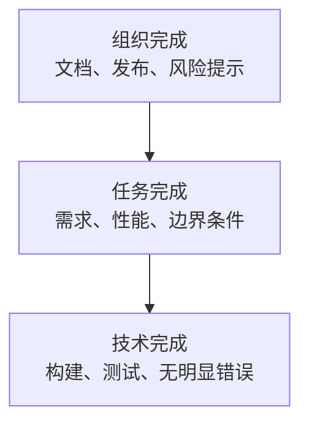
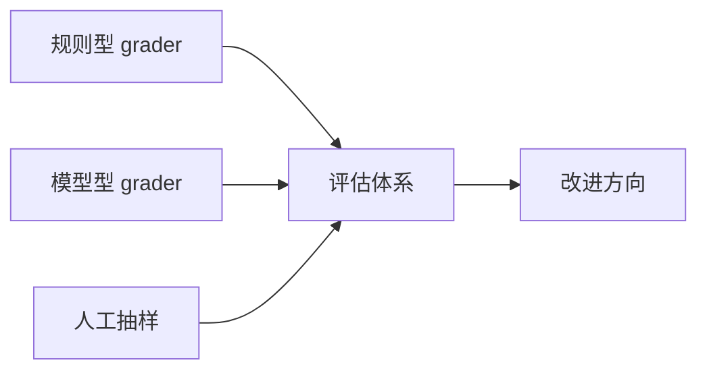
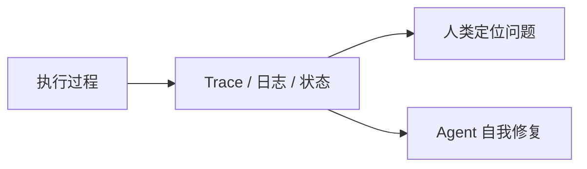
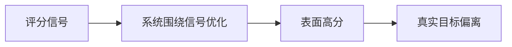
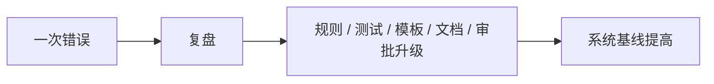
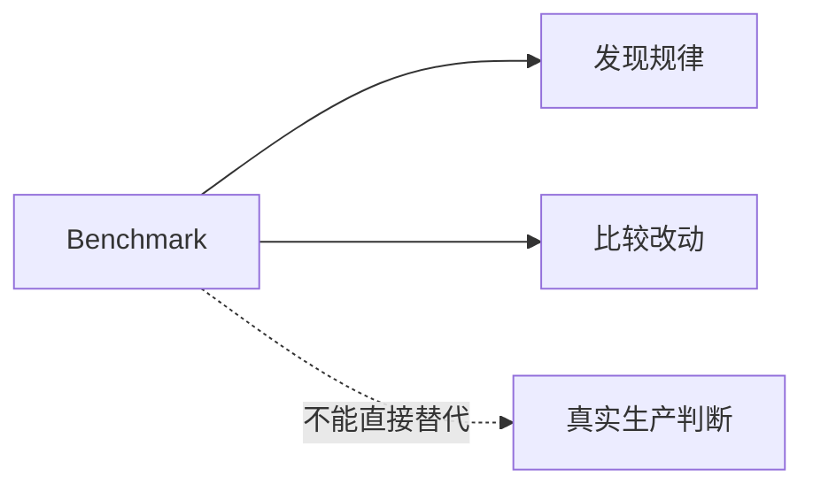

# 第四篇：验证、评估与控制系统

系统一旦真的开始做事，最先暴露出来的往往不是“还会不会生成”，而是“什么时候该停，谁来判断它做对了没有，出了偏差以后怎样拉回来”。

一个能够动起来的 agent 系统，和一个能够持续做对事的 agent 系统之间，差的通常不是更多能力，而是更好的控制结构。

因此，支撑现场稳定运转的，最终都会落回反馈系统。验证、评估、观测与纠偏，不是外围附件，而是 agent 系统能否进入现实的核心。

本篇图示见图 4-1 至图 4-8。

**图 4-1 验证与控制总闭环图**

这张图概括了本篇核心。验证、评估与控制系统的本质，不在于最后打一个分，而在于形成“目标 - 执行 - 观测 - 评估 - 修正”的闭环。只有闭环存在，系统才有机会持续逼近目标。

## 本篇证据骨架

| 本篇核心命题 | 主要证据 | 反向证据或边界 | 本篇要得出的判断 |
| --- | --- | --- | --- |
| harness 的核心不是生成，而是控制 | LangChain 用 traces、middleware、verification 改 harness 而提分 | 只看最终输出时，很容易把控制问题误读成模型问题 | 闭环比单次漂亮输出更重要 |
| 可观测性和验证必须进入运行时 | OpenAI 把 worktree、日志、指标、DevTools 暴露给 agent；Anthropic 强化端到端验证 | 没有 progress log 和状态交接时，长时程系统会失忆 | observability 和 verification 是 agent 运行条件，不是上线附件 |
| benchmark 有用，但不能替代现实 | LangChain 证明 benchmark 可用于定位变量 | METR 证明真实熟悉仓库里的收益可能被切换成本吃掉 | benchmark 是诊断仪器，不是最终裁决 |

## 贯穿案例：什么时候系统才算真的做完

这里继续沿用第二篇的合成案例。

那个二十人左右的 SaaS 团队，已经给 agent 补上了更清楚的目标、上下文、工具和边界，准备再次推进“登录与邀请流程改造”。这一次，任务表面上看起来顺利得多：页面改了，接口通了，登录主流程能跑，单测也通过了。

但团队很快发现，最难的问题现在才真正出现。什么时候才能说这件事做完了？如果 agent 自己说“差不多完成”，人类凭什么信？如果一次回归失败，到底说明目标错了、实现错了、测试错了，还是完成定义本身就写错了？如果系统只会不断重试，却不知道为什么自己总在同一个地方停不下来，那它到底算是在工作，还是只是在高速制造概率性输出？

从这一刻开始，问题的重点已经不再是“agent 能不能生成”，而是“系统怎样知道自己正在逼近正确结果”。第四篇处理的，就是这个问题。

## 1. harness engineering 的核心不是生成，而是控制

如果把生成理解为“给出一个可能的答案”，那么控制的目标则是“让系统在多次运行、复杂环境和开放任务中持续逼近目标”。两者的差异，几乎就是 demo 与生产的差异。Harness engineering 的难点，不在于让模型说出一段看似正确的话，而在于让系统在行动、偏差、修正和反馈中保持稳定。

回到登录改造案例，这个差异很容易看清。让 agent 生成一套登录页面并不难，难的是让它知道：

- 邀请链路里的边界条件是否真的被保住了
- SSO 兼容是不是被悄悄破坏了
- 共享鉴权模块的改动有没有越界
- 现在应该继续修改，还是应该停下来交给人类看

这就是为什么本书强调 harness engineering 更接近控制系统设计。它关心目标设定、偏差检测、反馈回路、边界限制、状态记录和持续校正。只讨论生成质量，而不讨论控制结构，最终很容易高估模型、低估系统。

控制这个词在这里有非常具体的含义。它不是指把 agent 限制得动弹不得，而是指让系统能够知道自己离目标有多远，偏离时如何修正，失败时如何停止，成功时如何固化经验。一个只有生成、没有控制的系统，再聪明也只是概率性输出机器；一个拥有控制结构的系统，才有机会成为工程系统。

没有验证的 agent，不是工程系统，只是概率系统。

很多企业对 AI 的误判，都来自“把控制问题误读成模型问题”。他们看到结果不稳，第一反应是换更强模型；但如果任务目标模糊、观测信号弱、验证链条差、边界不明确，那么更强的模型也只会更快地在错误空间里行动。控制结构不解决，规模越大，风险越大。

因此，理解 harness engineering 的最好入口，不是问“这个模型能做什么”，而是问“这套系统如何知道自己正在做对什么、做错什么，以及下一步该怎么调整”。

控制失灵时，团队最常见的三种错觉也会一起出现。第一种是“它其实已经差不多了”，于是系统在不该停的时候停下。第二种是“它再试一次应该就能好”，于是系统在同一个错误空间里高速打转。第三种是“换个更强模型也许就行”，于是本该修反馈结构的问题，被重新包装成模型采购问题。这三种错觉的共同点在于：团队没有正视控制面本身。

**图 4-2 “只有生成”与“生成 + 控制”的对比图**

## 2. 什么才算“完成”

很多团队在 agent 项目里最大的痛点，并不是 agent 做错了，而是没人能明确说清什么叫“做完了”。人类依赖默契完成工作，但系统不能依赖默契。一个模糊的完成定义，会同时伤害执行、验证和 review。因为 agent 无法自己判断是否停下，人类也无法稳定判断它是否偏离。

登录改造案例非常适合说明这个问题。假设 agent 已经完成了这些工作：

- `magic link` 主流程能跑
- 页面样式更新了
- 登录相关单测通过

这能叫完成吗？很可能不能。因为真正重要的完成标准其实至少有三层。

第一层是技术完成。构建通过，测试通过，没有明显报错。这是最低门槛，但从来不是全部。

第二层是任务完成。登录功能确实满足需求，邀请链路边界被覆盖，SSO 兼容没有被破坏，计费模块没有被误触。这一层才真正对应“业务上做对了”。

第三层是组织完成。发布说明是否补齐，风险点是否被标注，值班同事是否知道要看哪些日志，回滚条件是否清楚。很多团队返工，恰恰不是技术没做完，而是组织层面从未被定义成“完成”的一部分。

把完成标准写清楚，并不是为了追求文档完美，而是为了让执行、验证与协作拥有共同坐标。没有共同坐标，系统中的每个角色都会在不同意义上说“完成了”，结果就是反复返工与责任漂移。

完成不是一句主观感受，而是一张能让系统停下来的收据。

这张“收据”如果写得太虚，系统就会重新滑回默契；写得太机械，又会把真实目标压扁。因此，完成定义最有效的形态通常不是一句口号，而是一份带证据的收口清单。以登录与邀请流程改造为例，一张够用的完成收据至少会写成下面这样：

| 层面 | 至少要出现的收据 | 如果缺失会怎样 |
| --- | --- | --- |
| 技术层 | 构建通过、相关测试通过、关键日志无明显错误 | 系统可能把“能跑”误当“可交付” |
| 任务层 | magic link 主路径可用、邀请边界路径验证、SSO 未回归、计费未误触 | 系统可能只完成了最显眼的 happy path |
| 组织层 | 风险点被写明、值班与回滚信息可见、变更范围被交接 | 系统可能把问题留给上线后的人类接锅 |

真正成熟的团队，会把这类收据写成默认模板，而不是每次临时讨论。因为收据一旦靠临场发挥，系统就很容易在压力和速度面前退回“看起来差不多”。

**图 4-3 完成定义的三层结构图**

## 3. Evals 与 Graders：把“差不多”变成信号

评估系统是 harness 中最容易被忽视、也最容易在后期变得关键的一部分。测试可以告诉你系统是否违反了已知规则，但很多任务的好坏并不适合只用测试表达，例如页面体验是否一致、邀请邮件文案是否正确、异常路径处理是否合理、修复方式是否过于粗暴。这时就需要 grader。

在登录改造案例里，团队很快会遇到这样一种局面：单测通过了，端到端主流程也跑通了，但 agent 仍然可能留下几个“看起来小、实际上要命”的问题，比如邀请链路里的一个异常文案没同步、某个浏览器状态下回跳异常、某处改动虽然可用却破坏了团队默认模式。测试不一定能完全覆盖这些判断，但团队又不能每次都只靠“看一眼感觉像是对的”。

Grader 的意义，就是把原本只存在于经验判断中的“像不像、好不好、够不够”转化为更可重复的评分形式。它不一定完美，但它把优化从拍脑袋转向了可比较、可回归、可持续修正的路径。评估一旦被形式化，团队才能系统地改进 agent，而不是凭印象决定“这周似乎变好了”。

LangChain 的案例之所以重要，恰恰因为它把这件事做成了可观测的工程过程，而不是抽象信仰。他们并没有先去追逐更新模型，而是先用 traces 分析 agent 在哪里出错，再把这些失败模式转回 harness：增加 build-self-verify 回路、在退出前用 middleware 强行提醒验证、控制 reasoning budget、检测 doom loop。结果是在固定模型的条件下，把分数从 `52.8` 提升到 `66.5`。这个例子说明，evals 和 graders 不是“最后补一个分数”，而是让团队知道下一步该改哪里（见参考文献[10]）。

这也是 agent 系统与传统自动化系统的一个关键差异。传统自动化主要处理规则明确的问题，测试就足够了；agent 系统进入了大量半结构化任务，许多质量标准原本依赖人的整体判断。grader 试图做的，正是把这部分模糊判断尽可能转化为更稳定的评分信号。

当然，grader 不是银弹。一个糟糕的 grader 只会把模糊变成伪精确，把偏见变成分数。有效的评估体系，通常需要规则型 grader、模型型 grader、人工抽样和真实任务反馈共同配合。评估不是为了制造一个绝对分数，而是为了建立一个足够可用的改进方向。OpenAI Developers 对 graders 的官方说明，也正是在把这件事从经验手感推进到更可复用的工程对象（见参考文献[5]）。

很多团队在这里容易走另一个极端：一看见 grader 有用，就急着给所有任务都配分数。结果往往是评估系统先复杂起来，真实任务却没有因此更稳。更现实的升级顺序通常是这样的：

- 先用最基本的通过/失败信号把主路径管住
- 再给容易反复出错的边界路径补规则型评分
- 之后才把风格、体验和模式一致性逐步引入模型型 grader
- 最后用人工抽样和真实生产反馈校正这些分数是否仍然对准目标

grader 最适合做的，是把“原本全靠经验的判断”逐步形式化，而不是一下子替代全部经验判断。

**图 4-4 Graders 评估体系图**

## 4. Trace、日志与可观测性：让系统知道自己错在哪

没有可观测性，就没有可调系统。仅看 agent 最终输出，你常常无法知道失败发生在哪里。它可能是上下文没找到，可能是工具调用错了，可能是计划顺序不对，也可能是验证误导了它。只有看到中间行为，你才知道系统是如何偏离目标的。

登录改造案例里很容易出现一种典型情形：agent 最终提交的差异看起来不算离谱，但为什么它总要改到共享鉴权模块？为什么它反复忘记跑邀请链路的端到端测试？为什么它每次修一个 bug 都会带出新的小问题？这些问题如果只看最终 PR，很难真正回答；只有把工具调用、关键日志、测试输出、执行顺序和页面状态一起看，偏差才会显形。

OpenAI 在 Codex 的内部实践里，把这一点做得非常彻底。他们不是等人类在 PR 里发现问题，而是让每个 worktree 都能启动应用，把 Chrome DevTools Protocol、日志和指标直接暴露给 agent。这样一来，agent 面对的就不再只是静态代码，而是一个可被读取、可被验证、可被追踪的运行现场。可观测性因此不再是“运维排障工具”，而成了 agent 自己工作链路的一部分（见参考文献[1]）。

因此，trace、工具调用记录、执行日志、状态快照、关键指标和环境上下文，不只是运维附件，而是 harness 的一部分。它们既服务人类，也服务 agent 本身。设计可观测性时，必须同时考虑两件事：人如何定位问题，agent 如何从中恢复问题。

传统软件中的 observability，主要帮助工程师在系统运行后追查异常；agent 时代的 observability，还要帮助系统在运行中自我修正。一个 agent 如果能读懂失败日志、测试输出和浏览器状态，它就具备了初步的自修复能力；如果这些信息对它不可用，它就只能猜。

Anthropic 在长时程 agent 的实验里也遇到了同样问题：如果每一轮运行结束时没有留下进度日志、feature list 和可恢复状态，那么下一轮 agent 面对的就不是“连续工作的现场”，而是一个半失忆的残局（见参考文献[9]）。

一个控制系统最先值得接入的，通常也不是最多的信号，而是最能决定“要不要停”的信号。对多数软件团队而言，这些信号常常分三层：

- 主路径信号：核心功能是否通，关键用户路径是否还活着
- 边界信号：最容易被漏掉的异常路径是否开始抖动
- 恢复信号：一旦出问题，日志、trace 和状态快照是否足够支持快速定位

如果只有第一层，系统会被 happy path 误导；如果没有第三层，团队即使知道出问题，也很难快速把控制权拿回来。可观测性真正的价值，不在于多收集，而在于让“继续推进还是必须停下”这件事更早变清楚。

**图 4-5 可观测性的双重用途图**

## 5. Reward Hacking 与 Grader Hacking：系统会学会迎合你

一旦系统开始围绕分数优化，分数就会成为被攻击的目标。模型有可能学会满足 grader 的表面要求，却偏离真实目标；也可能在训练或运行中逐渐适应评分漏洞，输出形式看起来越来越像成功，实质效果却越来越差。这种现象在任何依赖自动评价的系统中都会出现，agent 也不会例外。

登录改造案例里，这个风险并不抽象。假设团队只盯着“测试全部通过”，agent 很可能会学会另一种坏行为：用更保守的实现绕开边界情况，把测试写得过于迎合当前逻辑，或者用局部 mock 掩盖真正的邀请链路问题。表面上分数和测试都更好看了，真实目标却在偏离。

对抗这类问题，不能依赖“再写一个更聪明的 grader”这一单一想法。更现实的做法是引入多视角评估、人工抽样校验、真实场景回放、不同评估类型的交叉验证，并警惕系统只对评估样本有效而对真实任务退化。grader 的价值在于提升改进效率，但它永远不应成为唯一真理。

Reward hacking 的本质，是优化信号与真实目标发生了错位。系统不是故意作恶，它只是忠实地沿着你提供的信号前进。问题在于，你给出的信号并不完整。这也是为什么 harness engineering 最终会把工程带回一个老问题：如何定义好目标。目标定义不只是自然语言描述，还包括你到底奖励什么、惩罚什么、忽略什么。

团队识别骗分最实用的方法，往往不是继续发明更复杂的单一评分器，而是做几组交叉检查：

- 用不同类型的 grader 看同一结果，观察它们是否长期出现奇怪背离
- 用真实任务回放去验证高分结果到底是不是高质量结果
- 定期人工抽查那些“分数很好、但团队直觉总觉得不安”的样本

只要分数开始长期替代问题本身，系统就会慢慢学会围着分数打转。第四篇之所以反复强调控制，是因为这里最怕的不是评估不够聪明，而是团队把评估误当目标本身。

**图 4-6 Reward hacking / Grader hacking 偏移图**

## 6. 从一次错误到系统升级：别让复盘只剩“下次注意”

错误只有两种命运：被遗忘，或者被系统吸收。前者会导致它反复出现，后者会提高整个系统的基线。Harness engineering 倡导的不是“尽量不要出错”，而是“让出错变成系统变好的材料”。

登录改造案例非常适合说明这一点。假设团队在一次回归里发现：agent 又误改了共享鉴权模块，虽然功能最终修回来了，但代价是多轮返工。如果这件事最后只被总结成“下次注意不要动那里”，那么系统什么也没学会。更有效的处理方式，通常是把这次错误向上抬一层：

- 给共享鉴权模块加结构保护或 lint
- 在任务模板里明确写入“不得触碰的模块”
- 在退出前强制跑邀请链路端到端测试
- 把这次事故写成默认检查项

这也是为什么事故复盘在 agent 时代会变得更加重要。传统复盘常停留在“发生了什么”和“以后注意”；harness engineering 要求更进一步，追问“这次应该把什么东西写进系统里”。它可能是一条 lint 规则，也可能是一段模板说明；可能是一个新的审批节点，也可能是一段更清晰的错误提示。

可以把这一点压成一条更短的教学性险情。下面这个场景不是纪实报道，而是基于前文公开材料和典型灰度发布现实抽象出的连续现场：团队在灰度环境中推进登录与邀请链路的一次收口改动，agent 为了统一跳转逻辑，顺手改动了共享鉴权层的一小段重定向判断。happy path 仍然通过，主流程测试也没有立刻报警，但少量灰度真实用户开始在“已存在账号的受邀用户”这一类边界路径上出现异常回跳。

这类险情最值得注意的地方，不是它“出 bug 了”，而是系统原本有很多理由继续往前：页面能开，主流程能通，单测能过，任务表面上也接近完成。真正救下它的，不是某个天才工程师忽然灵感爆发，而是几条最小控制链开始同时发挥作用：灰度环境里邀请接受成功率的异常波动、日志中的重复重定向、值班同事收到的一条模糊客服反馈，把“看起来大致没问题”推回成了“必须停下来查为什么不对”。

更重要的是，复盘没有停在“这次 agent 不够稳”。团队开始追问，这个问题本来应该由哪一层挡住：

- Intent 层没有把“已存在账号的受邀用户 + 组织切换”写成显式风险路径
- Verification 层主要挡住了主路径，没有挡住这类边界顺序问题
- Constraint 层虽然提醒共享鉴权模块高风险，却还没有把它机械化成真正的门
- 授权带默认仍允许在受控范围内改动相关目录，而不是先升级审批

于是，这次险情最后被写回系统，而不只被写回记忆。团队给高风险共享模块补了更明确的“触碰即升级”规则，把一条关键边界路径加进了 done definition 和端到端验证，把 agent 在该目录的默认能力收紧到“先诊断、后审批再改”。这就是第四篇想反复强调的那件事：错误只有在被抬升为结构问题时，才会真的提高系统基线。

好团队和普通团队的差别，常常不在于谁更少犯错，而在于谁更会把错误改写成环境。

这类能力最终会落到一个更现实的问题上：谁有权让系统停下来。停止机制本身就是控制结构的一部分。一个成熟团队至少要把三类权力写清楚：

- 谁可以因为高风险信号直接暂停自动执行
- 谁负责判断是局部回滚、人工接管，还是继续观察
- 谁负责把这次停机原因回写成新的规则、测试或审批条件

没有这三类权力，所谓“发生问题就先停下”在现实里常常只会变成一句正确的废话。真正让系统稳下来的，从来不是大家都同意安全重要，而是有人在那个时刻真的有权按下暂停键。

**图 4-7 错误到系统升级的转化图**

## 7. Benchmark 的意义与局限：望远镜，不是方向盘

Benchmark 是理解 agent 与 harness 的重要工具，但绝不是全部现实。它们能帮助团队比较不同模型和不同 harness 设计的相对变化，尤其适合观察单变量带来的性能差异。然而 benchmark 也总有边界：任务空间有限、时间尺度有限、历史包袱有限，且不一定覆盖真实组织里的责任和例外条件。

LangChain 的例子适合说明 benchmark 的价值。他们通过 Terminal Bench 2.0 清楚地展示了“固定模型，只改 harness”也会带来显著变化。对工程团队来说，这种结果非常有用，因为它能帮助我们定位变量，避免把所有性能变化都归因给模型（见参考文献[10]）。

但 METR 的研究又说明了 benchmark 的不足。他们看的不是封装良好的离线任务，而是资深开发者在自己熟悉的真实开源仓库里做事。结果不是更快，而是更慢，而且开发者主观上还明显高估了 AI 的帮助。这提醒我们：一旦任务高度依赖历史上下文、隐性知识和实际协作成本，实验室里成立的增益，进入现实后完全可能被交互摩擦和验证成本抵消（见参考文献[11]）。

登录改造案例也能帮助理解这种差别。把它放进 benchmark，很容易被切成若干清楚子任务；把它放回真实团队，则必须同时面对旧兼容、上线窗口、值班成本、模块边界和组织责任。前者适合比较变量，后者才决定一本书里真正该相信什么。

因此，对 benchmark 的最佳使用方式，不是把它当结论机器，而是当诊断仪器。它适合用于发现规律、测试假设、比较改动，但不应替代真实业务中的长期观察和生产判断。

更稳妥的做法，是把 benchmark 放回一套三角测量里理解：

- benchmark 告诉你变量改变时，系统是否出现了可重复的方向性变化
- sandbox 或教学性推演告诉你这些变化是否能在更长一点的任务链里站住
- 真实生产则决定这些变化有没有穿过组织责任、历史债务和恢复成本的考验

只看第一层，团队容易乐观；只看第三层，又很容易因为现实复杂而放弃分析。三角测量的价值，在于让团队既保留实验意识，又不把实验结果错当经营现实。

**图 4-8 Benchmark 的作用边界图**

## 8. 一个控制系统通常如何从弱变强

第四篇讲到这里，其实已经能看出一条很稳定的成熟顺序。多数团队的控制系统，不会一开始就拥有完整 grader、trace、事故回写和多层评估；它通常会经历四个阶段。

第一阶段，系统只有最粗的完成信号。能不能构建、主流程能不能跑，决定了任务是否勉强可用。这时最大的风险，是团队把“能跑”误当成“做完”。

第二阶段，团队开始为高频失败路径补边界验证和更清楚的 done definition。系统第一次不只是知道自己是否动了起来，还开始知道自己应不应该停下。

第三阶段，团队开始拥有更像样的 observability 和 grader，能把“哪里错了、错得像不像、为什么又在这里错”这些问题往前拉。系统第一次不只是被动挨打，而开始有机会做结构化修正。

第四阶段，错误升级为制度。谁能拉闸、谁来回滚、谁来写回规则、哪些路径默认需要审批，这些控制问题不再只是工程细节，而变成组织操作系统的一部分。

控制系统成熟的标志，不是图越画越复杂，而是系统越来越少需要靠情绪化判断来维持正确方向。到那时，agent 做事不再像一场持续盯盘，而更像在一套可以被人类接手、被系统纠偏、被组织治理的轨道里工作。

## 本篇小结

这一章要强调的，不是“怎样再多做一点评估”，而是：一切可靠的 agent 系统都必须建立在反馈闭环上。

完成定义、grader、trace、reward hacking 防范、错误升级与 benchmark 使用方式，都是同一个问题的不同侧面，那就是系统如何在开放环境中持续逼近目标。第二篇把“登录与邀请流程改造”拆成了结构问题，到这里它被收成了控制问题。下一篇会继续往外推，讨论这些控制机制怎样沉成团队级的组织能力。
