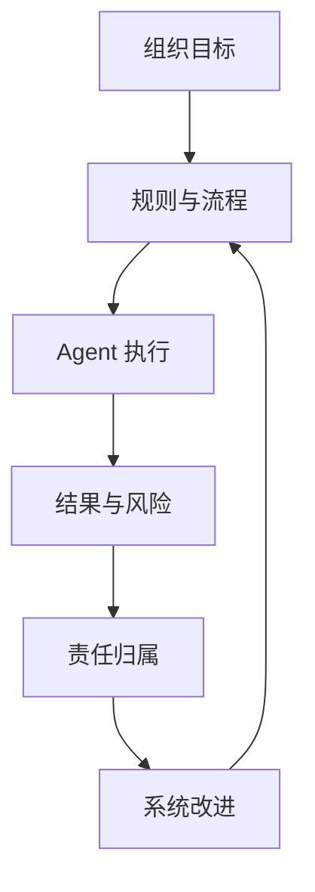
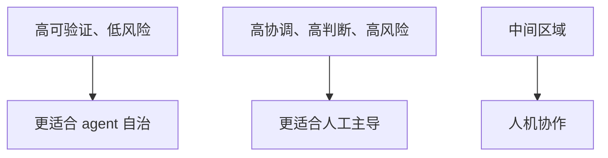
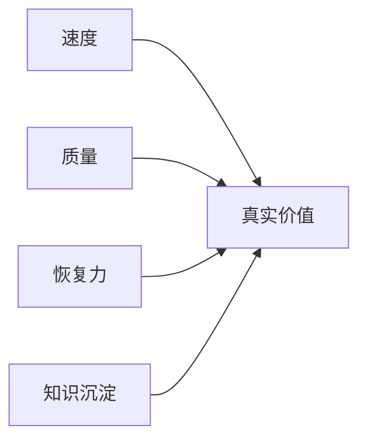
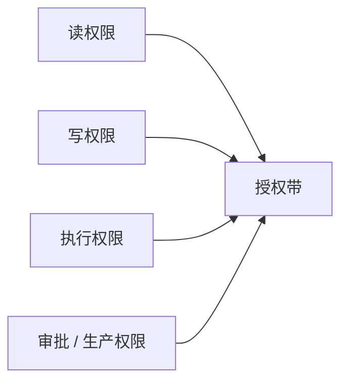
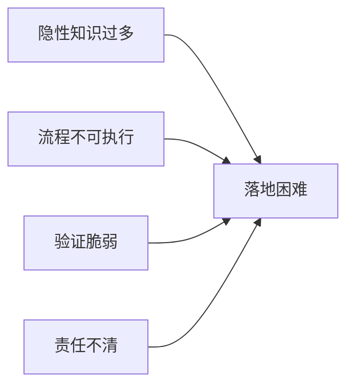
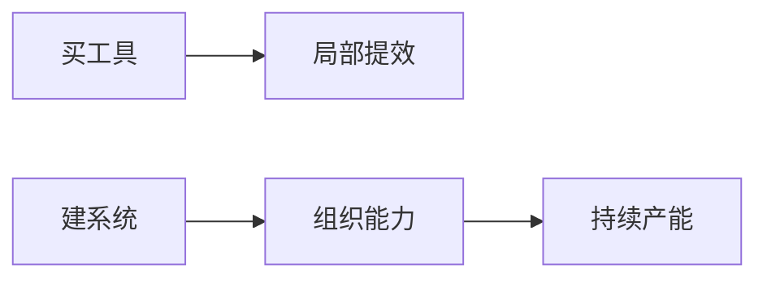

# 第五篇：组织、管理与协作

很多团队并不是不知道 harness 应该长什么样，而是走到真正落地时才发现：没人拥有它。

Agent 系统一旦离开个人实验、进入团队协作，就不再只是技术问题，而会立刻变成协作问题、责任问题、预算问题、权限问题和管理问题。许多组织不是死在模型不够强，而是死在没有人为这套系统真正负责。

因此，本篇讨论的中心不再是结构本身，而是组织如何接住这套结构：什么任务适合先试点，什么任务现在不要碰，谁拥有知识面，谁拥有评估面，谁拥有运行时和工具面，谁来拍板 build vs buy，管理者又该看什么指标。

本篇图示见图 5-1 至图 5-6。

**图 5-1 Harness 作为团队能力的责任闭环**

这张图概括了本篇的核心：agent 从来不是孤立工作的。它被放进组织流程中，也被放进责任结构中。没有清晰责任的自动化，只会把风险扩散得更快。

## 本篇证据骨架

| 本篇核心命题 | 主要证据 | 反向证据或边界 | 本篇要得出的判断 |
| --- | --- | --- | --- |
| harness 终究会变成团队能力 | OpenAI App Server 说明一套 harness 会被多端、多角色共同维护（见参考文献[3]） | 个人 demo 可以跑通，组织却会卡在所有权和维护上 | harness 不是个人技巧，而是组织资产 |
| 人机分工本质上是责任分工 | Anthropic 把 initializer agent 与 coding agent 明确拆角色（见参考文献[9]） | 若角色和升级点不清，自动化只会扩散失败 | 自动化边界必须由责任结构来定义 |
| ROI 不能只看“写得更快” | LangChain 显示 system gain，METR 显示真实场景可能先变慢（见参考文献[10]、[11]） | 单看速度指标，容易被局部胜利误导 | 管理者应同时看质量、恢复力、沉淀和切换成本 |
| 从买工具到建系统是组织分水岭 | App Server 显示平台化、线程化、协议化能力（见参考文献[3]） | 只买入口工具，常停留在局部体验优化层 | 真正门槛不在接入模型，而在系统建设 |

## 贯穿案例：当“登录与邀请流程改造”进入团队现实

那个二十人左右的 SaaS 团队走到这里，面对的已经不再只是技术问题。真正难的，不是 agent 能不能把登录与邀请流程改好，而是谁来定义完成，谁来放权，谁来承担误改共享鉴权模块的后果，谁来维护任务模板、验证链路和知识入口。

同一个任务，到这里暴露出的是一组组织层问题：

- 谁批准 agent 修改鉴权相关目录
- 谁定义“邀请链路边界覆盖完成”到底是什么意思
- 谁决定什么时候必须升级给人
- 谁把这次误碰计费模块的事故写回规则
- 管理者到底该看“这次快了多少”，还是“以后会不会更稳”

从这一刻开始，harness 已经不只是工程结构，而是组织能力。

## 1. harness engineering 不是个人技能，而是团队能力

一个人当然可以搭出自己的 agent 工作流，但一旦要在真实团队中长期运行，harness 就不再是个人偏好，而是团队能力。谁来维护知识库，谁来定义规则，谁来更新模板，谁来处理权限，谁来解释评估结果，谁来把事故转成系统修复，这些都需要明确所有权。

回到登录与邀请流程改造案例，团队很快会发现：如果只有一个“最会用 agent 的工程师”知道登录链路的文档入口、默认测试命令、共享鉴权模块的禁区和升级条件，那么系统其实并不稳定。那只是某个人的工作流，不是团队的能力。一旦这个人不在，任务就会重新滑回混乱。

许多看起来像是“模型不够好”的团队，真实问题其实是协作结构没有准备好。没有所有权，就没有持续维护；没有持续维护，就没有可信环境；没有可信环境，agent 产出就会越来越不可预测。Harness engineering 说到底，是一种组织化工程能力。

OpenAI 后来把 Codex harness 做成 App Server，这件事很能说明问题。只有当 CLI、IDE、桌面端、Web 端和外部集成都要共用同一套 harness 时，团队才会被迫把原本隐性的工程习惯变成显性的运行时能力、配置接口和线程管理机制。这已经不是某个高手的个人工作流，而是多个角色共同维护的组织资产（见参考文献[3]）。

成熟团队在这一步往往会做一件事：把“谁来维护环境”从隐性期待变成显性分工。否则所有人都享受环境红利，却没有人真正为环境负责，系统很快就会滑回无人维护的状态。

**图 5-2 新的人机分工图**

## 2. 新的人机分工：不是能力分工，而是责任分工

Agent 不是廉价实习生，也不是万能执行体。人机分工的关键，不在于让 agent 做尽可能多的事，而在于让系统知道什么适合下放、什么适合协作、什么必须升级给人。重复性高、可验证、边界清晰的任务更适合自治；价值判断强、跨部门协调重、风险成本高的任务则更需要人类介入。

登录改造案例正好处在这个边界上。页面样式和局部逻辑重写，也许可以让 agent 自治；共享鉴权模块的结构调整、上线窗口变更、回滚策略确定，就很难完全交给 agent。不是因为后者在技术上一定更难，而是因为后者的责任密度更高。

Anthropic 的长时程 agent 设计，是这种分工的一个非常清楚的例子。他们没有幻想一个 agent 同时把初始化、规划、执行、验证和交接都自然做好，而是把角色拆开：initializer agent 负责搭环境和建立可恢复状态，coding agent 负责按 feature 逐轮推进，真正高风险或模糊边界的判断仍然由人来决定。这种拆法的意义，不在于多造几个 agent，而在于组织终于开始认真回答“谁负责哪一段失败”（见参考文献[9]）。

这要求组织放弃一种过于简单的想象：不是把所有低级任务都交给 agent，把所有高级任务都留给人，而是根据任务的可验证性、可逆性、风险成本和协调复杂度重新划线。一个技术上不算难的任务，如果牵涉高风险发布，依然不适合完全自动；一个看似复杂的重构任务，只要边界清晰、回归完备，反而可能很适合交给 agent。

人机分工的本质不是能力分工，而是责任分工。谁在何时拥有决策权，谁在何时承担后果，谁在何时能够中止自动流程，这些才是组织真正需要想清楚的部分。

## 3. 一个普通技术团队的 180 天教学性推演

只讲组织原则还不够，时间过程也必须被拉出来看。下面这个场景不是一家可核查公司的纪实案例，而是基于 OpenAI、Anthropic、LangChain、METR 等公开材料，结合典型 SaaS 团队结构抽象出的连续推演。它的意义，不是制造“像真的故事”，而是把第五篇的组织问题压回一个普通团队也能代入的推进过程里。

这个团队大约二十人，属于一家一百来人的 B 端 SaaS 公司。仓库能跑，CI 不是没有，测试也有一部分，大家平时零散在用 AI 工具，但知识仍大量停留在老员工脑中，任务交接严重依赖口头背景，模块边界不总是写清楚。他们选中的试点任务仍然是登录与邀请流程改造，因为这类任务足够真实、足够可验证、又足够能暴露系统问题。

这 180 天最值得看的，不是“用了 AI 之后做得多快”，而是组织按什么顺序学会了三件事：先把工作面显影，再把验证与交接接进来，最后把失败写回系统，并逐步明确 owner、指标和 build vs buy 的边界。这条路径之所以重要，不是因为它比公开案例更真实，而是因为它更接近多数团队会经历的推进节奏。

先把它压成一张最短的阶段表，会更清楚：

| 时间段 | 团队真正学会的事 | 主要暴露的问题 |
| --- | --- | --- |
| Day 0-30 | 工作面必须可发现 | 知识散、边界不清、AI 只是在局部帮忙 |
| Day 31-60 | 完成必须可验证、任务必须可交接 | 系统过早宣布完成、handoff 断裂 |
| Day 61-90 | 失败必须写回系统 | 边界碰撞、同类错误反复出现 |
| Day 91-180 | 组织必须知道自己在建设什么 | owner 不清、指标混乱、build vs buy 开始出现 |

后面的几个部分，不过是把这条 `180 天教学性推演` 重新压成管理动作：试点怎么选，90 天怎么走，谁来 owning，值不值得投，什么该买、什么该建。组织不是在“使用一个更强工具”，而是在逐步把工作现场改造成 agent 能参与的系统。

## 4. 第一批试点该选什么：任务优先级与风险分层矩阵

组织最常见的落地错误，不是太慢，而是太急。一个新能力刚进入团队时，最危险的冲动就是“既然方向对，就全线推广”。真实情况恰好相反。越是新的执行系统，越需要在任务选择上保守、克制、有顺序。很多失败不是因为 harness 方法不对，而是因为第一批任务选错了。

回到登录与邀请流程改造案例，它之所以适合成为贯穿案例，不只是因为它常见，而是因为它刚好处在一个好试点应该具备的几个特征之间：它足够真实，能暴露知识、边界、验证和交接问题；它又没有高到不可回滚的风险，不会因为一次错误就把整个公司拖进事故。这种任务最适合拿来搭最小可行 harness。

一个更稳的组织做法，是先用一张任务分层矩阵来挑试点：

| 任务类型 | 典型特征 | 建议策略 | 例子 |
| --- | --- | --- | --- |
| 低风险、高反馈 | 可回滚、边界清晰、很快能验证结果 | 第一批优先试点 | 页面改造、测试补齐、文档更新、局部重构 |
| 高风险、高反馈 | 价值高、结果可验证，但一旦出错代价大 | 受控试点，必须配审批与回滚 | 鉴权改造、数据库迁移脚本、发布流程自动化 |
| 低风险、低反馈 | 出错损害不大，但效果也不明显 | 可做，但不宜作为样板任务 | 零散文案整理、一次性脚本、边缘工具整合 |
| 高风险、低反馈 | 难验证、跨部门、代价高、回滚难 | 当前阶段不要碰 | 生产账单逻辑、核心风控、强监管审批自动执行 |

真正好的第一批任务，不是“最先进”的任务，而是“最能让组织学会搭系统”的任务。第一批任务的价值不只在于完成它本身，还在于它会不会逼出一套后面可复用的知识面、验证面和升级面。

如果组织连这张矩阵都没有，那么所谓“落地 AI”往往只是把一堆不该碰的任务过早丢给系统，然后用失败反过来否定方法本身。

## 5. 90 天路线图：从试点到最小可行 Harness

技术 leader 和管理者最需要的，不是终局蓝图，而是一条能在一个季度内真正动起来的路。`90 天路线图` 的意义，也不在于严格卡时间，而在于逼组织把先后顺序想清楚。对大多数团队来说，最稳的节奏往往是三段式：先显影工作面，再接验证与交接，最后才开始把规则和治理写回系统。

普通团队最先学会的，通常不是如何全面提速，而是如何按顺序让系统先不乱、再可连续、最后可积累。这里给出的 `90 天路线图`，正是把前面那条连续推演压成一张组织动作表。

### Day 0-30：先把工作面显影出来

这个阶段最重要的不是追求 agent 立刻创造巨大产能，而是先把“它到底在哪儿工作”写清楚。对登录与邀请流程改造团队来说，这意味着：

- 把相关目录、架构边界、共享鉴权禁区写进仓库
- 整理默认测试命令和本地启动方式
- 写清楚登录、邀请、SSO、计费模块之间的边界
- 为任务建立统一模板：目标、禁止项、完成定义、升级条件

这阶段的产物不是“神奇 demo”，而是第一版可发现工作面。它的验收标准也很简单：一个新加入这个任务的人，能不能不用口头背景就找到足够多的事实开始工作。

### Day 31-60：把验证和交接接进来

第二阶段开始让系统真正“可连续”。这个阶段最重要的，不是再补更多文档，而是补验证与 handoff。对登录改造团队来说，这意味着：

- 把端到端测试补到真正能挡住“邀请链路看起来好像好了”的误判
- 建立进度记录与 feature list
- 明确 agent 退出前至少必须完成哪些验证
- 约定什么时候必须升级给人，例如触碰共享鉴权模块、变更上线窗口、涉及计费联动

到了这一步，团队第一次有机会从“一次性完成任务”切换到“系统可持续推进任务”。很多组织会在这一阶段第一次感觉到 agent 开始真正进入工作流。

### Day 61-90：把失败写回系统

第三阶段才是把局部经验变成团队资产。前两个阶段解决的是“能不能开工”“能不能不乱”，第三阶段解决的是“能不能越做越稳”。这意味着：

- 把过去 60 天里出现过的误改、误判完成、边界碰撞写成规则或 lint
- 把最常见的任务收成模板和 Golden Path
- 把谁负责知识、谁负责评估、谁负责运行面写成显式分工
- 开始收集稳定指标：返工率、升级频率、恢复时间、知识复用度

如果一个团队到第 90 天还只是“会用一个强工具”，却没有把任何经验沉进环境，那它并没有真的建起 harness。

把这条路线图再压成一张表，开会时会更好用：

| 时间段 | 组织重点 | 关键动作 | 阶段产物 | 常见误区 |
| --- | --- | --- | --- | --- |
| Day 0-30 | 工作面显影 | 整理知识入口、任务模板、模块边界、默认命令 | 第一版可发现工作面 | 过早追求“立刻提速” |
| Day 31-60 | 验证与交接入场 | 补测试、加 handoff、定义升级点、明确 done | 第一版可连续推进的任务系统 | 以为“能跑就算完成” |
| Day 61-90 | 规则与治理闭环 | 失败回写、模板沉淀、角色归属、指标收集 | 最小可行 harness | 只关注结果，不沉淀系统 |

这张路线图不会自动解决所有问题，但它能防止组织一开始就把问题问错。不是“模型能干多少”，而是“我们准备好让系统先在哪个工作面里稳定地干起来”。

## 6. RACI-lite：谁拥有知识、谁拥有评估、谁拥有运行时

真正让组织卡住的，往往不是原则不对，而是所有人都觉得重要，最后却没有人真正 owning。前半章已经说明 harness 是团队能力，但如果不把所有权压到角色上，这句话很容易变成正确的空话。更实用的做法，不一定是先做一份庞大的治理制度，而是先用一张足够轻的 `RACI-lite` 表，把关键所有权钉住。

对大多数技术组织，我建议最少把下面四类所有权分清：

| 能力面 | 主要责任人 | 协作方 | 典型职责 |
| --- | --- | --- | --- |
| 知识面 | 业务 / 模块 owner | 产品、研发、技术写作者 | 文档入口、边界说明、历史决策、任务模板 |
| 评估面 | QA / 质量 owner / 资深工程师 | 业务 owner、平台工程 | done definition、测试链路、grader、回归标准 |
| 运行面 | 平台 / AI 平台 / DevEx | 模块 owner、安全 | tool 接入、runtime、权限带、线程状态、日志与观测 |
| 改进面 | 技术 leader / 平台 owner | 全团队 | 事故复盘、规则回写、模板沉淀、Golden Path |

在更小的团队里，这些角色可能由同一批人兼任；在更大的组织里，它们则会更清晰地分开。关键不在于职位名称，而在于问题出现时，全团队知道该找谁。

继续以登录改造为例，如果共享鉴权边界没人 owning，规则就会停在会议里；如果 done definition 没人 owning，测试就会越来越像形式；如果运行时没人 owning，工具接得再多也很快失控；如果改进面没人 owning，事故就只会变成“下次注意”。Harness engineering 真正开始像组织能力，往往就是从这些所有权第一次被写下来开始。

## 7. 管理者如何衡量 agent 系统的价值

把 agent 系统只看成模型采购或工具采购，是最容易发生的管理误判。需要被衡量的，不只是 token 成本或代码生成速度，而是整个系统的生产能力：任务吞吐是否提高，返工率是否下降，平均恢复时间是否缩短，人工升级频率是否可控，知识是否沉淀得更快，长期维护是否更稳定。

登录改造案例特别适合提醒管理者不要被表层速度骗到。假设团队报告说：这次 agent 用两天做完了过去一周的工作。这个数字当然抓人，但它根本不够。管理者真正该追问的是：

- 返工轮次是不是变少了
- 共享鉴权模块误碰问题是不是被永久收住了
- 端到端测试是不是更完整了
- 下次类似任务是不是更容易交给 agent
- 负责登录链路的人是不是不再需要每次亲自盯全程

一个高质量的 harness，有时甚至会在短期内让流程显得更重，因为它增加了文档、规则、验证和治理。但如果这些投入换来了更低的返工、更稳定的交接和更可重复的执行，那么它就不是成本，而是新的生产资本。

这里最容易被忽视的，是“好消息”和“坏消息”都必须一起看。LangChain 的实验说明，在固定模型下，只改 harness 就可能显著提升表现；METR 的研究又说明，在真实熟悉仓库里，资深开发者使用早期 AI 工具反而平均慢了 19%。对管理者来说，这两个结果合在一起才有意义。它们共同说明：价值从来不是一个单向数字，而是任务形态、环境整理程度、验证成本和组织协作方式的函数（见参考文献[10]、[11]）。

为了让 ROI 不再停在口号上，建议至少用下面四组指标同时观察：

| 指标层 | 应该看什么 | 为什么重要 |
| --- | --- | --- |
| 速度 | 单任务周期、等待时间、吞吐量 | 防止只凭体感谈“提效” |
| 质量 | 返工率、回归失败率、误改率、人工拦截率 | 判断系统是不是把问题后移了 |
| 恢复力 | 平均恢复时间、回滚频率、升级频率 | 判断自动化是否真正可控 |
| 沉淀 | 模板复用率、文档命中率、重复问题回写率 | 判断系统是否在积累复利 |

真正的 ROI 往往不是“节省了几小时”，而是“组织有没有越来越容易重复做对同类事情”。这才是第五篇应该帮管理者看见的价值。

**图 5-3 agent 系统价值衡量图**

## 8. 安全、权限与责任边界：谁能放权，谁就要能兜底

任何生产级 agent 系统都会碰到一个根本问题：它到底能做什么，出了问题又该由谁承担。权限设计不只是技术控制，更是责任结构。能读哪些数据、能改哪些文件、能否联网、能否触发生产操作、何时必须审批，这些问题决定了系统的风险形状。

登录改造案例里，这个问题非常具体。agent 能不能直接改共享鉴权模块？能不能跑带真实邀请邮件的测试？能不能改上线配置？能不能提交到准备发布的分支？这些都不是纯技术问题，而是组织在回答：哪里可以放权，哪里必须有人兜底。

最成熟的 agent 系统，不是权限最大的系统，而是责任最清楚的系统。它会在高频任务中追求低摩擦自动化，但在高风险路径上保留明确的人类升级点。这样做并不保守，而是承认：自动化一旦触碰真实环境，治理就是能力的一部分。

这也意味着权限设计应当是分层的，而不是二元的。不是简单地区分“能用 agent”与“不能用 agent”，而是细分成读权限、写权限、执行权限、网络权限、审批权限、合并权限与生产权限。不同层级的任务应落在不同授权带中，这样系统才能在保证效率的同时维持可控。

把责任边界放回一条更接近生产现场的险情里，会看得更清楚。他们在灰度环境里推进登录与邀请链路的一次收口改动，agent 为统一跳转逻辑而碰到了共享鉴权层。问题并没有立刻演化成全面故障，但少量灰度真实用户开始出现异常回跳。真正考验组织的，不是“谁先发现 bug”，而是谁有权让系统停下。

这时最值钱的，不是大家一起焦虑，而是一条最小可用的责任接力开始生效：

- 值班工程师先暂停继续放量，避免局部偏差继续扩大
- 模块 owner 与技术 leader 共同判断，这不是继续让 agent 在线修补就能赌过去的问题
- 当值负责人拍板先回滚共享鉴权相关改动，而不是边上线边试错
- agent 的后续任务被临时切到只读诊断，不再允许继续修改相关目录
- QA 与产品一起把影响范围说清楚，避免过度惊慌，也避免误判为偶发噪音

这条接力之所以重要，是因为它把“权限”真正变成了“责任结构”。谁有暂停权，谁就必须承担局部止损的责任；谁有回滚权，谁就必须对回滚条件足够清楚；谁有规则回写权，谁就不能把复盘写成一句“下次注意”。自动化越深入生产，组织越要承认一件事：没有兜底能力的放权，不叫效率，叫扩散风险。

一个最小可用的授权带，往往可以先分成三层：

| 授权带 | agent 可做的事 | 必须升级的点 |
| --- | --- | --- |
| 观察带 | 读代码、读文档、读日志、生成方案 | 任何写操作 |
| 变更带 | 在受控分支改代码、跑测试、写说明 | 触碰高风险模块、改 CI、改配置 |
| 发布带 | 在明确审批后触发合并、发布或外部动作 | 任何生产级变更与跨系统动作 |

责任边界也是同样道理。一个没有明确升级路径的 agent 系统，会把风险悄悄扩散到组织角落里。相反，一个高质量系统会让人清楚知道：何时由 agent 自治，何时由人类接管，何时需要跨团队协商，何时必须记录与审计。自动化能力越强，责任设计越要精细。

谁能放权，谁就要能兜底。

**图 5-4 权限与责任边界图**

## 9. 企业落地的真实障碍：难的往往不是模型，而是自己

企业常常误以为引入强模型就是进入 agent 时代，结果很快发现实际收益不稳。原因往往并不在模型，而在组织基础设施不适合 agent。事实散落在会议和聊天记录中，文档不可信，流程不可执行，知识没有入口，权限界限模糊，验证系统脆弱，责任归属不清。这种环境对人已经不算理想，对 agent 则几乎不可用。

登录改造案例如果放在一个不成熟组织里，很快就会暴露这些问题。登录链路为什么不能碰计费模块，没有文档；邀请流程真正的边界条件，只存在老员工脑中；上线窗口和回滚经验靠群里口头传；端到端测试脚本过时却没人维护。结果不是 agent “不够聪明”，而是系统根本没有把事实写成一个新执行者可用的形式。

METR 的反例之所以值得反复提，不只是因为“变慢了 19%”这个数字醒目，而是因为它揭示了真实落地阻力的来源：熟悉仓库的人类专家原本就掌握大量隐性上下文，AI 工具的交互、验证和切换成本会把这些优势重新拉回到人工一侧。很多企业以为自己是在和模型能力较劲，实际上是在和自己多年积累下来的隐性工作方式较劲（见参考文献[11]）。

harness engineering 不只是技术升级，也是一面照见组织成熟度的镜子。很多“AI 项目失败”，其实是旧有工作方式在新执行者面前暴露了问题。

**图 5-5 企业落地障碍图**

## 10. Build vs Buy：什么时候买工具，什么时候建系统

从老板到 CTO，最常问的往往不是“方向对不对”，而是“这件事到底该买，还是该建”。这个问题如果答不好，组织很容易陷入两个极端：要么是技术理想主义，觉得什么都应该自己做；要么是工具乐观主义，觉得只要买到一个强产品，组织自然会升级。

更稳的判断并不是二选一，而是先回答：我们到底缺的是模型入口，还是工作系统本身。

如果团队当前的痛点主要是“没有一个好用入口”，任务又集中在低风险、高反馈的编码场景，那么先买工具往往是合理的。它能快速降低试错成本，让团队知道 agent 到底在哪些局部真有用。

如果团队已经明确知道问题在知识分散、验证脆弱、审批不清、运行面碎片化，那么就算买到再强的工具，也只会停留在局部体验改善层。此时真正该建的，是知识入口、验证回路和责任结构，而不是再换一个更亮眼的入口。

把 build vs buy 压成一张表，会更清楚：

| 问题状态 | 更合理的做法 | 原因 |
| --- | --- | --- |
| 还在探索 agent 是否有局部价值 | 先买工具 | 先降低试错成本，快速识别有效场景 |
| 已经确认有效，但成果不可复制 | 开始建最小 harness | 问题已不在入口，而在工作面与验证面 |
| 多团队重复搭同类流程 | 建平台能力 | 说明组织已经进入复用阶段 |
| 高风险、高审计要求场景 | 工具只作入口，关键能力自建 | 授权、审计、责任链必须掌握在组织内 |

对登录改造团队来说，更现实的路径往往是混合策略：先用买来的 agent 入口跑通第一批低风险任务，再把最小任务模板、边界规则、验证链路和交接方式逐步建起来。真正昂贵的，不是模型接入，而是把这些局部经验变成组织资产。

## 11. 从 AI 工具采购到 AI 生产系统建设

组织真正需要建设的，不是某个炫目的 AI 功能，而是一整套可持续的生产系统。模型、IDE 插件、自动化平台、评估框架、权限控制、知识管理、观测平台和组织流程，必须一起被看作一个系统，而不是彼此孤立采购的工具。

OpenAI 把 Codex harness 继续做成 App Server，恰好说明“建系统”和“买工具”的区别。买工具的逻辑是：给工程师一个更强入口。建系统的逻辑则是：把线程管理、审批交互、工具调用、状态持久化和多端接入都做成平台能力。前者解决的是局部体验，后者解决的是组织级复用。两者看起来都叫“在用 AI”，但含金量完全不同（见参考文献[3]）。

登录改造案例也可以用同样方式来区分。买工具的做法是：给这个团队配一个更强的 coding agent，然后期待它自动变快。建系统的做法则是：把任务模板、共享鉴权边界、默认测试链路、升级规则、日志可观测性和复盘机制一起建起来，让下次同类任务都更容易成功。前者会带来一次性的兴奋，后者才会带来可复用的产能。

只有当管理者开始把 agent 视为生产系统的一部分，而不是某种临时提效插件时，harness engineering 才会从团队试验变成组织能力。

也正因为如此，“买一个更强的工具”常常不足以带来预期中的组织变化。工具只能提供潜在能力，真正把能力变成产能的，是与之配套的知识整理、流程重构、验证接入、权限分层和维护机制。没有这些，工具再强，也只能停留在局部体验优化层。

组织需要从“AI 采购思维”切换到“AI 系统建设思维”。前者关心买了什么，后者关心这套能力如何进入流程、如何被衡量、如何被治理、如何被持续改进。Harness engineering 的门槛不在模型接入，而在系统建设。

**图 5-6 从“采购工具”到“建设生产系统”的迁移图**

## 本篇小结

这一章讨论的重点，不是 agent 能不能工作，而是组织有没有准备好让它工作。Harness engineering 一旦进入真实团队，就必须回答分工、责任、任务选择、落地顺序、权限、衡量与建设路径这些问题。第四篇把“登录与邀请流程改造”收成了控制问题；到这里，它进一步被收成组织与管理问题。

如果把本篇收成几句最可执行的话，就是：

- 第一批不要选最炫的任务，要选最能逼出系统的任务。
- 先用 `90 天路线图` 把工作面、验证面和规则面按顺序接起来。
- 把知识、评估、运行时和改进面的 owner 写清楚。
- ROI 不只看速度，要同时看质量、恢复力和沉淀。
- build vs buy 的分界，不在模型强弱，而在工作系统有没有被建出来。

组织线收住之后，接下来的问题就会自然出现：为什么有些领域更容易外溢，有些领域却必须慢很多。
