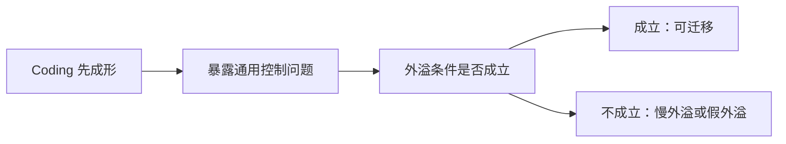
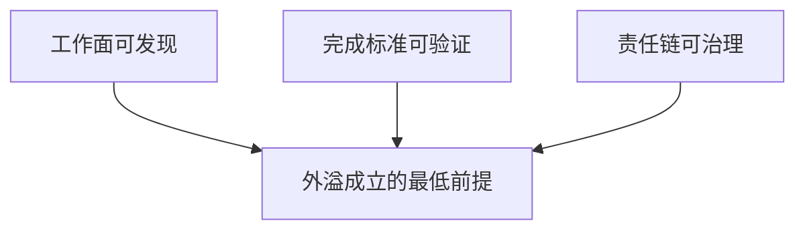
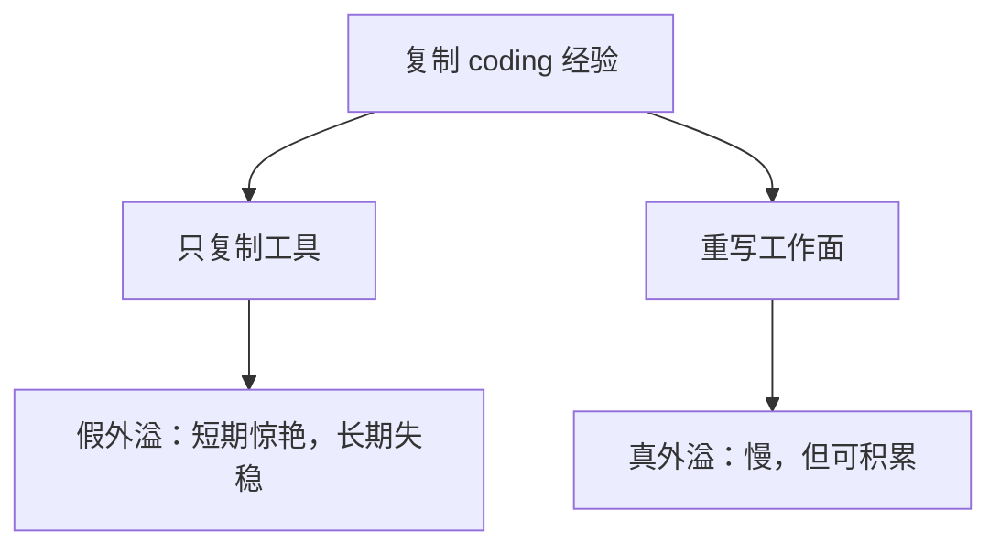

# 第六篇：超越 Coding 的泛化

把组织与治理问题收住之后，接下来就该追问另一件事：这套经验究竟能走多远。代码是这场变化最早长出清晰形状的地方。

这不是因为程序员比别人更懂 agent，而是因为代码天然更容易版本化、测试、差分、回滚。也因此，coding 最早把 harness engineering 的问题暴露出来。

但一旦离开 coding，问题就必须换一种问法。这里不再追问“它会不会外溢”，而要追问得更冷一些：**什么条件下它才会外溢，什么条件下它不会外溢，什么条件下它会以一种比 coding 更慢、更重、更制度化的方式外溢。**

这一章不是“万物皆可 harness”的乐观宣言，而是一篇条件分析。

本篇图示见图 6-1 至图 6-3。

**图 6-1 从 Coding 样板到跨域外溢的条件图**

这张图要表达的重点是：能外溢的不是某个表面场景，而是一组已经被工作环境支持起来的条件。coding 是最早的样板，不是最终的边界。

## 本篇证据骨架

| 本篇核心命题 | 主要证据 | 反向提醒 | 本篇要得出的判断 |
| --- | --- | --- | --- |
| coding 暴露的是一组通用控制问题 | OpenAI、Anthropic、LangChain 揭示的不是纯编码技巧，而是任务拆分、交接、验证、改进等问题（见参考文献[1]、[9]、[10]） | coding 先成形，不等于别的行业会按同样速度复制 | coding 是样板，不是模板 |
| 外溢依赖条件，而不是依赖口号 | App Server 说明 harness 会平台化；Anthropic 说明交接会骨架化（见参考文献[3]、[9]） | 缺少可验证工作面时，agent 可能拖慢而不是提速；METR 即是反例（见参考文献[11]） | 能外溢的不是“agent 很强”，而是“环境已足够可形式化” |
| 非 coding 的难点主要在环境，而不在智力 | 高风险领域普遍缺少 coding 那样天然的版本化、差分、测试和回放基础 | 如果忽略制度、审计和责任链，所谓泛化只会变成误用 | 未来真正稀缺的是领域化 harness，而不是抽象的通用激情 |

有必要先限定本篇的讨论范围。本篇并不声称研究、客服、法律、金融、医疗等行业已经像 coding 一样，被同样充分地证明。

更稳妥的判断是：coding 场景先把一组更一般的工程问题显影出来；其他行业能否吸收这些经验，取决于它们能否先把自己的工作面整理到足够清楚。

## 1. Coding 先说清楚了什么，又没有证明什么

如果只看近两年的热闹，很容易得到一个草率印象：既然 coding agent 已经能在某些环境里高吞吐产出，其他行业也只是时间问题。

这个判断有一半对，一半错。对的部分在于，coding 的确先把一组重要问题说清楚了；错的部分在于，这不等于其他行业已经被同样强度地证明。

coding 首先说清楚的，是 agent 进入真实工作后一定会遇到的控制问题。任务如何拆分，状态如何交接，工具如何接入，边界如何表达，完成如何判定，错误如何写回系统，这些都不是程序员私有问题，而是任何长任务 agent 迟早都会遇到的问题。

OpenAI 在内部使用 Codex 时，真正逼出来的不是“怎样让模型写函数”，而是怎样让仓库知识可发现、怎样让 agent 有 worktree、怎样让质量控制变成默认回路、怎样持续清理系统熵增（见参考文献[1]）。

Anthropic 在讨论长时程 agent 时，真正暴露出来的也不是某种编码技巧，而是交接、日志、清洁状态和恢复连续性的问题（见参考文献[9]）。

但 coding 并没有证明另一件事：这些机制可以无成本复制到一切行业。代码之所以最早成为样板，不是因为程序员更早懂 agent，而是因为代码工作天生拥有许多可形式化特征。变更可差分，结果可测试，错误可回滚，过程可回放，产物可版本化。

coding 率先成熟，不只是模型能力的胜利，也是工作环境本身更“适合被机器工作”的结果。

因此，这里要做的，不是把 coding 的成功外推成常识，而是把“coding 为什么能先成功”这件事拆开看。只有这样，后续关于客服、销售、法律、金融、医疗的讨论，才不会沦为“把几个行业名词填进同一张 PPT”。

## 2. 外溢真正依赖的三个前提条件

如果把前半本压缩成一句方法论，那么这里真正要补上的就是：**能外溢的不是场景，而是条件。** 从 coding 迁移到其他领域，至少要满足三个前提。

第一，工作面必须足够可发现。所谓工作面，指的是 agent 真正赖以行动的事实层：有哪些任务对象，哪些知识有效，哪些状态最新，哪些边界不能碰，哪些文档系统真的能找到。

如果一个团队的大量关键知识仍停留在会议、聊天、口头交代和老员工经验里，agent 就没有稳定上下文面。人类还能靠默契凑合，agent 几乎不行。

第二，完成标准必须足够可验证。coding 的好运，在于它拥有测试、lint、类型检查、运行回放这些近乎天然的验证机制。非 coding 领域也需要自己的“收据系统”。

研究工作要有证据链与引用可追溯，客服工作要有政策一致性与承诺边界，法律工作要有版本准确性与复核机制，金融工作要有时效、审计与授权一致性。如果一个行业无法回答“怎样才算系统可以停下”，它就还没有准备好大规模引入 agent。

第三，责任链必须足够可治理。很多行业并不缺工具，而是缺责任结构。谁能审批，谁能放权，谁对错误兜底，谁定义升级点，谁持有回滚权，这些问题一旦不清楚，agent 的效率就会变成组织风险。

第五篇已经说明，harness engineering 最后一定会走向团队与制度；到第六篇，这一点更重要，因为非 coding 场景里的风险成本往往比代码回滚高得多。

**图 6-2 外溢成立的三个前提条件**

这三个条件缺一不可。只有工作面，没有验证，系统会越来越会做事，却不知道何时该停。只有验证，没有责任链，系统会越来越会发现问题，却不知道谁能处理。只有责任链，没有工作面，系统会越来越谨慎，却始终干不了真正的活。

这里还要再补一个容易被忽略的判断：外溢首先不是按行业发生，而是按任务结构发生。

一个法务团队不一定准备好让 agent 进入正式签发链路，但可能已经准备好让 agent 做条款差异比对和引用回溯；一个客服团队不一定准备好让 agent 自主处理补偿，但可能已经准备好让它做知识检索、历史工单摘要和升级前信息整理。真正决定外溢先后顺序的，往往不是部门名字，而是任务结构本身。

一个更适合组织使用的粗分法是：

| 任务结构 | 先行可能性 | 最常见卡点 | 更适合先让 agent 承担什么 |
| --- | --- | --- | --- |
| 输入稳定、输出可验证、错误可内消 | 高 | 默认路径尚未写清 | 执行、回归、初稿、比对 |
| 输入分散、输出半结构化、错误可复核 | 中 | Context 与 Verification | 检索、整理、预检、交接 |
| 输入高度依赖隐性知识、输出直接形成外部后果 | 低 | Constraint、Responsibility、停机机制 | 辅助分析、证据聚合、风险提示 |

这张表真正想说的，不是哪个行业“更先进”，而是：很多转型失败，并不是因为模型太弱，而是因为组织把“最不该先做的任务”误认成了“最值得展示的试点”。

## 3. 为什么非 Coding 往往更慢、更重、更制度化

从这三个条件出发，就能看见非 coding 为什么通常不会像 coding 一样迅速起飞。问题不主要出在“模型不够聪明”，而在环境形式化成本远高于写代码。

研究工作的问题在于，材料来源往往不整齐，引用边界容易漂移，推断与事实之间的距离难以自动判断。客服工作的问题在于，知识库、用户历史、政策版本和权限边界往往分散在不同系统里，稍微错一点就可能把错误承诺直接带给用户。法律和金融的问题更明显：文本看起来像样，不等于结果可采信、可执行、可追责。医疗场景更进一步，错误代价高到很多“试试看”的工程习惯根本没有生存空间。

因此，这一章需要和第四、第五篇放在一起理解。离开 coding 之后，控制、验证、责任与制度的成本会同时上升。

非 coding 领域不是不能做 harness，而是要比 coding 更早面对审计、复核、签发、权限、升级点这些制度性要素。很多团队看到一个能自动起草回复、备忘录、分析的 agent，就误以为外溢已经发生；其实那往往只是自动生成发生了，harness 并没有真正建起来。

METR 的反例对这里尤其重要。它提醒我们，如果环境边界不够清晰、反馈不够强、工作面不够整理，agent 不但不会外溢成生产力，反而可能在真实熟悉环境中拖慢资深开发者平均 `19%`（见参考文献[11]）。

这并不是 coding 特有风险，而是所有低形式化场景都要面对的风险。

而 coding 的“好运气”恰恰也在这里。它之所以最早成熟，不只是因为模型先会写代码，而是因为它天然拥有五种对 agent 友好的环境特征：可差分、可回滚、可测试、可版本化、可治理。

改动能被看见，错误有机会在组织内部先吸收，状态能被记录，边界能被代码和规则表达，责任链也早已部分存在于 review、merge 和 ownership 里。

这五种“环境好运气”一旦被看清，就能解释为什么 coding 经验不能被轻率照抄。很多跨域失败，不是因为别的行业更笨，而是它们尚未拥有这些等价物。

第六篇真正想迁移给其他领域的，不是“写代码 agent 的做法”，而是这几种好运气背后的工程前提：差分、回滚、验证、版本化与治理纪律。

## 4. 同样的七层，落地成本为什么完全不同

第二篇已经提出，harness 可看作七层结构：Intent、Context、Tool、Constraint、Verification、Memory、Improvement。第六篇要补上的，是同样七层进入不同领域后，为什么成本结构会完全不同。

在 coding 场景里，Intent 往往可通过 ticket、issue 和 diff 范围较快落定；在法律或医疗场景里，Intent 本身就可能需要更多资格审核和责任定义。Context 在代码仓库中至少还有版本控制可依赖，到了客服、研究和运营场景，知识更新频率与来源一致性会更难。Tool 在 coding 中通常指 shell、browser、editor、CI；到了金融、法律、医疗，Tool 很快就和最小权限、审批链、日志留存绑在一起。Verification 在 coding 中还能靠测试先挡一层，在高风险行业里往往必须引入更重的人类复核。Memory 在长时程工作里同样重要，但非 coding 场景下的记忆容器往往更分散、更受权限约束。Improvement 在软件仓库里可通过规则、模板和评估快速回写，到了非 coding 场景，则更容易碰到制度升级慢、审批周期长的问题。

这意味着“同样的七层”不等于“同样的工程难度”。很多人会误以为只要七层模型足够通用，跨行业落地就只是替换名词。真实情况恰好相反：模型越通用，越需要正视每一层在不同领域的落地摩擦。

下面这张表更适合被理解成“落地摩擦图”，而不是行业结论图：

| 领域 | 最难结构化的层 | 为什么最难 | 一旦做成，最先释放的价值 |
| --- | --- | --- | --- |
| 研究 | Context / Verification | 来源质量参差、推断与事实边界模糊 | 更稳的证据链与更少的资料拼接 |
| 客服 | Context / Constraint | 政策更新快、历史记录散、越权风险高 | 更一致的承诺边界与升级点 |
| 销售 | Context / Memory | 商机状态变化快、交接频繁、话术容易漂移 | 更稳的跟进连续性与客户上下文继承 |
| 法律 | Verification / Constraint | 结果必须可采信、可复核、可归责 | 更快的草稿循环与更清楚的责任带 |
| 金融 | Tool / Constraint / Verification | 权限、审计、时效和风险要同时成立 | 更强的流程可追踪与更低的越权成本 |
| 医疗 | Verification / Constraint | 错误代价高、双签与指南约束重 | 更清晰的辅助边界与更强的留痕能力 |

这张表想表达的，不是哪一行最难，而是一个更稳的判断：**跨域竞争力不在“会不会套七层”，而在“能不能把本行业最难结构化的那一层先做出来”。**

## 5. 最常见的假外溢：复制工具，不复制工作面

组织谈“把 coding 经验复制到别的部门”时，最常见的误判不是想得太远，而是做得太浅。很多所谓外溢，其实只复制了若干工具入口，却没有复制真正工作面。

最典型的误区有三种。

第一种，是把 agent 当作更强聊天入口，而不是工作系统的一部分。这样做能带来短期惊艳，却不会带来稳定产出。

第二种，是只复制工具，不复制验证。部门里新接了一个 agent，能查资料、能起草、能调用几个系统，但没有完成定义、没有升级点、没有审计与回放。系统看起来“会干活了”，实际只是把原本隐性的错误暴露得更晚。

第三种，是只复制表面形式，不复制制度成本。coding 世界里看到 AGENTS 文档、评估、脚手架、日志，别的团队也照抄一份，却没意识到背后真正工作是把隐性知识改造成机器可工作的结构。

也因此，这一章把“平台化”与“制度化”放在一起讨论。OpenAI 的 App Server 之所以重要，不是因为它让 agent 多了一个接口，而是因为它暗示 harness 会从团队习惯上升为运行时和协议层（见参考文献[3]）。

一旦到了这个层级，复制就不再是“把某个工具装给另一个部门”，而是“这个部门是否有足够清楚的工作面，值得被平台化”。

**图 6-3 真外溢与假外溢的分叉图**

## 6. 三组跨领域 mini case：外溢最先卡在哪里

仅有条件和表格还不够。要看清外溢为何常常卡住，还需要把这些条件压回几个更接近工作现场的 mini case。

它们不是可核查公司的纪实案例，而是基于前文公开材料和不同行业共性抽象出的机制对照。它们的作用，不是证明某个行业已经成熟，而是让读者看清：**外溢在不同行业最先卡住的层，为什么完全不同。**

### Mini case 1：研究团队，卡在证据链而不是卡在写作

设想一个研究团队希望让 agent 接手“竞品扫描 + 文献综述初稿”。表面上看，这件事和 coding 很像：都有大量文本，都能分阶段，都能先生成草稿再让人 review。于是组织很容易高估这一场景，觉得它会像 coding 一样迅速起飞。

真正的阻力却很快出现，而且不在“文笔好不好”，而在证据链。Agent 当然能很快拼出一份看起来像样的综述，但团队真正要追问的是：

- 这段判断到底来自哪篇材料
- 这条引文是不是当前版本
- 这是事实概括，还是 agent 把两段相似论点混成了一条推断
- 这份摘要里，哪些地方可以引用，哪些地方只能拿来做检索入口

这时，研究场景最先卡住的往往不是 Tool，也不是简单 Context，而是 `Context + Verification` 的组合。工作面里最难的部分，不是“资料不够多”，而是“资料之间的可信边界没有被整理成系统可判断结构”。

只要这一点不解决，研究 agent 的速度越快，团队后面花在溯源、核对和纠偏上的成本就越高。

这类场景能外溢吗？当然能，但它最先释放的价值通常不是“完全自动完成研究结论”，而是：

- 更快地整理资料池
- 更稳定地生成证据链入口
- 把人工时间从搜资料转向判资料

研究的 harness 先成熟的，往往不是生成层，而是证据层。

### Mini case 2：客服团队，卡在政策版本和升级点，而不是卡在回复速度

客服是另一个很容易被误判的场景。很多组织第一次把 agent 接进客服，往往会被“回复速度”和“24 小时在线”吸引。

但客服系统真正难的地方，从来不是能不能更快说话，而是会不会在该升级时仍继续说下去。

假设一个客服团队把 agent 接进售后场景，让它处理账号邀请、组织加入、套餐权限和发票相关问题。表面上看，这些都属于高频问答，似乎非常适合外溢。但真正把系统拖慢的，是另外几件事：

- 政策版本在变，旧口径未必已经失效
- 用户历史散在 CRM、工单系统和内部 wiki 里
- 某些问题表面像权限问题，实则已经触到退款、补偿或法务承诺边界
- 同一句话在普通咨询里没问题，在高情绪投诉里却可能直接升级成风险

所以，客服场景最先卡住的，往往不是生成质量，而是 `Context + Constraint`。系统不是不会回复，而是不知道哪些政策当前有效，不知道哪些问题表面像 FAQ、实则必须升级给人。

到了这里，客服 agent 真正稀缺的能力也不是“更自然”，而是：

- 识别自己何时已经越过了自动处理边界
- 识别当前回答绑定的是哪一版政策
- 识别这一轮对话是否必须被转给人工

因此，客服场景里最值钱的外溢，不是“把人工客服整体替掉”，而是先把承诺边界、政策版本和升级点写成系统能执行的结构。客服 harness 先成熟的，不是表达层，而是升级层。

### Mini case 3：法务与金融团队，卡在可签发性，而不是卡在草稿能力

法务和金融场景最容易制造一种误解：agent 已经能起草得很像样，所以它离真正进入主流程只差一点点。

事实上，这类场景常常恰好相反：草稿能力成熟得很早，可签发能力成熟得很慢。

法务团队让 agent 起草条款对照、风险提示、合同摘要；金融团队让 agent 整理合规说明、风控复核建议、资金异常分析。表面上，产物都已经相当像专业文本，但组织真正要承担的是：

- 这份东西能否被正式引用
- 谁对其中的判断承担责任
- 审批链在哪里接入
- 留痕、审计、时间戳和版本回放是否足够

在这类场景里，最先卡住的通常不是 `Intent`，也不是简单 `Tool`，而是 `Verification + Constraint` 再叠加治理责任的组合。这里的“责任”不是第二篇七层之外的新第八层，而是第五篇讨论过的治理维度：谁签发、谁复核、谁留痕、谁承担后果。

系统甚至可能已经非常擅长生成“像样草稿”，但只要它还没有进入可复核、可审计、可签发、可追责的结构，就离真正组织外溢很远。

这也是为什么法务与金融场景往往不是“先提速、后治理”，而是“先治理、后提速”。与 coding 相比，它们会更早把制度成本推到前台。不是因为这些行业更保守，而是因为它们对错误后果的承受方式，本来就不同。

把这三组 mini case 并置起来，差异会更清楚：

| mini case | 表面看起来最像的问题 | 实际最先卡住的层 | 真正先释放的价值 |
| --- | --- | --- | --- |
| 研究 | 写得不够像样 | Context / Verification | 更稳的证据链与资料整理 |
| 客服 | 回复不够快 | Context / Constraint | 更清楚的政策边界与升级点 |
| 法务 / 金融 | 草稿还不够强 | Verification / Constraint / Responsibility | 更稳的留痕、复核与签发链 |

这张表要表达的不是“谁更难”，而是：**同样叫外溢，不同行业首先需要补的，不是同一块地基。**

## 7. 一个团队怎样判断自己是不是到了外溢准备期

组织更常追问的，其实是另一个问题：什么时候该开始，什么时候还不该开始？

这个问题如果没有答案，前面的条件分析就很容易重新落回“抽象正确”。

一个更有用的判断方式，不是问“我们想不想做”，而是问“我们现在有没有一条最小可行的外溢试点”。判断时可以先看五件事：

1. 这个任务有没有足够清楚、足够收敛的输入边界？
2. 它有没有至少一层能自动化或半自动化验证的完成收据？
3. 错误如果发生，能不能先在组织内部被发现和止损？
4. 这个任务最值钱的部分，是不是可以先拆成检索、整理、交接、比对，而不必直接让 agent 端到端自治？
5. 团队里是否已经有人明确持有暂停权、升级权和责任回写权？

如果这五个问题里有三四个答案仍然模糊，组织现在更该做的多半不是“上 agent 试试看”，而是“先把任务整理到值得试”。

反过来，如果这五个问题已经有基本答案，即使任务还远谈不上完全自治，也很适合先做最小外溢：让 agent 先承担资料整理、初稿起草、交接记录、异常预警和边界比对，而不是一开始就幻想它独立完成整条高风险链路。

因此，有必要把“准备期”单独说清。很多转型不是败在能力不够，而是败在时机判断失真：要么在工作面还没整理好时硬推，结果一地鸡毛；要么因为看见高风险，就把所有外溢机会一起推迟，错过其实已经可以先跑起来的低风险结构任务。

## 8. 哪些领域短期内就不该硬推

讨论到这里，就不能只讲哪里可能成功，也必须讲哪里短期内不该硬推。更冷一些看，最不适合硬推 agent 自治的，并不是那些表面上最传统的行业，而是同时满足下面几项条件的任务：

- 工作面高度依赖隐性知识，且短期内无意整理
- 输出一旦错误，就会直接形成外部承诺、资金动作、医疗建议或合规风险
- 没有稳定的升级点、审批链和暂停权
- 没有足够快的验证、回放和审计装置
- 任务负责人自己也说不清“什么叫完成”

一旦这五条里同时占到三四条，组织最该做的往往不是“先接一个更强 agent 试试看”，而是承认：这里还不是外溢准备期，而是环境建设前夜。

可以把“不该硬推”的场景先压成三类：

### 1. 直接外部签发型任务

例如直接发法律意见、直接发金融审批结论、直接给出医疗处置建议。这类任务的问题，不是 agent 能不能先生成草稿，而是错误后果无法留在组织内部消化。只要复核、签发和责任带没有被系统化，这类任务就不该追求高自治。

### 2. 高度依赖单个专家隐性判断的任务

例如只有极少数资深成员才知道如何裁断的风险判断、策略判断、例外处理。如果组织连“专家到底在看什么”都还没有整理出来，那么把 agent 接进去，多半只会放大切换成本和幻觉式自信。这正是 METR 反例最值得被跨域记住的地方：熟悉环境的人类优势，短期内不会自动被抹平（见参考文献[11]）。

### 3. 没有停机装置的高风险流程

任何不能清楚回答“谁能暂停、谁能回滚、谁能升级、谁能留痕”的流程，都不适合高自治。系统最危险的时候，不是完全不会做，而是一路做下去却没人能让它停。第六篇前面那条灰度险情之所以重要，就是因为它说明：控制能力不成熟时，越高频的执行，越容易把偏差扩散成事故。

因此，一个更冷、也更有用的结论是：**外溢不是“能不能上”的问题，而是“哪一类任务已经具备了被机器参与的最低制度条件”的问题。**

## 9. 真正稀缺的，不是通用激情，而是领域化 harness

读到这里，最该留下来的结论其实更冷。未来真正稀缺的，不会是“谁最会谈 agent”，也不会只是“谁最先接上最强模型”，而是“谁最早把本行业的知识、边界、验证和责任链整理成 agent 真能工作的环境”。

这意味着竞争会逐步迁移。早期竞争发生在模型能力和工具可用性上；中期竞争会迁移到工作面的形式化、验证系统的可靠性、责任链的清晰度和运行时平台成熟度上；更长期竞争则会迁移到领域化 harness 的制度厚度上。

谁更早把行业中的隐性知识重写成机器也能参与的环境，谁就更可能在 agent 时代形成真正持久的壁垒。

也正因为如此，第六篇的结论必须保持克制。眼下并没有足够证据说明所有行业都会像 coding 一样，成熟地进入 harness engineering。

已经能够确认的，是另一件更稳的事：coding 先暴露了一套通用控制问题，而其他领域能否吸收这些经验，取决于它们能否先把自己的工作环境整理到足够清楚。外溢当然会发生，但不会平均发生，更不会自动发生。

## 本篇小结

第六篇最终要保留的判断其实只有三层。coding 先成为 harness engineering 的样板，不是因为它代表全部工作，而是因为它最早具备可版本化、可验证、可回放的环境优势。外溢能否发生，也不取决于口号，而取决于三个前提：工作面可发现、完成标准可验证、责任链可治理。也正因为如此，非 coding 领域真正难的地方首先不是模型智力，而是环境形式化的成本。

所以，本篇最重要的结论不是“harness 一定会统治所有行业”，而是更冷的一句：**能外溢的不是场景，而是条件。** 真正的外溢，从来不是多装几个工具，而是先把一个领域的工作面、验证面和责任面重新做出来。把这层门槛说清之后，第七篇才有条件继续回答整本书最后的问题：这件事究竟真正改变了什么，又没有改变什么。
