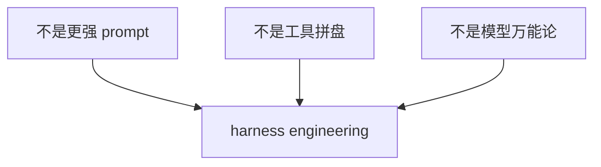
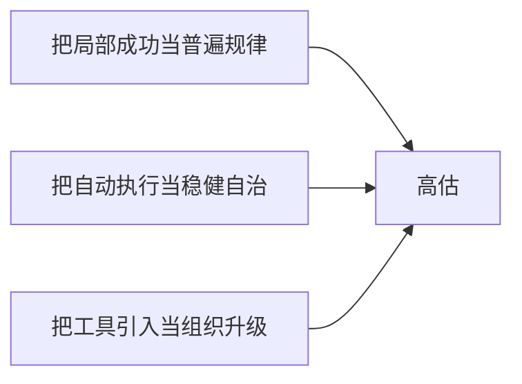

# 第七篇：批判、边界与未来

把外溢条件、制度成本和失效边界说清之后，讨论就该进一步收束。到了这一篇，判断的重心不再是继续展开，而是回答：哪些结论可被检验，哪些边界必须被承认，哪些风险需要被主动写进系统。

本篇将前述分析收束为五个问题：harness engineering 不是什么，它真正改变了什么，它最容易被高估在哪里，它最容易被低估在哪里，以及当工程环境成为竞争力后，工程师角色将如何重构。

本篇图示见图 7-1 至图 7-5。

**图 7-1 高估、低估与成熟判断的三角结构**

这张图强调的是判断方法，而非历史必然。对同一现象，成熟判断必须同时解释成功机制、失效机制与适用边界，否则只能形成立场对立，无法形成工程方法。

## 本篇证据骨架

| 本篇核心命题 | 支持证据 | 反向证据 | 本篇要得出的判断 |
| --- | --- | --- | --- |
| 它不等于“模型更强” | OpenAI、Anthropic、LangChain 均显示关键差异来自环境、交接、验证与约束（见参考文献[1]、[9]、[10]） | 若只看产能数字，容易误判为模型单点胜利 | 讨论对象是环境工程，而非模型崇拜 |
| 它真正改变的是工程重心 | App Server 显示 harness 正在上升为平台与运行时层；长时程 agent 显示交接与记忆已骨架化（见参考文献[3]、[9]） | 若只看表面做法，容易误判为“旧实践换名” | 变化发生在工作组织方式，不仅发生在工具层 |
| 它同时存在高估与低估风险 | OpenAI 的高度整理环境解释了成功，METR 解释了失效边界（见参考文献[1]、[11]） | 若只取顺风或逆风案例，判断会系统性偏斜 | 成熟方法论必须同时解释增长曲线与失效条件 |

## 1. 它不是什么

首先需要完成概念排误。Harness engineering 不是 prompt engineering 的包装升级，不是工具采购清单，也不是“模型足够强后工程问题自然消失”的推论。

前文证据已经显示，团队间结果差异的主因并非模型本身，而是模型被置入的工作环境。OpenAI 案例中，决定系统上限的并非单次生成能力，而是 repo-local docs、默认路径、评估回路、worktree、持续清理等环境要素（见参考文献[1]）。Anthropic 的长时程经验同样表明，若缺少交接、日志、状态恢复与会话连续性，模型能力无法稳定兑现为产出（见参考文献[9]）。

因此，这里讨论的核心不是“更强模型是否替代人”，而是“在模型进入真实流程后，哪些环境变量开始主导结果”。这一判断将“单次生成质量”降为必要条件之一，并将“系统可运行、可验证、可治理”提升为决定条件。

从方法论角度看，这里至少要排除三类常见混淆。第一类混淆是把“模型进步”与“系统成熟”视为同一变量，忽略两者时间尺度与责任结构的不同。第二类混淆是把“工具可用性”与“组织可用性”视为同一结果，忽略知识整理、权限控制和回滚治理的建设成本。第三类混淆是把“局部样例成功”与“全局流程稳定”视为同一结论，忽略失效条件、边界任务与灰度风险在现实中的权重。若不先排除这三类混淆，本章后续判断会被反复拉回“模型强弱”这一单轴叙事。

**图 7-2 它不是什么**

## 2. 它真正改变了什么

它改变的不是“是否还需要实现”，而是“工程优势的形成位置”。在传统语境中，优势主要来自个体实现能力；在 agent 语境中，优势逐步迁移到环境塑形能力，即把目标、知识、边界、验证与反馈写成可执行系统。

这一迁移已开始体现为平台层变化。App Server 说明 harness 不再局限于团队内部经验，而正在进入运行时、协议与多端共享能力（见参考文献[3]）。一旦进入该层级，工具接入、状态交接、审批表达、验证回路便不再是外围流程，而成为生产结构本体。

从软件工程史看，这一变化更接近版本控制、CI、代码审查带来的结构升级：它们并未改变“代码”概念本身，却重写了代码生产、协作与质量判定方式。Harness engineering 的历史位置与之相似，它重写的是任务组织方式，而非任务对象本身。

因此，本章保留的核心判断是：它真正改变的，不是模型是否能够行动，而是工程环境首次被系统化设计为“人机共同执行”的生产对象。

进一步说，这一变化具有明确的制度后果。过去，工程治理主要围绕“人如何协作”；现在，治理对象扩展为“人机如何协作”。治理扩展带来的不是流程叠加，而是工程语义变化：完成定义要能被执行系统识别，审批边界要能被运行时执行，复盘结论要能被默认路径继承。也正因此，harness engineering 的关键价值并不在于提出一个新名词，而在于把“环境本体化”这一结构变化写成可操作框架。

**图 7-3 它真正改变了什么**

## 3. 它最容易被高估在哪里

第一类高估，是把高度整理环境中的成功外推为无条件规律。OpenAI 的成功本身并不虚假，但其成立前提是高强度环境重写。如果忽略这一前提，仅保留“高产能结果”，就会将条件化成功误读为普遍结论（见参考文献[1]）。

第二类高估，是把自动执行等同于稳健自治。系统可以执行动作，并不意味着系统具备停机判断、升级机制与责任交还能力。缺少验证与控制结构时，自动化只会更快扩散偏差。

第三类高估，是把工具引入等同于组织升级。工具采购解决的是入口问题，组织升级解决的是工作面、验证面与责任面的重写问题。两者之间隔着制度成本与治理工程，不可相互替代。

METR 的反向证据使上述边界具备经验重量：在真实熟悉仓库场景中，资深开发者使用 2025 年初 AI 工具平均慢 `19%`（见参考文献[11]）。这一结果并不否定前述成功，而是要求方法论必须同时解释“何时变快”与“何时变慢”。

这三类高估的共同结构，是把“条件化结论”误写为“无条件结论”。方法论一旦发生这种误写，就会在实践中形成两个连锁后果：其一，组织会把失败直接归因于模型版本，延后对环境问题的真实修复；其二，组织会将治理投入视为“可选优化”，而非“上线前提”。从传播效果看，这种误写短期有利于动员，长期却会导致对方法论本身的信任折损。

**图 7-4 它最容易被高估的三处**

## 4. 它最容易被低估在哪里

低估通常发生在“表面相似性”上。文档、规则、测试、日志、平台并非新事物，因此容易产生“只是旧实践延续”的判断。问题在于，执行者结构已经改变：这些实践不再仅服务人类协作，还必须服务机器执行。

这一变化会直接改写实践形态。文档从“可读叙述”转为“可发现入口”；规则从“经验约定”转为“可执行约束”；日志从“事后排障材料”转为“运行中恢复与纠偏信号”。对象变化导致方法变化，方法变化再反向改写组织结构。

App Server 与 Anthropic 的证据共同表明，当前被低估的不是某一技巧，而是工程环境本身正在产品化、平台化、制度化（见参考文献[3]、[9]）。这意味着未来竞争不只发生在模型调用层，而将持续迁移到环境治理层。

在组织实践中，这种“低估”通常表现为三种症状。第一，团队投入大量时间优化提示模板，却不投入时间建立高质量工作面。第二，团队对单次演示结果高度敏感，却对验证链路和责任边界长期缺位保持容忍。第三，团队把环境治理看成“支持部门工作”，而非“核心生产能力建设”。这些症状并不来自认知错误本身，而来自旧工程分工尚未完成对新执行结构的适配。

## 5. 当工程环境变成产品，工程师会变成什么

工程师不会因 agent 强化而退出现场，但其核心价值将从“局部实现完成度”扩展到“系统运行可持续性”。实现能力依然是地基，差异在于能力作用点上移：从写对一次，转向让系统持续写对。

这将推动岗位重心分化，例如 agent 平台工程、评估工程、知识系统工程、环境设计与治理工程。名称未必统一，但共同方向明确：工程师角色将由单一实现者扩展为工作系统设计者与维护者。

这一迁移并不降低技术要求，反而提高综合要求。缺少实现理解、边界意识、故障经验与治理判断的环境设计，最终会退化为纸面秩序，无法承载真实生产。

在能力结构上，可进一步区分三层。第一层是“实现层能力”，即代码、架构、性能、故障定位等传统硬能力；第二层是“系统层能力”，即任务建模、执行约束、验证回路与运行时观测；第三层是“组织层能力”，即职责编排、授权设计、升级机制与复盘回写。未来稀缺性将更多出现在第二层与第三层的耦合能力上，而不是单层极值。

这意味着工程师职业路径也会出现新的分叉：有些人会在实现层持续深耕，有些人会成为环境与治理层的“杠杆角色”。两者并非替代关系，而是新的协同关系。真正高绩效团队，不是“只剩系统设计者”，而是能让实现层与系统层相互放大的团队。

**图 7-5 从实现者到工作系统设计者**

## 6. 再往前看：五条定律与十年预测

关于未来的讨论如果只停在阶段性观察上，很快就会过时。更稳妥的方式，是把它落成可被未来检验的结构判断。基于前文证据，可以先提出五条工作定律：

1. 当执行者规模扩张后，验证会先于生成成为瓶颈。  
这条定律的含义是，系统能力每上升一阶，组织都会更早追问“何时应当停止”，而不是继续追问“还能否再生成一些内容”。生成能力的边际收益递减，验证能力的边际收益递增，这是执行系统成熟过程中的常见结构特征。

2. 不能被机器发现的知识，在执行层面等同于不存在。  
这不是知识论判断，而是操作性判断。信息若不能被发现、引用、更新、校验，就无法进入执行链路，最终只能停留在“组织知道”而非“系统可用”的状态。前文关于 repo、文档入口、知识地图的讨论，都指向这一点。

3. 自动执行本身不会首先破坏工程，失控默认路径才会。  
多数系统性事故并非来自“模型突然失常”，而来自默认路径将局部偏差快速复制。默认路径若未被约束、验证和回退机制包围，执行速度越快，扩散半径越大。这一规律在 coding 场景与非 coding 场景中都成立。

4. 自治上限首先受交接能力约束，而非受能力上限约束。  
长时程任务里，“会做”与“做得完”之间隔着交接结构。若状态不可恢复、阶段不可继承、失败不可解释，即使单轮能力很强，系统也会在多轮任务中表现为断裂。Anthropic 的证据对这一点提供了直接支持（见参考文献[9]）。

5. 长期竞争力将先沉淀为环境质量，而不仅是模型强弱。  
短期竞争可以依赖模型红利，长期竞争必须依赖环境沉淀。所谓环境沉淀，不是文档数量，而是知识可发现性、规则可执行性、验证可复用性与责任可追溯性的持续累积。

据此可形成十年期方向判断：仓库将继续演化为执行载体；测试将扩展为执行系统验证；岗位会向环境、评估与知识分化；事故复盘语言会从“代码错误”转向“控制失效”；组织分水岭将更多体现为环境重写能力差异。

这些预测不保证逐条成立，但每一条都必须附带可证伪信号。若信号长期缺失，判断就应当被修订，而不是被修辞性维持。

| 预测 | 接下来 `3-5` 年应出现的可观察信号 | 若未出现，意味着什么 |
| --- | --- | --- |
| 仓库会继续演化成 agent 的操作系统 | 更多团队把任务模板、边界文件、交接工件、验证入口和默认命令写回 repo，而不是散落在聊天记录和口头默契中 | “repo 作为操作系统”被高估，工作面可能转移到其他承载体 |
| 测试会扩展为“验证执行系统” | 除单元测试和集成测试外，团队开始把 grader、trace 检查、灰度停机条件、授权带校验纳入自动回路 | 验证体系尚未从代码层上升到执行层，该判断需收窄适用范围 |
| 关键岗位将围绕环境、评估与知识分化 | 平台、DevEx、AI 平台、知识工程、评估工程等职责开始稳定分配 | 角色分化尚未制度化，可能仍停留在前沿团队临时配置 |
| 事故复盘会先追问控制结构 | 复盘更频繁追问停止条件、审批边界、交接失败、观测缺口，而非仅追问“哪行代码错了” | agent 尚未进入足以改写事故语言的生产中心 |
| 分水岭会先出现在环境重写而不是模型接入 | 相近模型条件下，团队结果差异更多归因于知识结构、验证闭环与治理能力 | 模型差距仍压倒环境差距，环境复利判断可能偏早 |

## 7. 哪些不会变

关于未来判断，必须设置一组不变量作为校准。新执行者进入后，若将既有工程底线视为可废弃项，最终会导致治理失真。以下五条在可预见期内仍成立。

第一，边界约束不会消失。目录边界、权限边界、职责边界与灰度边界仍是复杂系统稳定性的前提；执行速度越高，边界越需要前置与明确。边界不是降低效率的装置，而是效率可持续的前提条件。没有边界，系统只能在短期吞吐中透支长期恢复力。

第二，回滚、值班与责任归属不会消失。系统行动能力增强后，暂停权、回滚权、升级权与责任回写权的重要性上升，而非下降。组织如果没有把这四类权力写清楚，任何“自动化升级”都可能在关键时刻失去控制手柄。

第三，清晰结构优先于局部聪明。可交接、可验证、可维护的结构，在长期上将持续优于高度依赖个人记忆的技巧性结构。对执行系统而言，短期聪明写法往往意味着长期不可继承写法；系统越依赖继承，结构清晰度越成为硬性约束。

第四，失败仍是系统升级的主要来源。变化只在于失败必须更快沉淀为规则、模板、检查项与退出条件，而不能停留于口头复盘。未来的复盘有效性，不取决于复盘会议质量，而取决于回写动作是否进入了下一次执行默认路径。

第五，实现理解仍是工程核心能力。环境设计并非脱离技术的管理活动，而是把技术判断上移到系统层。缺少实现理解的环境治理，最终会把抽象规则写成错误规则，造成“制度在场、能力缺席”的结构性问题。

因此，关于未来的主张并不否认传统工程底线；相反，它要求这些底线以更制度化、结构化、机器可执行的方式继续存在。

## 8. 若预测偏离现实，最先需要修正什么

可持续的方法论必须同时给出“方向判断”与“修正条件”。在这一框架内，最可能先被修正的通常不是高层结构逻辑，而是以下三类具体判断。

第一类是载体判断。例如何种介质承载工作面，是否仍以 repo 为主。未来完全可能出现更强的任务运行时或知识平面，承接原本放在仓库中的部分能力。若出现这种迁移，需要修正的是载体形式，而不是“可发现性”这一结构命题。

第二类是节奏判断。角色分化、制度化与平台化推进速度可能慢于预期。技术可行不等于组织可行，组织可行也不等于预算可行。很多能力会先被现有岗位吸收，而不是快速形成新职位名称。

第三类是组织形态判断。能力内建比例可能受行业、规模与监管环境显著影响。部分企业可能长期采用“平台主导 + 关键边界内建”的混合路径，而非全内建或全外包。

此外，还需警惕实践层“细节固化”风险：部分当前有效做法会被模型能力跃迁快速替代。可以保留的应是结构问题本身，而非某一代具体实现细节。将细节上升为原则，会使方法论在技术迭代中失去弹性。

因此，若未来需要修正第七篇，首先修正的应是形态、节奏与载体层判断；相对稳健的仍是高层结构命题，即验证瓶颈、知识可发现性、默认路径风险、交接上限与环境复利。

## 9. 未来组织不会长成同一种样子

即使总体方向成立，组织形态也不会收敛为单一模板。至少会出现三类稳定路径。

第一类，内建型。组织将环境能力作为核心生产力，持续建设知识平面、任务模板、验证链与运行时能力。这类组织通常出现在工程密度高、历史系统复杂、迭代压力大且对差异化要求高的场景。其优势是控制面完整、迭代自主性高；代价是建设成本与治理门槛高。

第二类，平台借力型。组织依托外部平台，但保留领域知识组织、关键验证、授权边界与事故拉闸权。这类路径最可能成为多数企业的现实均衡：在基础能力上利用平台效率，在关键控制点上保持组织主权。

第三类，外包错觉型。组织采购大量工具，但未重写知识结构、默认路径与责任边界。该路径常见于早期冲刺阶段：短期增速可见，长期壁垒不足，且在关键故障情境中容易暴露“解释权缺失”与“恢复权缺失”。

三类路径的分界不在“接入了多少工具”，而在“是否保有工作定义权”。未来分水岭将主要表现为环境能力是内建、半内建还是高度外包。

这也意味着“环境质量先于模型强弱形成竞争力”并不等同于“所有组织都要自建完整平台”。更准确的表述是：无论平台能力多强，决定差异的关键环境能力必须由组织自身掌握。

## 10. 工程师首先会在哪些能力上分化

角色分化将首先出现在以下三类能力。

第一类，把模糊任务写成可执行对象的能力。其核心是任务结构化、收口定义、升级条件与默认路径设计。该能力决定系统是否能够“接得住任务”，而不仅是“跑得动命令”。

第二类，把局部经验写成环境规则的能力。其核心是将个人判断沉淀为 lint、测试、模板、审批门与脚手架。该能力决定组织是否能够把个体经验转化为可复用资产。

第三类，边界与事故判断能力。其核心是在不确定状态下做停机、放行、升级与回写决策。该能力决定系统是否能够在高压状态下维持治理秩序，而不是把复杂性留给事后补救。

与之对应，单纯依赖局部手工实现、且缺少知识外化与路径复用能力的工作方式，将难以单独构成长期稀缺性。局部实现能力仍有价值，但其价值越来越依赖于是否能够进入组织级系统复利。

因此，工程师不会退出，但“稀缺性定义”会改变：从“局部实现速度”转向“系统持续正确率”。

## 11. 五个自检问题：跨版本校准清单

若把 harness engineering 当作工程方法，而不是术语标签，就需要一组跨版本、可重复使用的校准问题。以下五问，可作为周期性自检：

1. 关键知识是否已被写成系统可发现的事实，而非主要分布在熟手记忆中？
2. 关键任务是否具有明确完成收据，而非依赖“差不多可上线”的默契？
3. 险情发生时，暂停权、回滚权与规则回写责任是否明确？
4. 同类错误是否正在转化为模板、测试、lint 或审批边界，而非重复口头提醒？
5. 模型替换后，团队能力是否仍可保持；若不能，依赖是发生在能力层还是供应商默认层？

这五问的用途不在于追求“立即满分”，而在于建立稳定的识别框架：组织当前是在“用更强工具做旧工作”，还是在“把工作本身重写为可持续的工程系统”。前者可以获得短期效率，后者才能形成长期竞争力。

更具体地说，这五问完全可以作为季度复盘模板使用。若连续两个周期只有“速度指标改善”，却没有“规则沉淀增加、恢复能力增强、责任边界清晰化”，组织就该警惕：自己也许仍停留在工具层提效，而没有进入系统层升级。

本篇可以收束为一句话：**决定长期上限的，不只是模型能力，而是被写成系统的工程环境。** 但一句判断若要站住，最后仍要回到现场。
