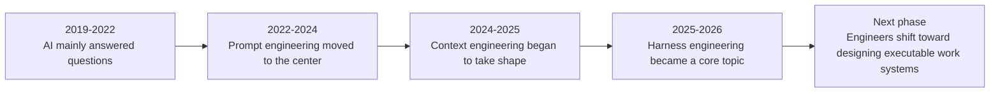
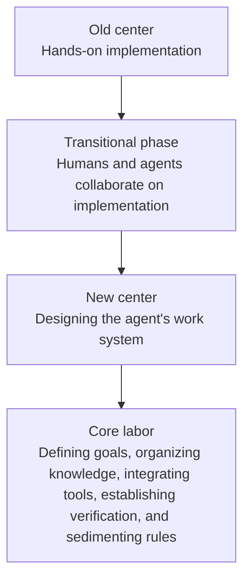

# Prologue: After We No Longer Write Code by Hand, What Remains for Engineers?

## 1. A Question We Can No Longer Avoid

See Figures 0-1 and 0-2 in this chapter.

Over the past decade, software engineers have had a broadly stable understanding of themselves. We proved our value by writing implementations, reading systems, fixing bugs, refactoring, and aligning team collaboration.

Even as job specialization became more detailed, that central image did not change: an engineer was, first of all, someone who personally built complex things.

But once agents began to enter real development workflows, that image was quietly unsettled. Code implementation, test scaffolding, documentation patches, simple regressions, fault reproduction, and localized fixes—more and more steps that once depended on human hands began to be handed over to models.

The change is uneven and far from complete, but the direction is already clear.

Viewed side by side, two public scenes make the change especially sharp.

At the beginning of 2026, OpenAI described how a small team, under nearly extreme constraints, used Codex to build an internal beta product. Much of the application logic and infrastructure code was no longer written by hand.

At the same time, METR ran randomized controlled experiments with senior open-source developers deeply familiar with their own repositories and got the opposite result: in real projects, early-2025 AI tools made developers slower by an average of `19%`.

These two scenes matter not because one side is right and the other wrong, but because they move the question from whether models can write code to what kind of engineering environment amplifies a model into productivity, and what kind of environment turns it into additional friction (see References [1] and [11]).

That leads to a question that is becoming harder and harder to avoid: if more and more code itself is produced by agents, what remains for engineers?

**Figure 0-1. The shift from prompt engineering and context engineering to harness engineering**

What this timeline expresses is not only a change in terminology, but a shift in the center of work: from whether a model can answer, to how to ask the question correctly, and then to how to make a model truly work in a complex environment.

It is precisely within this transition that harness engineering moves to the center (see References [1], [6], [7], and [8]).

## 2. First, a Small Case That Will Run Through the Whole Book

To keep the later discussion from remaining at the level of abstract claims, this book repeatedly returns to a synthetic case. It is not an actual internal record from any one company, but a typical team scene abstracted from public materials by OpenAI, Anthropic, LangChain, METR, and others.

Imagine a SaaS team of about twenty people maintaining an enterprise collaboration product. They are preparing to let an agent take over a task that does not look very large: redesigning the login and invitation flow. The business requirements are not especially complex, but the constraints are numerous:

- Add `magic link` login
- Preserve compatibility with the existing SSO flow
- Do not touch the billing module
- Fill in the end-to-end tests
- Ship within two weeks

The team's first reaction is natural: give the agent as complete a prompt as possible. The result is unsurprising. In the first round, the agent fixed the page but missed a boundary condition in the invitation flow. In the second round, it filled in the logic but failed to wire in the regression tests. In the third round, it finally got the main path running but touched a shared authentication module that should not have been modified. Each time it felt like it was almost correct, and each time a human had to step in and patch the gap.

The significance of this case is that it is small enough to look like an ordinary task a typical team could encounter today, yet complete enough to bring out almost every question the rest of the book will address.

How should the task goal be written clearly? Where should the background information live? Which tools can the agent use? What must not be changed? How do we prove that the task is really done? How is work handed over when execution stretches across multiple rounds? How do we ensure that pitfalls already encountered are not repeated? All of these questions surface one by one inside this small case.

If compressed into one short sentence, the point is this: getting a system to start working is not hard; the truly hard part is making it finish work reliably.

## 3. Why the Old Question Is No Longer Enough

Much public discussion still focuses on whether AI will replace programmers. It is, of course, a compelling question because it touches professional anxiety, industrial narratives, and the imagination of the era.

But from an engineering perspective, it increasingly looks like a question pointed in the wrong direction.

The change that really carries weight has never been simply that there is now a model that can write code. It is that the task itself is beginning to be reorganized.

Once models begin to read repositories, call tools, run tests, modify files, and continuously receive feedback, the most important labor in software engineering moves upward. It is no longer expressed only in how beautifully a piece of code is written, but increasingly in whether goals are clearly defined, whether knowledge is discoverable, whether tools form a closed loop, whether boundaries are encoded, whether verification is fast enough, and whether failures can be turned into rules.

So the most worthwhile question today is no longer whether a model can write, but whether the system can make it write reliably.

That is also why this book uses harness engineering as its overall framework. It is concerned not with a single prompt, but with the entire worksite that surrounds the prompt.

If the distinction must be stated in the shortest possible way, it can be remembered like this:

- `prompt` is one instruction
- `context` is a stack of materials handed over
- `harness` is the organization of people, materials, permissions, tools, verification, and escalation paths into a worksite

And for that reason, a single instruction is not enough to manage a new colleague, and a single prompt is not enough to manage an agent.

## 4. Engineers Have Not Disappeared; Their Work Has Moved Upward

This judgment is the easiest to misunderstand. The moment many people hear that the role of the engineer is shifting, their first reaction is: will the future consist only of people who write prompts and review AI drafts?

That understanding is far too shallow.

Engineers have not disappeared. If anything, they look more like system designers. In the past, engineers wrote judgment into implementation. Now, more and more judgment has to be written into the environment.

In the past, your taste showed through in a piece of code. Now it may show through in task templates, directory structure, knowledge entry points, structural rules, evaluation scripts, test chains, and rollback paths. Technology has not left the stage; it has shifted from local implementation to the working system as a whole.

That is why what is truly striking in the public materials from OpenAI, Anthropic, and LangChain is not the productivity numbers, but the one thing they all point to: once teams seriously invest in documentation, task templates, default paths, graders, progress logs, and cleanup mechanisms, the influence of engineers is no longer expressed merely as “this time I personally wrote it correctly,” but as “next time the system is more likely to write it correctly on its own” (see References [1], [9], and [10]).

Engineers increasingly arrange the worksite rather than personally completing every step.

**Figure 0-2. The engineer's role shifts from “hands-on implementation” to “designing the work system”**

## 5. How the Book Unfolds from Here

The path ahead is actually simple: first establish the coordinates of language, then break apart the structure, then enter the engineering worksite, the control system, and organizational reality, and finally return to the conditions of spillover and the book's ultimate judgments.

What this book tries to answer is not how to write prettier prompts, but how software engineering is reorganized once agents truly enter the workflow.

## Chapter Summary

The prologue does only one thing: it establishes the problem. The most important question today is no longer whether models can write code, but what kind of working environment can let them produce artifacts reliably.

The next part begins by building the language coordinates for this change, so that the structure, cases, and judgments that follow do not collapse back into the old vocabulary.
