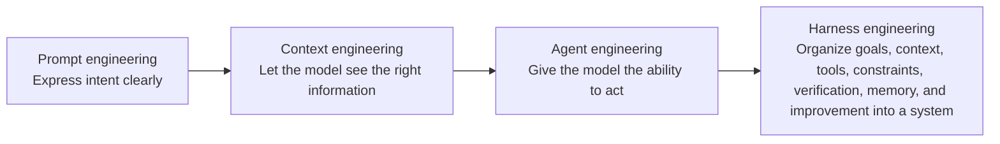
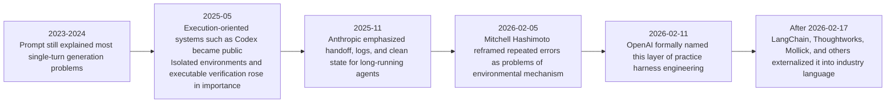
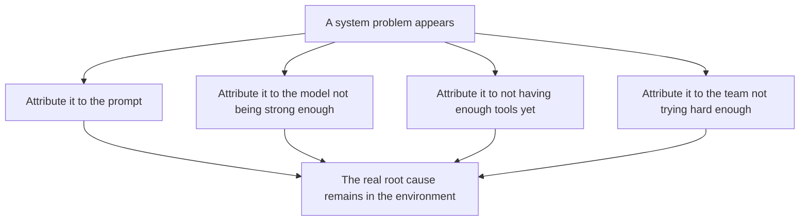
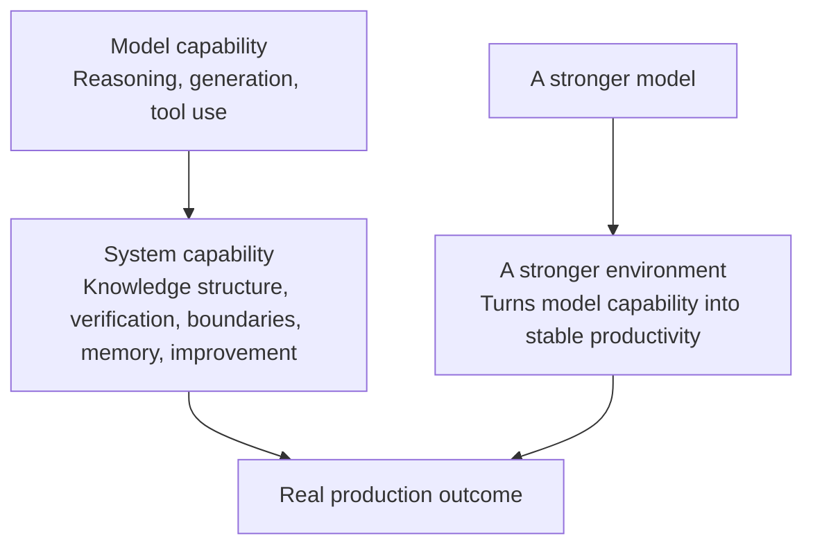

# Part I: Terms, Origins, and Paradigm Shifts

When a change truly begins to enter reality, what changes first is often not the tools, but the language.

The old vocabulary is still there, yet people feel with increasing frequency that it is no longer sufficient. The problem clearly lies in knowledge entry points, verification loops, handoff structure, and responsibility boundaries, but teams still use prompt quality, the number of tools, and model strength to explain success and failure. Once language falls behind, solutions fall behind with it.

That is the problem here: why do the old words begin to fail, why are new ones forced into being, and why does the center of gravity move from the performance of the model itself to the organization of the system?

Before methodology appears, the coordinates must first be set.

See Figures 1-1 through 1-4 in this part.

**Figure 1-1. The relationship among Prompt, Context, Agent, Workflow, and Harness**

The key point in this diagram is not sequence, but the expansion of problem scope. Prompt engineering mainly solves expression; context engineering handles visibility; agent engineering gives the model agency; harness engineering tries to place all of those capabilities inside a whole that is runnable, verifiable, and governable.

## Evidentiary Skeleton of This Part

| Core claim of this part | Main evidence | Counter-evidence or boundary | Judgment this part aims to reach |
| --- | --- | --- | --- |
| Prompt is no longer enough to explain success or failure with agents | OpenAI, Anthropic, and LangChain all shift the center of attention to environment, verification, handoff, and tools, not just prompts | METR reminds us that even with AI tools, real production may initially become slower | The debate is shifting from how to ask to how to build the system |
| Harness first emerged in engineering practice and was only later named | Mitchell Hashimoto's practical reflections and OpenAI's internal practice both show trial-and-error first and abstraction later | If one looks only at terminology history, it is easy to miswrite it as “a word invented by an article” | Harness engineering is an engineering language forced out by reality |
| The same model can perform very differently depending on the system | LangChain raised scores significantly with the same model by changing only the harness | METR shows that tacit knowledge inside familiar repositories can weaken the gain | Model capability still matters, but system capability is beginning to dominate production outcomes |

## 1. When the Old Words Begin to Fail

Prompt engineering still matters today, but its explanatory power has begun to shrink. It excels at expression problems: how to help the model understand intent more precisely, how to reduce ambiguity, and how to use few-shot examples to pull output closer to a target. As long as the task stays within the boundary of single-turn Q&A, a code completion, or one-shot generation, these techniques explain most success and failure.

Real work is not like that. Real work is always multi-step: understanding goals, finding background, calling tools, modifying objects, observing feedback, verifying outcomes, and, if necessary, continuing across several stages. Once a task crosses those steps, prompt quickly retreats from being the main variable to being one variable among many.

The reason is simple. A prompt can answer only what I want you to do. By itself it cannot answer several harder questions: what can you see, what can you touch, how do you know you did it correctly, and how do you recover after failure? The first pair belongs to context and tools; the latter pair belongs to verification, memory, and improvement. Together they form the agent's real working system.

That is why many teams eventually share the same feeling: the marginal return of polishing prompts keeps declining, but once they redesign knowledge entry points, task templates, test chains, and feedback loops, the overall quality rises substantially. Language has not ceased to matter; it has been absorbed into a larger structure.

So it is not quite accurate to say that prompt engineering is outdated. A more precise statement is that it is no longer sufficient, by itself, to explain the production problems of the agent era. It is still part of the entrance, but it can no longer constitute the entire explanation on its own (see References [1], [9], and [10]).

## 2. A Clearer Timeline

The easiest way to miswrite the history of terminology is to turn it into a story in which one person invents one word on one day. What truly drives terminological change is usually not invention, but mismatch. As long as the old words still explain the situation, new ones do not really stabilize. Only when reality repeatedly overflows the boundary of the old vocabulary do new terms slowly grow from informal feeling into a shared engineering language.

That is why Part I cannot consist only of a definition table. It must also explain when engineering teams began to feel consistently that prompt was no longer enough, tool use was no longer enough, and even workflow was no longer enough. Only once this timeline is established can readers understand that harness engineering is not simply a more fashionable phrase, but the result of long-accumulated engineering pressure.

If we line up the most important public materials from the last few years, we roughly see the following shift:

**Figure 1-2. The pressure timeline from prompt to harness**

What matters most in this timeline is not the final name, but how the pressure accumulated step by step before that. After systems like Codex became public in 2025, engineering teams encountered a new reality at scale for the first time: the model was no longer merely answering questions, but reading repositories, calling tools, running verification, editing across files, and entering a stateful runtime environment. At that point, many problems that had previously been covered over by a single prompt surfaced all at once: whether directory information was discoverable, whether default commands were correct, whether tests were fast enough, whether failure could be recovered from, and whether permissions and boundaries were written clearly (see Reference [2]).

By the end of 2025, Anthropic's discussion of long-running agents pushed another layer of problems to the foreground. Even when the model performed well on one task, the longer the task ran, the more the system exposed the importance of handoff, progress logs, clean state, and thread continuity. The question was no longer whether the model could do the work, but whether the system could enable it to continue, hand off, and recover (see Reference [9]).

In early 2026, Mitchell Hashimoto explained the shift in more grounded language: when an agent repeats the same mistake, the most worthwhile thing to do is not to keep complaining about the model, but to write the mechanism that prevents the next recurrence into the environment. That move may seem plain, but it marked an important turn: error was understood for the first time not only as model failure, but as the environment's failure to sediment experience into mechanism (see Reference [6]).

A few days later, OpenAI explicitly named this layer of change and showed how far it had already grown internally: not just prompts and tools, but repository structure, documentation layout, evaluation loops, worktrees, observability, background cleanup, and default paths were all being designed together as a working system (see Reference [1]). After that, LangChain used benchmark evidence to show that holding the model constant while changing only the harness could produce a substantial score jump. Thoughtworks decomposed the idea again into context, constraints, and garbage collection. Mollick carried harness into a broader discussion of agent use (see References [7], [8], and [10]).

So if the history of the term is written accurately, it should not read as “who invented harness engineering,” but rather as this: **engineering reality kept colliding with a class of problems the old vocabulary could no longer explain, and only later did it finally find a word capable of containing them.** That is also why this book places terms, origins, and paradigm shift in a single part rather than discussing them separately. They are, in fact, the same thing.

## 3. How Harness Engineering Was Forced into Being

Important concepts are rarely invented first by theorists and then executed faithfully by engineering teams. Harness engineering emerged in the opposite way: engineering teams first ran into the same class of problems in real work and only gradually needed a larger word to gather those scattered responses together.

These problems were all concrete. The model looked intelligent in a single turn, yet easily lost focus when entering a real repository. A single output looked good, yet once the work crossed sessions it began to lose continuity. At first the model seemed helpful, but once scale increased it kept replicating bad patterns. Teams gradually realized that the problem was not just the model, but everything around the model: whether knowledge was discoverable, whether tools formed a closed loop, whether tests were fast enough, whether boundaries were clear enough, whether error messages were useful enough, and whether the system could observe the agent's intermediate behavior.

When Mitchell Hashimoto reflected on his AI adoption journey in early 2026, he articulated this intuition in a very plain way: when an agent repeats the same mistake, what is worth doing is not continuing to complain about the model, but writing the mechanism that prevents the next occurrence into the environment. That mechanism might be `AGENTS.md`, a verification script, a directory guide, or a boundary constraint. The power of this expression lies not in abstraction, but in the fact that it came out of repeated collisions in real engineering work (see Reference [6]).

OpenAI then pushed this reaction into a more extreme position. In the February 2026 article, what they described was not a collection of prompting tricks, but a team that wrote almost no code by hand and was therefore forced to rewrite documentation, rules, tools, tests, observability, and repository structure into an environment in which agents could actually work. The most noteworthy thing was not merely the astonishing productivity numbers, but their explicit acknowledgment that an ever-expanding `AGENTS.md` would soon fail, whereas what truly worked was splitting knowledge into the repository, making the worktree runnable, exposing logs and DevTools to the agent, and then continuously converging quality through graders and background cleanup (see Reference [1]).

The speed with which harness engineering spread is itself evidence of one thing: it struck a problem that was already widespread but not yet clearly named. The value of the term is not that it replaces every old concept, but that it gives engineering teams a higher-level perspective from which to observe.

## 4. The Typical Misjudgments That Translate System Problems Back into the Old Language

Before a new engineering language truly stabilizes, it usually passes through a period dense with misjudgment. People already feel that the old solutions are no longer enough, but they have not fully admitted that the problem itself has changed layers, and so they instinctively translate the new problems back into the old language. If Part I did not spell out these misjudgments, the methodology that follows would too easily look like nothing more than a new vocabulary for the same old thing.

There are at least four typical forms of misjudgment.

The first is to continue attributing every failure to an inadequate prompt. An agent searches the wrong directory, misses crucial context, or continues moving down the wrong path, and the team's first impulse is still to “revise the prompt again.” But in many cases what is actually missing is not expression, but a knowledge entry point, a directory map, default commands, exit conditions, and fast verification. Continuing to invest only at the prompt layer means spending more and more effort at the wrong layer.

The second is to treat the number of tools as a proxy for agent maturity. Tools certainly matter; without them, agents cannot enter real work. But more tools do not automatically mean more power. Too many teams in the early stage interpret connecting a browser, a shell, a database, and an external API as a capability upgrade while overlooking the harder questions: is there a clear default path among these tools, are authority boundaries explicit, are errors observable, and are recovery methods fast enough after failure? Tool expansion and system maturity are not the same thing.

The third is to mistake local success for a general rule. Frontier cases like OpenAI, Anthropic, or LangChain easily create the illusion that once a model is connected to the workflow, every team will naturally gain high throughput. METR's results remind us that reality is not so smooth. Tacit knowledge, local coordination, undocumented boundaries, and fragile verification in real familiar repositories can greatly shrink the gain of an agent and even cause it to appear first as friction (see Reference [11]). Successful cases cannot be treated directly as general law, and counterexamples cannot be treated directly as total negation. Both must be understood within environmental conditions.

The fourth is to dismiss harness engineering as old engineering common sense under a new name. This misjudgment is stubborn precisely because it looks partly true: documentation, rules, tests, logs, templates, and platforms have always mattered. The problem is that in the past they primarily served humans; now they must also serve agents. Once the target changes, many old practices are no longer simply being carried forward unchanged, but are forced into a new organizational form. Knowledge that machines cannot discover, rules that systems cannot execute, and verification that automated loops cannot use all expose new gaps in the agent era.

Placed together, these misjudgments reveal a stable pattern: **whenever a new problem appears, teams first try to explain it with the old vocabulary; harness engineering becomes necessary precisely because the old vocabulary can no longer hold those problems.**

**Figure 1-3. How typical misjudgments translate system problems back into the old language**

Terminology, then, is not rhetorical decoration but a redistribution of root cause. It forces teams to admit that not all failures occur at the output layer, and not all successes come from the model layer. Many of the variables that truly determine the outcome have already moved upward into environment, control, and organization.

## 5. From Model Capability to System Capability

In pure generation scenarios, it is reasonable to attribute performance mainly to model capability. Stronger model, stronger system; weaker model, weaker system. Once we enter agent scenarios, this understanding becomes too coarse.

The same model may produce completely different levels of productivity in the hands of two teams. The reason lies not in model parameters, but in system capability. One team has clear knowledge entry points, fast tests, explicit boundaries, a stable toolchain, and a continuous improvement loop. Another team has facts scattered across meetings, chat histories, and people's heads, fragile verification, chaotic directories, vague error messages, and rough permission design. Even if both use the same model, they are barely competing on the same plane.

LangChain's 2026 experiment stated this very plainly: using the same model, `gpt-5.2-codex`, and changing only the harness rather than the model, it raised the Terminal Bench 2.0 score from `52.8` to `66.5`. That result cannot be directly generalized to all real work, but it at least provides one clear piece of evidence: system design itself is enough to change the upper bound (see Reference [10]).

METR's study reminds us, from another angle, that system capability is not simply a matter of giving the agent more capabilities. In real projects whose developers know the repository well and rely on abundant tacit knowledge, early-2025 AI tools made experienced developers slower by 19% on average. This shows that system capability also includes another judgment: what task shapes suit agents, what level of environmental preparation is enough to support them, and in what scenarios human experts still maintain a clear contextual advantage (see Reference [11]).

Taken together, these two results support a relatively stable conclusion: model capability still matters, but what increasingly determines whether output can be turned into realized value is the capability of the system as a whole. Knowledge organization, verification chains, clarity of boundaries, memory structure, and improvement loops have for the first time risen from supporting conditions to something much closer to primary variables.

**Figure 1-4. The shift from model capability to system capability**

## 6. Terms Are Not a Noun Game, but a Problem-Solving Path

One of the biggest sources of noise in this field is terminological confusion. People often use different words for the same thing, and just as often use the same word for completely different things. For engineering teams, this is not an academic issue but a problem-solving issue. Once the wrong word is used, the solution becomes mismatched.

The following distinctions form the coordinate system for the rest of this book:

| Term | What problem does it primarily solve? | Typical misjudgment |
| --- | --- | --- |
| Prompt engineering | How to express intent clearly | Treating every failure as “the prompt was not good enough” |
| Context engineering | What exactly the model sees | Assuming “give it a bit more information” automatically means better |
| Agent engineering | How the model acquires the ability to act | Assuming that more tools always mean more power |
| Workflow automation | How multiple steps are chained into a process | Assuming that the existence of a process means the system is reliable |
| Harness engineering | How to organize goals, context, tools, constraints, verification, memory, and improvement into a system | Translating system problems back into single-point tool problems |

This layering matters because it helps teams identify which layer the problem actually belongs to. If an agent has the correct tools but always starts editing the wrong file, the problem is probably context. If an agent outputs the correct format but behaves incorrectly, the issue is more likely verification. If an agent performs well in a single task but steadily degrades across sessions, the problem is probably memory and improvement.

Without a clear layering, teams fall too easily into an expensive pattern: when a problem appears, they instinctively revise the prompt, switch the model, or add tools, yet never touch the root cause. Terms may look like language, but they actually determine the route of solution.

## 7. Why This Book Insists on “Harness Engineering”

This book uses “harness engineering” as its overarching framework not in order to chase a buzzword, but because it best accommodates this cluster of changes. Under one unified perspective, it allows us to discuss at the same time:

- How goals are defined
- How knowledge is organized
- How tools are integrated
- How boundaries are encoded
- How verification is run
- How memory is carried forward
- How experience is improved

Only from within this perspective can we avoid translating every new problem back into how the prompt is written or whether the model is strong enough.

This is the point at which the problem is calibrated. From here on, the discussion can no longer remain at naming alone. That small case of redesigning the login and invitation flow will be broken open in the next part and turned into a continuous thread through which the structure can be repeatedly seen.

## Part Summary

The significance of this chapter lies not in inventing yet another term, but in shifting the angle of observation from single-point model performance to the organization of the system.

Only at this point do the coordinates become stable enough: why the old words fail, why new ones appear, and how the pressure travels from expression problems all the way to verification, handoff, and responsibility. The next part continues by breaking those pressures apart and landing them on a seven-layer system that can be designed and repaired.
