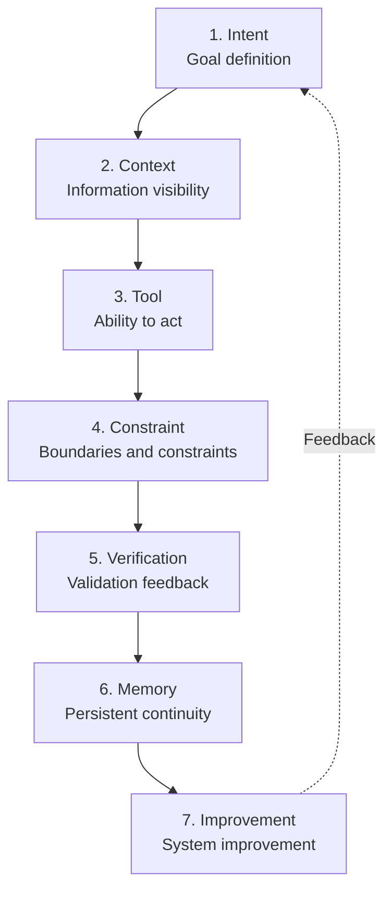
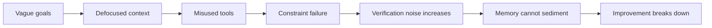

# Part II: The Seven-Layer Structure of Harness

Once the linguistic coordinates are in place, the question quickly becomes more concrete: what exactly is a harness made of, which layer breaks first when the system fails, and where should a team begin to patch it?

The real difficulty is never admitting that harness matters. The real difficulty is taking it from a catch-all term that can easily be copied as a slogan and breaking it into an engineering structure that can be discussed, designed, and improved. Only when the structure is broken apart do failures begin to become locatable and repairable.

See Figures 2-1 and 2-2 in this part.

**Figure 2-1. Overview of the seven-layer structure of harness**

These seven layers are not a static checklist, but a loop with feedback. Goal definition determines where the system should go; context determines what the system can see; tools determine what the system can do; constraints determine what it must not do; verification determines how it detects deviation; memory determines how continuity is preserved; improvement determines whether the system becomes better the more it runs.

Do not rush to memorize the seven names. The most useful way to read Part II is not to memorize the framework in full, but first to see how a real task fails at different layers and only then look back at why these seven layers recur so stably.

## Running Case: How a “Login and Invitation Flow Redesign” Forces Out the Seven Layers

To keep the seven-layer structure from becoming a mere conceptual list, this part continues the synthetic case introduced in the prologue.

A SaaS team of about twenty people is preparing to let an agent take over a redesign of the login and invitation flow. The task does not seem very large, but its constraints are strict:

- Add `magic link` login
- Preserve SSO compatibility
- Do not touch the billing module
- Fill in the end-to-end tests
- Ship within two weeks

At first the team had only a vague command. Only gradually did they realize that the task kept looping through rework not because the agent was always just a little short of intelligence, but because the system had never written down the correct path. The seven layers below are the process of patching that path back into the system one layer at a time.

If a more memorable metaphor helps, this part can also be read alongside another small example: setting up a workstation for a new colleague. The seven-layer structure is not mysterious. It simply retranslates the old engineering common sense of how to let a newcomer reliably take over work into the language of the agent era. This is also why the case is well suited as the running thread of Part II: it is not grand; instead, it is closer to the moment when most teams first truly feel the necessity of harness—not during a platform migration, but in the kind of real task that looks small and yet keeps returning for rework.

## 1. Intent Layer: Turn the Task into an Engineering Object First

One of the most common failures of an intelligent agent is not that it cannot execute, but that it does not know what counts as completion. Humans are good at working in ambiguous settings. We automatically fill in background, infer priorities, guess business context, and keep rewriting our own goals as we go. Agents do not possess that ability by default.

In the login-and-invitation case, the initial instruction “fix the login” was almost guaranteed to cause problems. The truly important information here lies not in the word “login,” but in the constraints that are omitted by default: SSO compatibility must be preserved, the billing module must not be touched, end-to-end tests must be filled in, and a two-week deadline means a large-scale refactor is not worth it.

The role of the intent layer is therefore not to make an informal command longer, but to turn the task into an engineering object. At minimum, such an object must answer the following questions: what problem is being solved this time, what artifacts are expected as output, what can be adjusted, what must not be touched, what counts as done, and in what circumstances the work must be escalated back to a human.

Anthropic's experience illustrates the importance of this layer very clearly. They later required agents to proceed by feature lists, usually advancing one feature per round—not because the model could not understand large tasks, but because if the intent layer is not first decomposed into small, verifiable objects, later sessions drift inside vague goals and may even declare completion too early (see Reference [9]).

When the intent layer fails, it resembles a new colleague hearing only “just take a look and handle it” on their first day. A human can still move forward by observing, probing, and asking questions. An agent will often only execute the ambiguity very seriously.

A minimally viable intent layer therefore usually has to make at least four things explicit:

- Task object: exactly which chain is to be changed and which is not
- Receipt of completion: what evidence must appear before the system is allowed to say it is done
- Prohibitions: which directories, modules, interfaces, or actions are off-limits by default
- Escalation conditions: what signals require the task to be handed back to a human immediately

If these four items are not written down, the remaining six layers easily end up repaying the debt of the intent layer. Teams often think they are adding more context, more tools, and more tests, when in fact they are paying for not having turned the task into an engineering object at the beginning.

A typical failure scene looks like this: in the issue, the team writes only “change login to magic link without affecting the existing flow.” The agent reads “without affecting the existing flow,” but does not know that this means preserving SSO compatibility, not touching the billing coupling, and keeping invitation links valid. So it starts from the most obvious shared authentication entry point; after the change, single sign-on begins to behave abnormally in staging. On the surface it looks like broken code. At the root, the task object was never written as an engineering object in the first place.

## 2. Context Layer: Turn Facts into Facts the System Can Find

Once the goal is clearly written, the next question is not whether the agent is smart, but what it has actually seen. In the login redesign case, a great deal of background information affects success or failure: which directories contain the login and invitation flows, why SSO compatibility must not break, why the billing module must never be touched, what incidents happened here before, and what the current test coverage actually reaches. If this information does not enter a work system that is discoverable, searchable, and referable, then for the agent it may as well not exist.

The core of the context layer is not “stuff in a little more background,” but making facts discoverable step by step. The entry point must be small enough, the navigation must be clear enough, documents must carry explicit source and update time, and detail must unfold on demand. For an agent, a clear map is often more useful than a gigantic manual.

When OpenAI used Codex internally, they quickly found that an ever-growing `AGENTS.md` could not really solve the problem, which is why they split explanatory material into the repository and turned planning, architecture notes, grading, and task state into a discoverable structure. The lesson is that the core of the context layer is never merely more background, but turning facts into a workspace the agent can actually find and use (see Reference [1]).

The same is true for a new colleague. Handing over one hundred pages of material does not mean they know where to begin. Giving them an office map, a few doorplates, and the day's task sheet comes much closer to effective support.

So a minimally viable context layer also usually needs at least four artifacts:

- Entry file: tells the system where to start instead of flattening all knowledge into one place
- Knowledge map: the correspondence among directories, modules, services, and documents
- Source of truth: which explanation is currently valid and which is only historical background
- Freshness signals: update time, version, and owner, so stale knowledge does not pose as current fact

Many teams do not suffer from having no documents, but from having many documents without a working surface. Once documents cannot be found progressively by the system, they remain close to nonexistent in the agent world.

When the context layer fails, the scene is painfully familiar. Inside the repository sits an ADR for the invitation flow from two years ago, a half-updated README, and a set of script notes maintained by no one. The agent reads the outdated document first, follows the old directory structure to find the invitation logic, edits a handler that is almost deprecated, and believes the task is complete. Human engineers later say, “How could it not even find the right directory?” The real issue is that the system never turned the current facts into a discoverable entrance.

## 3. Tool Layer: Turn Understanding into Action

Even if the goal is clear and the materials are complete, if the agent cannot read code, edit files, run tests, inspect logs, open pages, and check state, it is still only a reasoning text interface. The question at the tool layer is never whether more tools are better, but whether a task-level closed loop exists.

Back to the login redesign case. This task needs at least several kinds of action: searching authentication and invitation-related code, modifying logic, running unit tests, running end-to-end tests, opening the page to verify user paths, and reading failure logs. If any one of those steps frequently requires a human to step in midway, then the system has not actually given the agent a closed-loop tool surface.

OpenAI allowed every worktree to start the application and exposed logs, metrics, and Chrome DevTools Protocol to the agent. App Server then unified threads, tool calls, and approval interactions into a single runtime. Together those two steps show that the tool layer is not really about whether the agent can click more buttons, but whether it can complete work through a stable chain of interfaces (see References [1] and [3]).

For that reason, the two extremes the tool layer must avoid are these: exposing every interface all at once and creating a huge search space on one side, or giving only minimal ability and keeping the agent forever in a state where it can recommend but not close the loop on the other. The tool layer is not a capability showroom; it is an action interface.

That also means that tool-layer design is not only a question of which tools to connect, but in what order and to what depth. A more mature tool layer usually secures three closed loops first:

- Discovery loop: it can find what needs to be changed
- Execution loop: it can actually modify the object
- Verification loop: it can immediately see what happened after the change

If only the first two exist, the system easily pushes all the way to something that looks finished; if discovery and verification exist without execution, the system degenerates into a recommendation machine. The tool layer sits third not because tools are more advanced than constraints or verification, but because without the ability to act, later control cannot even begin.

When the tool layer fails, the failure is often more subtle than expected. The team gives the agent the ability to search and edit files, but not to run stable end-to-end tests or read staging logs. So it makes code changes that look polished and fills in unit tests, yet never knows that clicking the invitation email now sends the user into an infinite redirect loop in staging. By the time a human takes over, what they see is a pile of changes that looked very hard-working, not a system that could close the loop.

## 4. Constraint Layer: Write Preference into Boundaries

When many teams introduce agents, their first instinct is to let them loose as much as possible. It sounds advanced, but the outcome is often the opposite: the larger the space, the more trial and error, and the more serious the drift. The job of the constraint layer is to turn preferences that previously lived in the heads of senior engineers into executable system boundaries.

In the login redesign case, the most important constraints are actually very concrete:

- The billing module must not be touched
- The shared authentication module may only be adjusted locally
- Any login copy change must be synchronized with tests
- The invitation flow must preserve compatibility with the old interface

If those constraints exist only as spoken conclusions from meetings, the agent may step into the same pitfall in every round. Only when they are written as structural rules, lints, directory boundaries, templates, approval thresholds, and test conditions do boundaries truly enter the system.

OpenAI has publicly mentioned continuing to sediment taste and structural requirements into custom lints, graders, and background cleanup tasks. That is a typical form of mechanizing the constraint layer. If rules exist only in the heads of senior engineers, correction can happen only manually; once written into lint, grading, and cleanup mechanisms, boundaries truly enter the agent's search space (see Reference [1]).

Speed does not come from the absence of constraints, but from predictability. For an agent, rules are not shackles; they are navigation.

Many teams make a counterintuitive discovery here: the more mature the constraint layer becomes, the faster the system seems to move. That is because high-quality constraints do not add meaningless resistance; they eliminate meaningless search. Once boundaries are mechanized—what directories cannot be touched by default, which interfaces require the compatibility document first, what modifications require escalation, what commands must run first—the action space gets smaller, but the effective space gets larger.

So the minimum viable constraint layer is usually not a rules document, but a set of things that can truly enter the system loop:

- Structural boundaries: directories, modules, dependency direction
- Policy boundaries: which actions are forbidden by default and which require approval
- Quality boundaries: which checks must pass before the system may proceed
- Escalation boundaries: what signals require the system to stop

When the constraint layer fails, the most common result is not a dramatic collapse, but the kind of mistake where something that should never have been touched gets touched casually. In the middle of revising the login flow, the agent notices that user-state judgment lives in the shared authentication module and casually refactors the public logic there as well. Locally that seems reasonable. But nowhere in the system was the rule “the shared authentication module can only be adjusted locally, and billing-coupled modules are forbidden by default” written as a hard boundary. The result is not a single bug, but a string of unnecessary cascading changes.

## 5. Verification Layer: Without a Receipt, the System Does Not Know How to Stop

If the first four layers determine whether an agent can start, the verification layer determines whether it can land. An agent system without verification is, in essence, an automatic generator rather than an engineering system.

The easiest point of failure in the login redesign case lies right here. A page running does not mean the login flow is truly complete. The main path being usable does not mean the invitation boundary has not broken. Unit tests passing does not mean the end-to-end experience and regression conditions are actually satisfied. If the team has not written down a receipt for completion, the agent will stop again and again at places that merely look close enough.

Verification is to the agent what an old line from a mentor is to a new colleague: “done” does not mean you feel it is roughly okay; it means the system proves that it is.

Both LangChain's improvements and Anthropic's corrections illustrate this layer clearly. The former pushes verification back into the workflow through build-self-verify, middleware, and traces. The latter requires browser automation to validate end-to-end like a real user. In both cases the purpose is not prettier testing, but preventing the system from stopping too early when things merely look close enough (see References [9] and [10]).

That is why both this part and this book insist on a shorter judgment: without verification, there is no agent engineering.

What is easiest to get wrong here is to reduce verification to “run a few more tests.” That is not enough. The real difficulty of verification lies in writing what it means to be correct in a way that is close enough to the real goal. A more complete verification layer usually contains at least three levels:

- Structural verification: whether code, interfaces, configuration, and patterns satisfy requirements
- Behavioral verification: whether the main flow, boundary paths, and regression conditions hold
- Production verification: whether the system truly knows it can stop, rather than merely not throwing errors for the moment

Part IV expands this layer further into a control problem. But even in Part II, readers must first grasp one thing: **without verification, the earlier layers of goal, context, tools, and constraints merely increase the ability to act; the verification layer is the first place that turns the ability to act into engineering capability.**

When verification fails, the scene is often the most frustrating. The login page opens, the magic link is sent, the unit tests are green, and the PR passes. Yet when a real user enters through the invitation email, the boundary path that creates an organization and then jumps back to login breaks completely. Looking back, the team discovers that the system never obtained a true receipt of completion—only a set of partial signals too weak to cover the real path.

## 6. Memory Layer: What the Next Round Takes Over Must Not Be a Mess Left Mid-Game

Many teams understand long-running problems as a matter of insufficient model memory. That is only the surface. The deeper reason is usually that the system never designed externalized memory. Chat history is not reliable memory, and a giant pile of notes is not reliable memory either. Reliable memory must be a structure that can be restored, inherited, and cited.

Back to the login redesign case. If the task spans multiple sessions, the next-round agent must at least know:

- Which functions are already finished
- Which tests have already passed
- What the current risks are
- What the next minimal target is

If these are not written into progress logs, task state, decision records, and versioned history, then what the next round faces is not continuous work but a half-amnesiac mess.

Anthropic treats `init.sh`, progress logs, feature lists, and git commit history as the basic skeleton of a long-running agent precisely because they had run into this hard problem: without externalized memory, what the next round takes over is not continuity but a残局. App Server's persistent threads point to the same fact from another angle: memory is not an attachment to chat history, but infrastructure for work continuity (see References [3] and [9]).

For long-running agents, the most dangerous thing is not lack of capability, but inability to hand over the shift.

From an organizational perspective, the memory layer answers a more realistic question: can the system hand today's work to tomorrow's system or tomorrow's person? That is why a minimally viable memory layer is usually not “keep all history,” but keep the minimal state that determines continuity:

- How far things have been completed
- Which assumptions have been verified and which have not
- Which risks remain open
- Where the next round should continue from rather than start guessing again

Many teams treat memory as “save a bit more context.” Truly reliable memory is closer to a handoff sheet than to chat history.

When the memory layer fails, the most common sentence in the team is: “Didn't the previous round already fix that?” Yesterday's agent repaired the boundary bug that broke invitations and added two tests. The next day, a new session starts. Because there is no progress log and no record of which assumptions were verified and which risks remain open, the new agent begins searching from the old entry point again and may even overwrite yesterday's local fix. It looks like model forgetfulness. In reality, the system never designed a handoff at all.

## 7. Improvement Layer: Write the Error Back into the Environment

If failure leads only to another retry and not to a system upgrade, then the agent is merely consuming human attention again and again. The role of the improvement layer is to turn occasional experience into durable mechanism.

Once the login redesign case has run through a few rounds, the team typically notices several high-frequency failures:

- The agent always starts searching from the wrong directory
- A boundary condition in the invitation flow is repeatedly missed
- End-to-end tests are often forgotten
- The shared authentication module keeps being touched by mistake

If every instance is corrected ad hoc by humans, the system never grows up. Only when these problems are written into templates, rules, tests, checklists, graders, and default paths does the next run become genuinely different.

LangChain uses traces to identify failure patterns and then rewrites those patterns into middleware, budget control, and loop detection. OpenAI uses grading systems and background cleanup to continuously reclaim bad patterns. From two directions, these cases show that the essence of the improvement layer is not simply “do one more retrospective,” but write the output of the retrospective back into the environment so the next attempt succeeds more easily (see References [1] and [10]).

A good harness does not win because “nothing went wrong this time.” It wins because “the errors that occurred this time are less likely to recur next time.”

The maturity of the improvement layer therefore often depends on whether a team has completed the shift from “people remember” to “the system remembers.” Whether an incident, a rework cycle, or a near miss in staging eventually becomes a new template, check item, default command, structural test, or approval rule determines whether the system is actually accumulating or merely relearning in place.

This is also why the seven layers must be understood as a closed loop. Without the improvement layer, the first six layers behave as if every run were the first. With the improvement layer, the system finally begins to gain compounding returns.

When the improvement layer is missing, system failure has a wearying repetitiveness. Every time the login flow is modified, the agent first forgets to add end-to-end tests. Every time the invitation flow is involved, the team has to repeat, “do not start from the old handler.” Every retrospective ends with “let's pay attention next time,” and yet next time begins in the same pit. What is missing is not more reminders, but the sedimentation of those reminders into templates, default commands, and check items so the system can remember for itself.

## Looking Back at the Seven Layers: Why They Recur So Stably

Looking back from this point, the seven layers no longer resemble an abstract chart, but a fault-localization map. The reason the public practices of OpenAI, Anthropic, and LangChain can all be compressed back into these seven layers is not that someone first drew a framework and then searched for evidence to fill it. It is because real systems repeatedly break in these very places.

### Evidentiary Skeleton

| Core claim of this part | Main evidence | Counter-evidence or boundary | Judgment this part aims to reach |
| --- | --- | --- | --- |
| Harness is not an abstract slogan, but a decomposable engineering structure | The public practices of OpenAI, Anthropic, and LangChain can all be broken back into goals, context, tools, constraints, verification, memory, and improvement | If one looks only at productivity numbers or single-turn output, the seven-layer structure may be misread as conceptual gymnastics | The value of the seven-layer structure is that it helps teams locate exactly which layer the system is lacking |
| Most agent failures are not single-point capability problems but mismatches between layers | Anthropic exposes gaps in handoff and verification, LangChain exposes gaps in verification and control, OpenAI exposes gaps in context, constraint, and cleanup | METR reminds us that when the environment is immature, human tacit-knowledge advantage can outweigh agent gains | The real engineering task is not “switch to another model,” but find the mismatched layer and repair it |
| The seven layers must form a closed loop, not be addressed one by one in isolation | LangChain's traces, middleware, and self-verify form a loop; OpenAI's docs, worktrees, grading, and cleanup form a loop | Single-layer optimization often only pushes the problem downstream | The focus of harness engineering is system coupling rather than a checklist of parts |

## Why Seven Layers Rather Than More or Fewer?

Any layering scheme is somewhat arbitrary. It would be entirely possible to split harness into five layers, six layers, or even ten. The reason this book insists on seven is not that the number seven has any mysterious meaning, but that it avoids three common errors at once.

The first error is to compress too many problems back into the prompt. That is the easiest way to write, but it squeezes goals, knowledge, tools, boundaries, verification, and retrospection into one sentence until nothing can be clearly explained except that the prompt was not good enough. The second error is to divide everything only into context, tools, and evaluation. Such coarse-grained layering may suffice for explanation, but it is not enough for troubleshooting, because intent, constraints, memory, and improvement get stuffed back into vague large boxes. The third error is to slice the system too finely, until each layer starts to look like a product-module specification. Once the layers are too fragmented, the explanation looks complete but nobody knows which few layers actually form the essential skeleton that should be addressed first.

Seven layers are suitable because they correspond exactly to the seven most stable classes of questions inside a working system:

- Has the goal been written as an engineering object?
- Have facts been written as facts the system can discover?
- Can the system's ability to act form a closed loop?
- Have boundaries been mechanized?
- Can completion be verified?
- Can continuity be handed over?
- Will error sediment into a system asset?

With fewer layers, these questions collapse back into one another. With more, the chapters degenerate into term proliferation. Seven layers are not the final description of the world, but an engineering language that is stable and economical enough. Its value lies not in the number itself, but in enabling a team to explain “why the system always breaks here” more precisely than “the model just wasn't good today.”

## Seven-Layer Overview: What Question Does Each Layer Answer?

| Layer | Core question it answers | Most common symptom when missing | Minimum artifact that must be written into the system | First manifestation in the running case |
| --- | --- | --- | --- | --- |
| Intent | What exactly are we trying to complete? | Task drift, premature stopping, repeated rework | Task description, completion criteria, prohibitions, escalation conditions | The agent interprets “change login” as a broad authentication-system refactor |
| Context | What exactly can the system see? | Searching the wrong directory, missing key constraints, repeated search | Entry document, knowledge map, source of truth, update time | It does not know the real boundary between the invitation flow and the billing module |
| Tool | What exactly can the system do? | It can only suggest, not close the loop; or it has too many tools and thrashes | Search, edit, run, verify, and observe interfaces | It can change code but cannot run critical tests or read logs |
| Constraint | What exactly must the system not do? | Unauthorized changes, accidental touches in high-risk zones, uncontrolled search space | Directory boundaries, lints, approval points, policy rules | It mistakenly edits shared authentication or billing logic |
| Verification | How does the system know it did the right thing? | It stops at “looks about right” and ships with errors | Tests, graders, regression gates, runtime evidence | The main login path works, but invitation boundaries are not covered |
| Memory | How does the next round continue? | Every round starts guessing from scratch, unfinished残局, broken handoff | Progress log, state records, decision records | The next round forgets which tests passed and which risks remain |
| Improvement | How do errors become system assets? | The same errors repeat and humans keep reminding | Templates, rules, check items, cleanup tasks | It always starts in the wrong directory and always forgets end-to-end tests |

The most useful columns in this table to revisit repeatedly are the third and fourth. The third tells readers what the system most often looks like when a layer is missing. The fourth forces a team to admit that if those minimum artifacts are not written into the system, then saying “we know this matters” means very little. The value of the seven layers lies not in naming more abstractions, but in forcing teams to turn abstract concern into executable artifacts.

## 8. The Seven Layers Are Not Matured Evenly: Which Layers Does a Team Usually Patch First?

Although no layer can be missing forever, most teams do not mature all seven at the same time. Reality looks more like this: first there are scattered tools, then a few background documents, then intent and verification are patched under pressure from repeated rework, and only later do memory and improvement come into view. So in understanding the seven layers, we must avoid another misunderstanding: the idea that as long as a system does “a little” of all seven, it has been built.

The truth is the opposite. Maturity in the seven layers is not an egalitarian project; it has an order. For most teams seriously introducing agents for the first time, the first things that need patching are usually not the improvement layer, but the three earlier problems:

- Intent: otherwise the system begins by repaying the debt of a vague goal
- Context: otherwise the system moves at high speed on the wrong work surface
- Verification: otherwise even when part of the task is done correctly, the system does not know when to stop

The tool layer often gets the earliest attention because it is the most visible. Yet what truly decides the success or failure of a pilot is often intent, context, and verification. Many teams connect quite a few tools in the first phase and still feel that the agent's output is unstable. What is often missing is not capability, but a clear target, a clean entry point, and completion criteria written as receipts.

The constraint layer usually becomes important in the second phase. Once the system can actually run on local tasks, drift, overreach, and accidental contact with high-risk zones become more prominent. At that point, constraints are not conservatism; they are a way of protecting throughput. Memory and improvement belong more to the third phase: only once a team begins to pursue multi-round continuity and long-term compounding gains does it truly feel the cost of “starting from scratch each time” and “repeating the same errors.”

That is why a team should ask not “have we done all seven layers?” but “the most expensive mistake we are making right now—what layer does it emerge from first?” Part II provides not a chart of equal effort, but a map for prioritization.

## 9. Common Misreadings: What Looks Like a Model Problem, but Is Actually a Broken Layer?

The first time a team uses the seven-layer structure for troubleshooting, the biggest gain is often not learning seven new terms, but discovering that many things once classified as “model problems” are actually problems in an earlier or later layer. The following table compresses the most common misreadings.

| Surface phenomenon | What it is most easily misread as | Layer more likely broken first | First action to patch |
| --- | --- | --- | --- |
| The agent modified many files that should not have been touched | The model is unstable, the tools are too dangerous | Context / Constraint | Narrow the entry file, write explicit forbidden zones and directory boundaries |
| The agent always stops when things are “almost usable” | The model is lazy, the intelligence is insufficient | Intent / Verification | Write a receipt of completion and add behavioral verification rather than only unit tests |
| Task background has to be re-explained every round | The model cannot remember, the context window is too short | Memory | Replace chat history with progress logs and decision records |
| The same type of error reappears after being fixed | Model randomness is too high | Improvement | Write the error into templates, rules, check items, or default commands |
| The agent spends many steps finding code and documents | Retrieval ability is too weak | Context | Provide a clear entry point and a knowledge map rather than stuffing in more material |
| The agent has tools but still moves very slowly | The reasoning chain is not strong enough | Tool / Constraint | Reduce the irrelevant tool surface and give a shorter effective action path |

This table matters because it directly changes the way teams talk. In the past, whenever a problem appeared, teams easily reinterpreted every cost as a problem of model capability. With the language of the seven layers, they can now unpack “the model was not good today” into more precise statements: the context entry point was unclear, the completion criteria were never written down, or there was no externalized memory. Once the problem is renamed, the repair path changes with it.

That is the real practical meaning of Part II. It is not here to help readers memorize a pretty framework, but to help teams take fewer repetitive detours. A framework becomes most valuable not when it is used in a keynote, but when it is used in a retrospective.

## 10. How the Seven Layers Work Together

These seven layers are not independent modules, but a closed loop. If the login redesign case fails, it usually does not fail at only one layer.

- If the goal is vague, completion becomes hard to define later
- If the information entry point is chaotic, tools will be misused
- If boundaries are unclear, verification results lose explanatory power
- If there is no memory, improvement cannot sediment

Many teams fail not because these layers are totally absent, but because they have not formed stable coupling. Each layer appears to have something in place, and yet the whole remains unstable.

That is why Part II must weigh more than seven definitions. The true value of the seven layers is not helping readers remember seven English names, but giving teams a troubleshooting language. When the system fails, the team can finally stop saying only “the model wasn't good today” or “the prompt still needs tuning” and say instead:

- This time the problem first broke in the intent layer, and everything afterward paid its debt
- This time the context entry point was unclear, and tool misuse was only the result
- This time the verification layer was too weak, so the system stopped when it merely looked close enough
- This time memory and improvement did not sediment, so the same kind of error happened again

Once an organization begins to speak this way, it has already taken a step from “using agents to get work done” toward “designing the agent work system.”

**Figure 2-2. How imbalance across the seven layers propagates downstream**

This propagation becomes even clearer if OpenAI, Anthropic, LangChain, and METR are considered together. OpenAI primarily exposes the coupling among context, tools, constraints, and improvement. Anthropic exposes the coupling among intent, memory, and verification. LangChain exposes the coupling among verification, observability, and control. METR reminds us that once these layers fail to form a closed loop, the tacit-knowledge advantage of human experts and the cost of context switching can eat away the benefit of agents (see References [1], [9], [10], and [11]).

The best way to understand harness, then, is not as a parts list, but as a machine. A machine runs not because the parts exist, but because the parts form stable coupling with one another.

## 11. A Diagnostic Checklist for Teams

After reading this chapter, what matters more than remembering the definitions of the seven layers is turning them into a routine diagnostic checklist for the team. Any failure, rework cycle, near miss in staging, or distorted evaluation can be traced backward through at least the following five questions:

1. Was the task object really written clearly this time, or was everyone filling in the blanks with common sense?
2. Before the system failed, was the work surface it saw actually the work surface we wanted it to see?
3. Were the tools in its hands enough to close the loop, or only enough to complete half the moves?
4. Were boundaries written into the system, or were they still mainly being conveyed orally by senior engineers?
5. Did this error ultimately become a new artifact, or did it only become an emotional retrospective?

The checklist sounds simple. What is truly difficult is whether the team has the discipline to use it repeatedly. When an organization begins to use the language of the seven layers consistently, an important change often appears: retrospectives stop centering on emotional sentences such as “who didn't look carefully again?” or “why was the model so stupid today?” and begin centering on “which layer broke first?” and “what should we write into the system next time?” The former produces more temporary experience; the latter produces methods that accumulate.

## Part Summary

This chapter has decomposed harness from an abstract idea into seven interacting layers: intent, context, tools, constraints, verification, memory, and improvement.

More importantly, the running case of redesigning the login and invitation flow shows that the seven layers are not a stack of concepts, but a repair path that runs from task to system. What is valuable in each layer is not the definition itself, but the minimum artifact that must be written into the system. From here, the discussion moves into more concrete engineering sites: repositories, architecture, review, and default paths.
