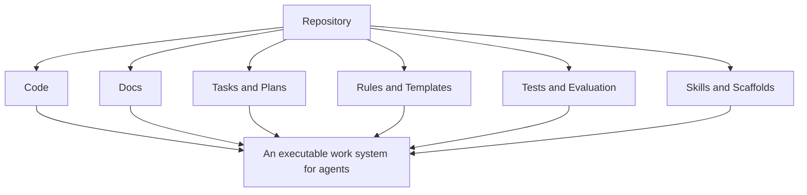
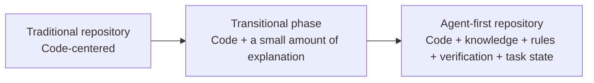
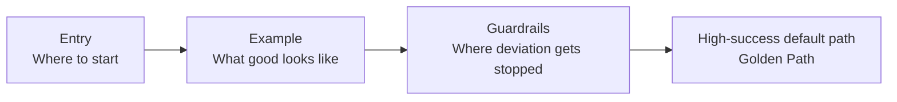
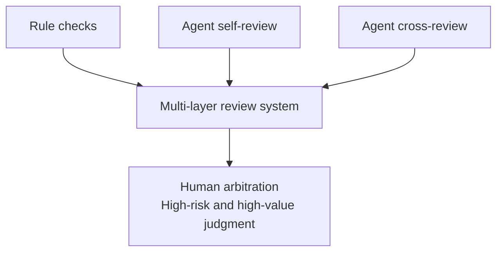
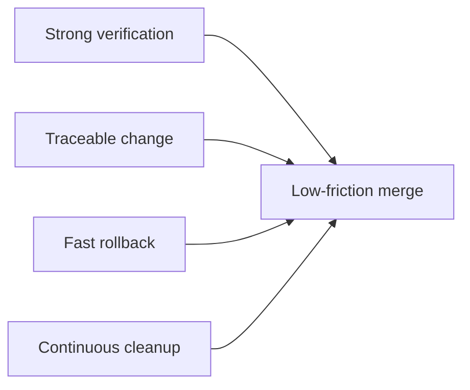
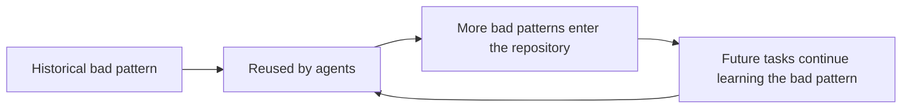
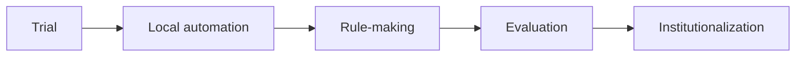

# Part III: Agent-First Software Engineering

Once harness stops being only a concept and begins to take structural form, the engineering worksite cannot remain unchanged. How the repository is organized, how architecture draws boundaries, how review is layered, and how default paths are designed—questions that once looked like engineering governance or team habit suddenly move to the center.

Once agents truly enter the workflow, the question facing software teams is no longer only how code should be written, but how the worksite itself should be written.

This part is concerned not with whether agents can write code, but with how repositories, architecture, review, merge strategy, and slop governance change as a result.

See Figures 3-1 through 3-7 in this part.

**Figure 3-1. How the repository becomes the agent's operating system**

A repository in an agent-first environment is no longer just a place where code lives. It becomes a compound space in which code, documentation, rules, plans, tests, templates, and state coexist inside one discoverable environment. Only then does the repository evolve into the agent's operating system.

## Evidentiary Skeleton of This Part

| Core claim of this part | Main evidence | Reverse reminder | Judgment this part aims to reach |
| --- | --- | --- | --- |
| The repository is becoming the agent's operating system | OpenAI puts docs, plans, grading, state, and observability into the repo/worktree | If knowledge still lives mainly in oral communication, agents still get lost | Repo-first has shifted from a tidiness habit to productivity infrastructure |
| Golden paths matter more than local heroics | Anthropic uses an initializer agent, progress logs, and feature lists to build a default work path | Without a default path, long-running agents forget or stop too early | The competitiveness of agent-first teams comes from default-path design |
| Review, merge, and slop governance must become systematic | OpenAI's high-throughput PR environment forces lints, graders, and background cleanup | At high throughput, manual line-by-line review and “clean it up later” both break down | Software-engineering governance shifts earlier, becomes automated, and becomes institutionalized |

## 1. How the Repository Becomes the Agent's Operating System

In traditional collaboration, the repository mainly stores code. In an agent-first environment, the repository increasingly becomes the working operating system. It is not only where code resides, but part of the source of truth, the navigation layer, the rule-bearing medium, and the execution environment. Design documents, execution plans, knowledge indexes, skill files, scaffolding, test rules, evaluation samples, and structural constraints increasingly move into the repository, because only once they enter the repo, are versioned, and become discoverable do they enter the usable world of the agent.

OpenAI's internal use of Codex is almost a textbook case. An ever-expanding `AGENTS.md` did not solve the problem, so documentation was broken apart into the repository; plans, grading, technical debt, task state, and architectural notes were all versioned; each worktree became independently runnable; logs, metrics, and DevTools were exposed to the agent. “The repository becomes the operating system” is therefore not a metaphor. The codebase literally begins to take on functions that once lived in engineers' heads: startup, navigation, verification, and state management.

This means repository design is no longer only an aesthetic question. It becomes a productivity question. A repository that is still workable for humans can remain highly unfriendly to agents, leading to repeated wandering, repeated search, and boundary errors. A repository with a trustworthy entry point, a map of modules, standard run/verify commands, and visible task state lowers startup cost dramatically.

A typical minimum upgrade sequence looks like this:

- A truly trustworthy entry file that tells the system where to start
- A directory/module map so the system does not re-search the tree from the top every time
- A set of standard run and verification commands that close the action loop
- A continuously updated task-state artifact so the next collaborator does not inherit a half-finished battlefield

What turns the repository from “where code is stored” into “the work operating system” is not sudden love of documentation. It is that tacit knowledge not written back into the repository is rapidly exposed as rework once agents enter the picture.

**Figure 3-2. The evolution from the traditional repository to the agent-first repository**

## 2. The New Object of Code Readability

We are used to discussing code readability in terms of whether a new teammate can understand the code easily. In an agent-first environment, we must add another question: can a future agent recover the right intent from the code and documentation?

Agent legibility does not mean “writing code to please a model.” It means accepting that if agents are long-term collaborators, then code structure must support stable navigation. Implicit conventions, clever shortcuts designed only for insiders, vague naming, and cross-layer coupling are amplified into system risk. Clear boundaries, explicit dependencies, searchable naming, stable patterns, and high-quality documentation become even more important.

This does not come at the expense of human readability. High-quality readability usually benefits both humans and agents. The problem lies in those places where “the people who know, know.” Such local tricks may be efficient for a few experienced engineers, opaque to most humans, and especially fragile for agents.

That changes the minimum standard. The point is not to write every line like a tutorial, but to reduce hidden doors that only insiders understand. If a boundary can be made explicit, it should not live only as tacit convention. If a responsibility can be separated, it should not remain stuffed into a convenient shortcut. If intent can be expressed through naming, it should not be left to the reader to guess.

## 3. Architecture Is No Longer Only About Elegance

For many teams, architectural rules become serious only once scale grows. In an agent-first world, architectural boundaries often become production infrastructure from the beginning. Clear layers, dependency direction, domain boundaries, and cross-cutting interfaces sharply reduce the probability that an agent will move in the wrong place.

What used to look like long-term governance cost now becomes short-term speed gain. The question is not only whether the agent can write, but whether it writes in the right place. The clearer the architecture, the more stable the navigation; the more stable the navigation, the more reliable regression and repair become.

In the manual-coding era, teams could rely on a few core engineers to remember the “real” boundaries and correct deviations in review. Agent throughput rapidly magnifies the limits of this implicit governance. Architecture that is not clearly expressed, not turned into rules, and not enforced by detectors is, in the agent era, close to non-existent.

This is why agent-first environments naturally prefer more rigid architecture—not rigid in the sense of inflexible, but in the sense of explicit boundaries. Which directories may depend on which others, which shared modules may be patched but not casually refactored, and which high-risk paths require escalation once touched should become executable rules rather than polite suggestions in a document.

## 4. From Writing Implementations to Designing the Golden Path

Humans are good at improvising in ambiguous spaces. Agents are good at moving with high throughput along a clear path. One of the key shifts in agent-first teams is therefore moving from “relying on experts to write critical implementations correctly” to “designing a production path that is unlikely to be taken wrongly by default.”

That path may consist of templates, scaffolds, example implementations, skills, directory conventions, default verification, and common-failure repair guides. Its purpose is not to limit creativity, but to make most tasks fall onto a high-probability-success route. The golden path compresses distributed engineering experience into a low-friction default.

Anthropic's harness for long-running coding agents is an excellent example. Rather than asking the agent to begin each time from chaos, an initializer agent prepares `init.sh`, a progress log, a feature list, and recoverable state. The coding agent then advances one feature per round and leaves clear handoff information at the end. The essence of a golden path is not freedom, but the fact that the agent is guided by default into a route that is handoff-ready, verifiable, and recoverable.

A useful golden path should answer at least four questions:

- How do you start? From which file, which command, which map?
- How do you imitate? Where are good reference implementations?
- How do you close the task? What evidence must appear before the system can say it is done?
- How do you ask for help? What situations require escalation?

**Figure 3-3. Structure of the golden path**

## 5. The Restructuring of Review

If agent output exceeds human review speed, the traditional all-manual review model becomes a bottleneck. Review must therefore become a layered system: rules catch structural issues, self-review catches visible defects, agent-to-agent review adds perspective, and human review focuses more on value judgment, boundary disputes, and high-risk changes.

OpenAI's case of producing more than a thousand PRs in a few months makes this very clear. Once throughput rises, line-by-line human review can no longer remain the default center. Scalable practice requires more and more problems to move earlier into linting, testing, grading, structural rules, and self-checking. Otherwise agent-first software engineering turns into a faster way of dragging senior engineers into heavier editorial labor.

This does not weaken review. It upgrades review from a single point of human labor into a layered quality system. Humans stop being the first discoverer of every problem and become final arbiters and rule designers.

A mature review system often separates the flow like this:

- Structural issues go to linting, the type system, structural tests, and rule checks
- Repeatable implementation issues go to agent self-review and fixed checklists
- Horizontal comparison and alternative perspectives go to agent cross-review
- High-value human judgment is preserved for architectural trade-offs, risk exceptions, and business boundaries

**Figure 3-4. A multi-layer review system**

## 6. Why Merge Philosophy Changes

In a high-throughput agent system, waiting can be more expensive than correction. Teams may therefore shorten the PR lifecycle, reduce unnecessary blocking, and move part of the work that traditionally “must be finished before merge” into rapid follow-up repair. This is not automatically reckless—but it works only under strict conditions: strong verification, traceability, rollback capability, and continuous cleanup.

Without those conditions, fast merge only creates debt. With them, fast correction may become the better strategy. What matters is not copying the surface process, but understanding the system capability that supports it.

This is a change in risk-control style. Traditional workflows flatten as much risk as possible before merge because repair speed is limited and change frequency is limited. In agent environments, repair speed and change frequency both rise, so the system relies more on rapid detection, rapid rollback, and rapid correction.

A team should therefore pursue low-friction merge only when the following are true:

- Rollback is already fast and does not depend mainly on one person's memory
- Critical-path verification already has stable automated signals
- Logs and staging metrics can quickly localize what broke
- Ownership is clear, and someone can actually pull the brake immediately

**Figure 3-5. Preconditions for low-friction merge**

## 7. AI Slop, Replicated Error, and System Entropy

One of the greatest strengths of agents is pattern replication. One of the greatest risks is also pattern replication. Whatever patterns already exist in the repository—good or bad—become part of the environment from which future output is produced. Once a bad local pattern becomes visible, it can be reused repeatedly across tasks and modules. Over time the system accumulates a special kind of entropy: not random chaos, but the organized replication of poor structure.

That is the engineering meaning of AI slop. It is not mainly a style issue, but a pattern-diffusion issue caused by insufficient feedback. It cannot be managed through periodic emotional cleanup. It requires continuous convergence: rules, templates, auto-fixes, background refactors, and quality scoring.

Human-written bad code is constrained by the time and reach of an individual. Agent-written bad code can become systemic pollution because throughput is so high. In a repository with historical debt, the agent naturally treats existing patterns as legitimate examples. Historical debt stops being mere history and becomes a template for future output.

Teams should therefore treat garbage collection as part of regular production. A good early-warning set looks like this:

- The same small problem appears repeatedly in similar forms
- New code imitates old debt more often than new templates
- The same review reminders recur again and again
- Background cleanup is always postponed to “later”

**Figure 3-6. The AI slop diffusion loop**

## 8. Case: How an Agent-First Repository Actually Grows

A healthy agent-first repository is almost never designed in one shot. It grows task by task. At first a team may have only a simple `AGENTS` file and a few run commands. Then it discovers the need for stable task templates, clearer knowledge navigation, faster test feedback, and finer permission boundaries. Later it discovers that even that is not enough; plans, quality scoring, cleanup scripts, and background maintenance tasks also need to be added.

Harness does not emerge in slides. It emerges from real work and real failure. Good teams do not begin by already knowing the answer. They become good by turning each failure into a new capability in the repository.

A typical evolution looks like this:

1. Trial stage: the team explores model capability and gives only minimal instructions.
2. Local automation stage: repeated failure produces clearer entry docs, directory explanations, and minimum execution rules.
3. Rule-making stage: the team realizes the issue is not merely insufficient information, but insufficient default paths; templates, scaffolds, and skills appear.
4. Evaluation stage: tests, graders, logs, and traces become necessary.
5. Institutionalization stage: ownership, approvals, slop cleanup, and rule maintenance become explicit organizational questions.

**Figure 3-7. Stages in the evolution of the agent-first repository**

## 9. The First Engineering Habits a Team Will See Rewritten

What Part III ultimately shows is that not only the repository is rewritten, but a group of basic engineering habits:

- Knowledge can no longer be organized mainly by who knows it; it must be organized by whether the system can discover it
- Good engineering practice is no longer justified only by long-term maintainability, but also by short-term throughput
- Default values expand from code style and directory habit into task templates, verification gates, escalation conditions, approval boundaries, and cleanup routines
- The worksite begins to look less like a collection of individually clever practices and more like a jointly maintained environment

## Part Summary

This chapter is not about whether agents can write code. It is about how the software-engineering worksite must be rewritten so that agents can keep producing code that is mergeable, maintainable, and governable.

Repositories, readability, architecture, golden paths, review, merge strategy, and slop governance all shift from traditional governance topics into productivity infrastructure for the age of agents. The next part puts these engineering changes back into a larger framework of verification, evaluation, and control.
