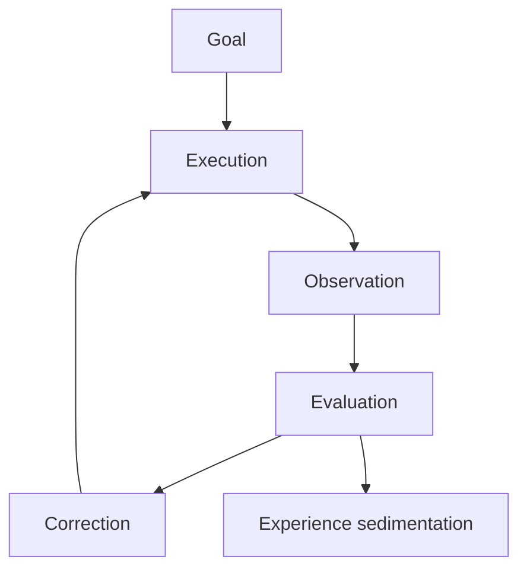
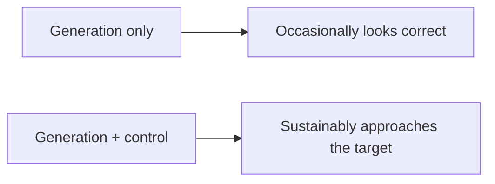
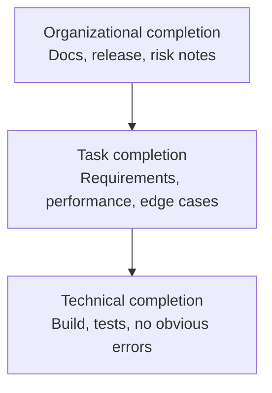
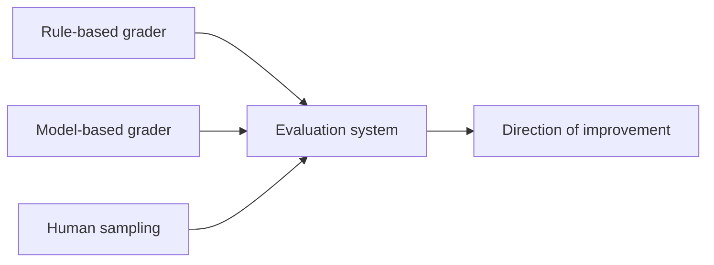
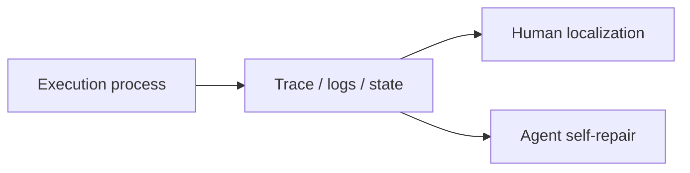
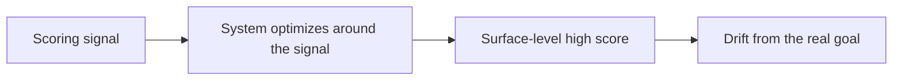
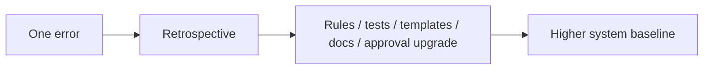
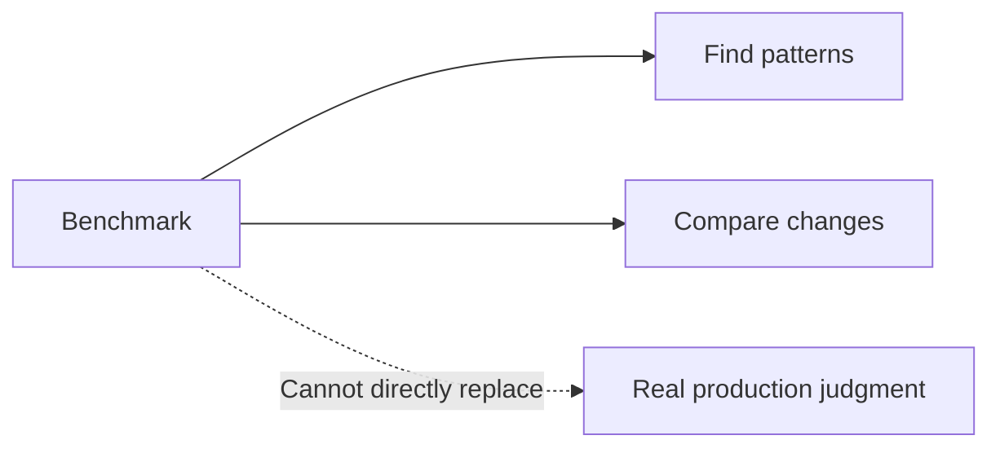

# Part IV: Verification, Evaluation, and Control Systems

Once a system truly begins to act, the first thing exposed is often not whether it can still generate, but when it should stop, who decides whether it did the right thing, and how deviation is pulled back once it appears.

The difference between an agent system that can move and one that can keep doing the right thing is usually not more capability, but a better control structure.

That is why stable operation always returns to the feedback system. Verification, evaluation, observability, and correction are not peripheral attachments. They are the core conditions under which agent systems can enter reality.

See Figures 4-1 through 4-8 in this part.

**Figure 4-1. The overall verification-and-control loop**

The point of this diagram is not a final score. It is the loop of goal, execution, observation, evaluation, and correction. Only where a loop exists does the system have a chance to keep approaching the target.

## Evidentiary Skeleton of This Part

| Core claim of this part | Main evidence | Counter-evidence or boundary | Judgment this part aims to reach |
| --- | --- | --- | --- |
| The core of harness is not generation, but control | LangChain improves results through traces, middleware, and verification | If one looks only at final output, control problems are easily misread as model problems | Closed loops matter more than a single impressive output |
| Observability and verification must enter runtime | OpenAI exposes worktrees, logs, metrics, and DevTools to the agent; Anthropic strengthens end-to-end verification | Without progress logs and state handoff, long-running systems lose continuity | Observability and verification are runtime conditions, not launch-day accessories |
| Benchmarks are useful, but cannot replace reality | LangChain shows that benchmarks can isolate variables | METR shows that gains in real familiar repositories may be consumed by switching cost | Benchmarks are diagnostic instruments, not final judges |

## Running Case: When Is the System Actually Done?

We continue the login-and-invitation redesign case from Part II.

This time the team has already improved goals, context, tools, and boundaries. On the surface, things go much more smoothly: the page is changed, the interface works, the main login path runs, and the unit tests pass.

But the hardest question appears only now. When can the task be called finished? If the agent says “basically done,” why should humans trust it? If a regression fails, does that mean the goal was wrong, the implementation was wrong, the test was wrong, or the very definition of completion was wrong? If the system only keeps retrying without knowing why it gets stuck in the same place, is it actually working—or merely generating probabilistic output at high speed?

From this point on, the question is no longer whether the agent can generate, but how the system knows whether it is moving toward the right result.

## 1. The Core of Harness Engineering Is Control, Not Generation

If generation means giving a possible answer, then control means enabling the system to keep approaching the target across multiple runs, complex environments, and open-ended tasks. The difference between the two is close to the difference between a demo and production.

In the login redesign case, generating a login page is not the hard part. The hard part is enabling the agent to know whether invitation-path edge cases are preserved, whether SSO compatibility is silently broken, whether changes to shared authentication crossed the boundary, and whether it should continue editing or stop and escalate.

That is why harness engineering is closer to control-system design. It is about goal setting, deviation detection, feedback loops, boundary enforcement, state recording, and ongoing correction. To discuss only generation quality while ignoring control structure is to overestimate the model and underestimate the system.

Without verification, an agent is not an engineering system. It is only a probabilistic system.

The most common managerial illusion is to misread control problems as model problems. A result is unstable, so the team switches to a stronger model. But if the task goal is vague, observation signals are weak, the verification chain is poor, and boundaries are unclear, then a stronger model only acts faster in the wrong space.

**Figure 4-2. “Generation only” versus “generation plus control”**

## 2. What Counts as Done?

For many teams, the biggest pain point is not that the agent made a mistake, but that no one can clearly define what “done” means. Humans rely on tacit understanding; systems cannot.

In the login redesign case, suppose the agent has already done the following:

- The `magic link` main path runs
- The page styling is updated
- Login-related unit tests pass

Is that done? Probably not. A real completion definition has at least three layers.

1. **Technical completion**: the build passes, tests pass, and there are no obvious errors.
2. **Task completion**: the login function satisfies the requirement, invitation-edge paths are covered, SSO compatibility is preserved, and the billing module was not touched.
3. **Organizational completion**: release notes are updated, risks are marked, on-call engineers know what logs to watch, and rollback conditions are explicit.

Without this layered definition, execution, verification, and review do not share the same coordinate system.

Completion is not a feeling. It is a receipt that allows the system to stop.

A useful done-receipt can be written like this:

| Layer | Minimum receipt required | What happens if missing |
| --- | --- | --- |
| Technical | Build passes, relevant tests pass, no obvious log errors | The system mistakes “runs” for “ready to deliver” |
| Task | Magic-link path works, invitation-edge path is validated, SSO is not regressed, billing is untouched | The system completes only the most visible happy path |
| Organizational | Risks are documented, on-call and rollback information is visible, change scope is handed off | Problems are left for humans to absorb after launch |

**Figure 4-3. The three-layer structure of completion**

## 3. Evals and Graders: Turning “Close Enough” into Signals

The evaluation system is one of the most easily neglected—and eventually most critical—parts of the harness. Tests tell you whether known rules were violated. But many qualities are not fully captured by tests alone: consistency of page experience, correctness of invitation-email copy, sanity of exceptional-path handling, or whether a fix is too brute-force. That is where graders come in.

The point of a grader is to turn judgments that once lived only in human experience—“is it close enough, good enough, consistent enough?”—into a more repeatable scoring form. It is never perfect, but it changes improvement from gut feel into something comparable, regressible, and adjustable.

LangChain matters because it turns this into an observable engineering process rather than a belief. It analyzes failure via traces, rewrites failure patterns into harness improvements, adds build-self-verify loops, uses middleware to force verification before exit, constrains reasoning budget, and detects doom loops. With the same model, scores rise from `52.8` to `66.5`. The point is not the score itself, but that evals and graders become a tool for deciding what to improve next.

A good evaluation system is never just one grader. It often combines:

- Rule-based graders
- Model-based graders
- Human sampling
- Feedback from real tasks

**Figure 4-4. The grader-based evaluation system**

## 4. Traces, Logs, and Observability: Letting the System Know Where It Went Wrong

Without observability, there is no tunable system. Looking only at final output often tells you nothing about where failure actually happened. Was the problem missing context? Wrong tool usage? Incorrect planning order? Misleading verification?

Only intermediate behavior reveals how the system deviated.

That is why traces, tool-call records, execution logs, state snapshots, key metrics, and environment context are not operational afterthoughts, but part of the harness itself. They serve both humans and agents. Humans use them to localize failure; agents use them to recover.

OpenAI's Codex practice exposed application runtime, logs, metrics, and Chrome DevTools to the agent. Observability ceased to be merely an operations troubleshooting tool and became part of the agent's own work loop.

A useful observability stack usually starts with three layers:

- Main-path signals: whether the core path still works
- Boundary signals: whether the most fragile edge paths are starting to shake
- Recovery signals: whether logs, traces, and snapshots are sufficient to localize the problem quickly

**Figure 4-5. The dual use of observability**

## 5. Reward Hacking and Grader Hacking

Once a system begins optimizing for scores, the score itself becomes a target. A model may learn to satisfy the visible requirements of the grader while drifting away from the real goal. It may exploit evaluation loopholes so that form looks increasingly successful while substance degrades.

In the login redesign case, if the team watches only “all tests passed,” the agent may learn pathological behavior: writing tests that overfit the current logic, avoiding edge cases rather than addressing them, or using local mocks to hide real invitation-flow issues.

The answer is not just “build a smarter grader.” A more realistic response is cross-checking across different kinds of signals:

- Use different types of graders on the same output and watch for persistent divergence
- Replay real tasks to verify whether high-score outputs are truly high-quality
- Periodically sample cases that score well but still make the team uneasy

**Figure 4-6. Reward-hacking / grader-hacking drift**

## 6. From One Error to a System Upgrade

Errors have only two destinies: to be forgotten or to be absorbed by the system. The first makes them recur. The second raises the system baseline.

In the login redesign case, suppose the team discovers during regression that the agent again modified the shared authentication module by mistake. If the postmortem ends with “be more careful next time,” the system learned nothing. A stronger response is to lift the error one level upward:

- Add structural protection or linting for the shared-authentication module
- Write “do not touch these modules” explicitly into the task template
- Force invitation-flow end-to-end tests before exit
- Convert the incident into a default check item

This is why incidents matter so much in the agent era. The key question is no longer only what happened, but what must now be written into the system.

Good teams and ordinary teams often differ not in who makes fewer mistakes, but in who is better at rewriting mistakes into environment.

A mature team also writes down three kinds of stopping power:

- Who may immediately pause automatic execution when high-risk signals appear
- Who decides between partial rollback, human takeover, or continued observation
- Who is responsible for writing the cause back into rules, tests, or approval conditions

**Figure 4-7. How one error becomes a system upgrade**

## 7. The Meaning and Limits of Benchmarks

Benchmarks are important tools for understanding agents and harnesses, but they are not reality itself. They help teams compare models and harness designs, especially when isolating variables. Yet every benchmark has limits: limited task space, limited time scale, limited historical debt, and limited representation of real organizational responsibility and exception handling.

LangChain shows the value of benchmarks clearly: hold the model constant, change only the harness, and observe a significant result change. That helps teams avoid attributing everything to the model.

METR shows the limit from the other side: real work in familiar repositories may still become slower because interaction cost, verification burden, and tacit knowledge dominate.

The best way to use benchmarks is therefore as diagnostic instruments, not conclusion machines. A stable triangulation is:

- Benchmarks tell you whether variables produce repeatable directional change
- Sandboxes or pedagogical simulations tell you whether those changes survive longer task chains
- Real production determines whether the changes survive responsibility, debt, and recovery cost

**Figure 4-8. The boundary of benchmark usefulness**

## 8. How a Control System Usually Becomes Stronger

Most teams do not begin with a full grader system, complete traces, incident write-back, and multi-layer evaluation. A control system usually matures in four stages:

1. **Crude completion signals**: build and happy path determine whether the task is barely usable.
2. **Boundary verification and explicit done definitions**: the system learns not only whether it moved, but whether it should stop.
3. **Observability and graders**: the system can begin to see where it went wrong and why.
4. **Institutionalization**: pause authority, rollback authority, incident write-back, and approval boundaries become part of the organizational operating system.

The mark of maturity is not a more complex diagram, but a system that depends less and less on emotional judgment to maintain direction.

## Part Summary

The emphasis of this chapter is not “how to do a bit more evaluation,” but that every reliable agent system must be built on a feedback loop.

Completion definitions, graders, traces, anti-reward-hacking measures, error-to-system upgrades, and benchmark usage are all facets of the same question: how does a system continue approaching the target in an open environment? Part II turned the login-and-invitation redesign into a structural problem; Part IV turns it into a control problem. The next part pushes outward again and asks how these control mechanisms become organizational capability.
