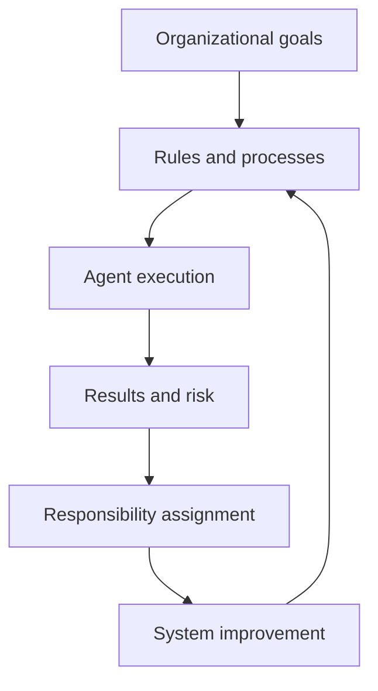
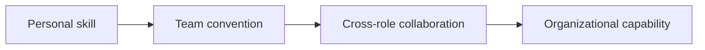
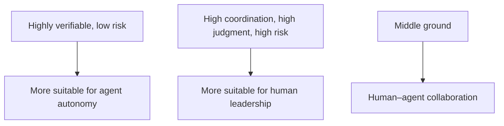
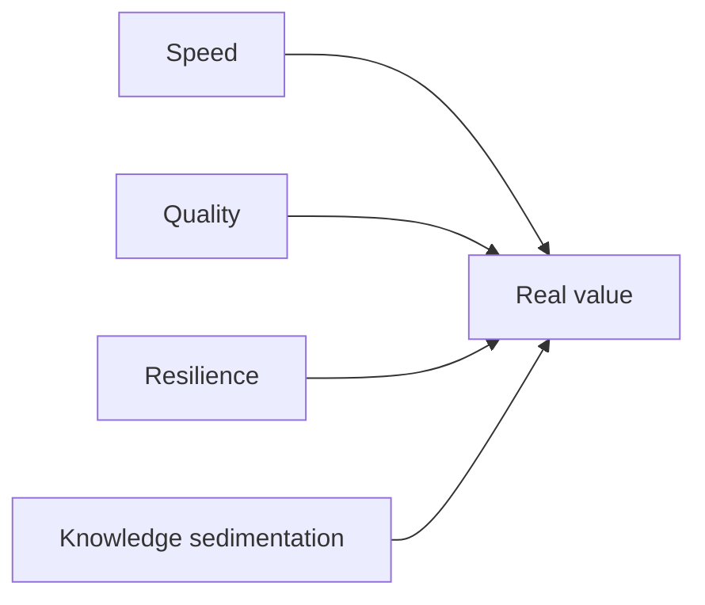
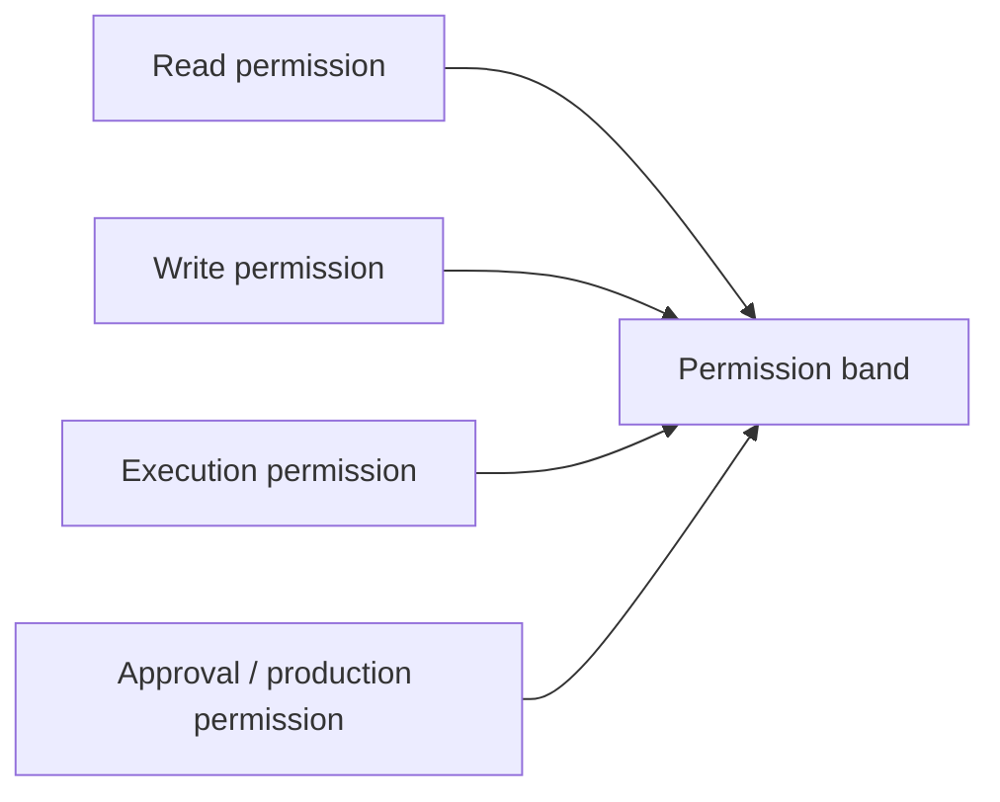
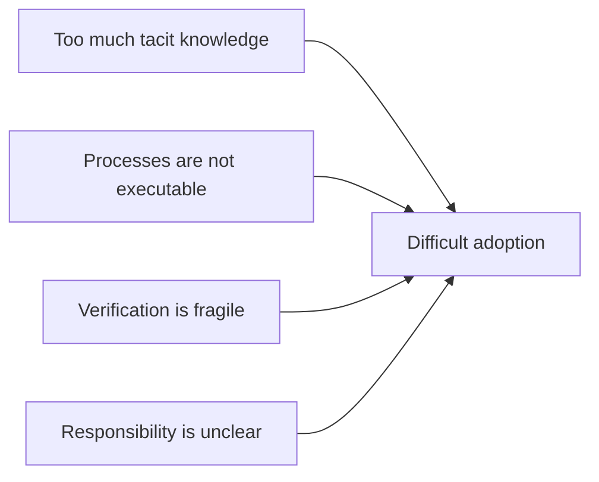
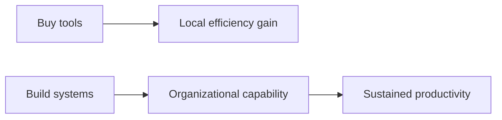

# Part V: Organization, Management, and Collaboration

Many teams do not fail because they do not know what harness should look like. They fail because, at the point of real adoption, they discover that no one actually owns it.

Once an agent system leaves individual experimentation and enters team collaboration, it stops being only a technical problem. It immediately becomes a problem of coordination, responsibility, budget, permissions, and management. Many organizations do not fail because the model is too weak, but because no one is truly responsible for the system.

This part therefore shifts its center from structure itself to how an organization receives that structure: what tasks should be piloted first, what tasks should not be touched yet, who owns the knowledge layer, who owns the evaluation layer, who owns the runtime and tool layer, who decides build versus buy, and what metrics managers should watch.

See Figures 5-1 through 5-6 in this part.

**Figure 5-1. Harness as a loop of responsibility in team capability**

Agents never work in isolation. They are inserted into organizational flow and into organizational responsibility. Automation without clear ownership only spreads risk faster.

## Evidentiary Skeleton of This Part

| Core claim of this part | Main evidence | Counter-evidence or boundary | Judgment this part aims to reach |
| --- | --- | --- | --- |
| Harness eventually becomes team capability | OpenAI's App Server shows that one harness is maintained across multiple interfaces and roles | An individual demo may run, but organizations get stuck on ownership and maintenance | Harness is not a personal trick, but an organizational asset |
| Human–agent division of labor is fundamentally a division of responsibility | Anthropic explicitly separates initializer and coding agents | If roles and escalation points are unclear, automation only spreads failure | Automation boundaries must be defined through responsibility structure |
| ROI cannot be measured only by “code gets written faster” | LangChain shows system gain; METR shows real scenes may first get slower | If one watches only speed, local wins become misleading | Managers should watch quality, resilience, sedimentation, and switching cost together |
| The divide between buying tools and building systems is organizationally decisive | App Server shows platformization, threading, and protocolization | Buying only entry-point tools often stops at local experience optimization | The real threshold lies not in connecting to a model, but in building the system |

## Running Case: When the Login-and-Invitation Redesign Enters Team Reality

At this point, the twenty-person SaaS team is no longer facing only technical problems. The hardest questions are now organizational: who defines completion, who grants permissions, who bears the consequence of accidental changes to shared authentication, who maintains the task templates and knowledge entry points, and who decides whether “faster this time” matters more than “more stable next time.”

From here onward, harness is no longer only an engineering structure. It is organizational capability.

## 1. Harness Engineering Is Not a Personal Skill, but a Team Capability

One person can certainly build a personal agent workflow. But the moment the workflow is meant to run stably in a real team, harness stops being a personal preference and becomes a team capability. Someone has to maintain the knowledge base, define the rules, update the templates, manage permissions, interpret evaluation results, and turn incidents into system repair.

If only one engineer knows the right document entry point, the default test commands, the forbidden zones in shared authentication, and the escalation conditions, then the system is not stable. It is merely that engineer's workflow. Once that person disappears, the task falls back into disorder.

This is why App Server matters. When a shared harness must serve CLI, IDE, desktop, web, and external integrations at once, invisible engineering habit has to become explicit runtime capability, configuration interface, and thread management. What emerges is not a personal workflow, but an organizational asset.

A mature organization therefore makes one move early: it turns “who maintains the environment” from an implicit expectation into an explicit division of labor.

**Figure 5-2. A new human–agent division of labor**

## 2. The New Human–Agent Division of Labor: Not Capability Division, but Responsibility Division

An agent is neither a cheap intern nor an omnipotent executor. The point of human–agent division of labor is not to let the agent do as much as possible, but to let the organization know what can be delegated, what should be collaborative, and what must be escalated to a human.

Tasks that are repetitive, verifiable, and clearly bounded are better suited to autonomy. Tasks that carry stronger value judgment, cross-team coordination, or high risk are better suited to human leadership.

The login redesign case sits exactly on that boundary. UI styling and local logic rewrites may be delegated to the agent. Structural changes to shared authentication, release-window changes, and rollback strategy determination are much harder to fully delegate—not necessarily because they are technically harder, but because they carry denser responsibility.

Anthropic's design for long-running agents shows this clearly: initialization, planning, execution, verification, and handoff are not all left to one agent. Roles are separated. The meaning is not merely that there are more agents, but that the organization has begun to answer who is responsible for which segment of failure.

This means organizations must abandon a simplistic imagination. The question is not “lower-level tasks to agents, higher-level tasks to humans.” The real line is drawn according to verifiability, reversibility, risk cost, and coordination complexity.

The essence of human–agent division of labor is therefore not a division of ability, but a division of responsibility.

## 3. A Pedagogical 180-Day Scenario for an Ordinary Technical Team

Principles alone are not enough; the time sequence must also be made visible. Consider a twenty-person B2B SaaS team in a roughly one-hundred-person company. The repository runs, CI exists, some tests exist, and people already use AI tools here and there. But a great deal of knowledge still lives in the heads of long-time employees; task handoff depends heavily on oral background; module boundaries are not always written clearly. The team chooses the login-and-invitation redesign as its pilot task because it is real, verifiable, and highly revealing.

What matters over the next 180 days is not simply how much faster the team becomes. What matters is the order in which the organization learns three things: first, how to expose the work surface; second, how to add verification and handoff; third, how to write failure back into the system and gradually make ownership, metrics, and build-versus-buy boundaries explicit.

A compressed phase table looks like this:

| Time period | What the team actually learns | Main problems exposed |
| --- | --- | --- |
| Day 0–30 | The work surface must be discoverable | Scattered knowledge, unclear boundaries, AI helping only locally |
| Day 31–60 | Completion must be verifiable; tasks must be handoff-ready | Premature completion claims, broken handoff |
| Day 61–90 | Failure must be written back into the system | Boundary collisions, repeated errors |
| Day 91–180 | The organization must know what it is building | Unclear ownership, confused metrics, build-vs-buy questions emerge |

## 4. What the First Pilots Should Be: A Matrix of Task Priority and Risk Layering

The most common adoption error is not moving too slowly, but moving too fast. When a new capability enters a team, the most dangerous impulse is “if the direction is right, roll it out everywhere.” The reality is the opposite. The newer the execution system, the more conservative, restrained, and sequenced task choice should be.

A good pilot task is not the most glamorous task, but the task most capable of forcing the organization to build a system.

A useful risk-and-feedback matrix looks like this:

| Task type | Typical characteristics | Suggested strategy | Example |
| --- | --- | --- | --- |
| Low risk, high feedback | Reversible, clearly bounded, quickly verifiable | First-priority pilot | UI changes, test completion, docs updates, local refactors |
| High risk, high feedback | Valuable and verifiable, but costly if wrong | Controlled pilot with approval and rollback | Auth refactors, DB migration scripts, release automation |
| Low risk, low feedback | Errors are not catastrophic, but benefit is unclear | Can be done, but not ideal as a showcase | One-off scripts, edge-tool integration |
| High risk, low feedback | Hard to verify, cross-team, costly, hard to rollback | Do not touch yet | Billing logic, core risk control, tightly regulated approval execution |

## 5. A 90-Day Roadmap: From Pilot to Minimal Viable Harness

Leaders do not need a final-state blueprint first. They need a route that can truly move within one quarter. A stable 90-day rhythm usually has three segments: expose the work surface, connect verification and handoff, and only then write rules and governance back into the system.

### Day 0–30: Expose the Work Surface

The first goal is not impressive productivity, but making the worksite legible.

- Write repository-relevant boundaries and forbidden zones into the repo
- Organize default test commands and startup instructions
- Clarify the boundaries among login, invitation, SSO, and billing
- Create a task template with goal, prohibitions, done definition, and escalation conditions

### Day 31–60: Bring Verification and Handoff In

The second phase makes the system continuous rather than one-shot.

- Add end-to-end tests that can truly block false positives on the invitation flow
- Create progress tracking and a feature list
- Define the minimum verification required before the agent can exit
- Specify what must be escalated: touching shared auth, changing release windows, affecting billing coupling

### Day 61–90: Write Failure Back into the System

The third phase turns local experience into team assets.

- Turn past accidental changes, false completion claims, and boundary collisions into rules or lints
- Turn common tasks into templates and golden paths
- Make ownership over knowledge, evaluation, and runtime explicit
- Begin collecting stable indicators: rework rate, escalation frequency, recovery time, knowledge reuse

A summary table helps:

| Time period | Organizational focus | Key action | Stage output | Common mistake |
| --- | --- | --- | --- | --- |
| Day 0–30 | Work-surface exposure | Organize knowledge entry, task templates, module boundaries, default commands | First discoverable work surface | Chasing immediate speed-up |
| Day 31–60 | Verification and handoff | Add tests, handoff, escalation points, explicit done definitions | First continuously executable task system | Mistaking “it runs” for “it is finished” |
| Day 61–90 | Rules and governance loop | Incident write-back, template sedimentation, role assignment, metric collection | Minimal viable harness | Watching outcomes only, not the system |

## 6. RACI-lite: Who Owns Knowledge, Evaluation, Runtime, and Improvement?

The reason organizations get stuck is often not that their principles are wrong, but that everyone agrees something matters while no one owns it. A practical response is a lightweight RACI-style table.

At minimum, four capability surfaces should be explicitly owned:

| Capability surface | Primary owner | Collaborators | Typical responsibilities |
| --- | --- | --- | --- |
| Knowledge | Business/module owner | Product, engineering, technical writer | Document entry points, boundary explanations, historical decisions, task templates |
| Evaluation | QA / quality owner / senior engineer | Business owner, platform engineering | Done definitions, test chains, graders, regression standards |
| Runtime | Platform / AI platform / DevEx | Module owner, security | Tool integration, runtime, permission bands, thread state, logs and observability |
| Improvement | Tech lead / platform owner | Whole team | Incident review, rule write-back, template sedimentation, golden path |

The titles may vary. The crucial point is that when a problem occurs, the team knows whom to go to.

## 7. How Managers Should Measure the Value of Agent Systems

To treat an agent system merely as a model purchase or tool purchase is one of the easiest managerial errors. What needs to be measured is not only token cost or code generation speed, but the production capacity of the whole system: has throughput increased? Has rework dropped? Has mean time to recovery shortened? Is human escalation frequency controllable? Is knowledge sedimenting faster? Is long-term maintenance getting more stable?

A useful ROI dashboard should therefore observe at least four groups of indicators together:

| Metric layer | What to watch | Why it matters |
| --- | --- | --- |
| Speed | Cycle time per task, wait time, throughput | Prevents intuition-only claims of efficiency |
| Quality | Rework rate, regression-failure rate, accidental-change rate, human interception rate | Reveals whether the system merely pushed problems downstream |
| Resilience | Mean time to recovery, rollback frequency, escalation frequency | Reveals whether automation is genuinely controllable |
| Sedimentation | Template reuse rate, documentation hit rate, repeated-problem write-back rate | Reveals whether the system is accumulating compounding returns |

**Figure 5-3. How to measure the value of agent systems**

## 8. Security, Permissions, and Responsibility Boundaries

Every production-grade agent system eventually meets a fundamental question: what is it allowed to do, and who bears the consequence when something goes wrong? Permission design is not merely technical control; it is a structure of responsibility.

The most mature agent system is not the system with the broadest permissions, but the system with the clearest responsibility. It pursues low-friction automation on frequent, bounded work, but preserves explicit human escalation points along high-risk paths.

A practical permission structure often begins with three bands:

| Permission band | What the agent may do | What must be escalated |
| --- | --- | --- |
| Observation band | Read code, docs, logs; generate plans | Any write action |
| Change band | Edit code in controlled branches, run tests, write docs | High-risk modules, CI changes, config changes |
| Release band | Trigger merge, release, or external actions with explicit approval | Any production-grade change or cross-system action |

Whoever can delegate power must also be able to absorb the consequences.

**Figure 5-4. Permission and responsibility boundaries**

## 9. The Real Obstacles to Enterprise Adoption

Enterprises often believe that introducing a strong model means entering the agent era. Then they quickly discover that returns are unstable. The problem is often not the model at all, but the organization's infrastructure: facts scattered across meetings and chats, untrustworthy documents, non-executable processes, unclear knowledge entry points, vague permission boundaries, weak verification, and blurred ownership.

METR is especially important here. It reminds us that in environments rich in tacit context, human familiarity can retain a strong advantage, while the interaction and verification cost of AI tools pulls work back toward humans.

Harness engineering is therefore not only a technical upgrade, but also a mirror of organizational maturity.

**Figure 5-5. Obstacles to enterprise adoption**

## 10. Build vs. Buy: When to Buy a Tool and When to Build a System

The practical question asked most often is not whether the direction is correct, but whether the organization should buy or build.

The better answer is not a binary choice, but a prior question: are we missing a model entry point, or are we missing a working system?

If the pain point is mainly “we do not yet have a usable entry point,” and tasks are concentrated in low-risk, high-feedback coding scenarios, buying a tool is often sensible. It lowers experimentation cost and helps the team discover where agents are genuinely useful.

If the team already knows that the real problems are scattered knowledge, weak verification, unclear approvals, and fragmented runtimes, then even a stronger tool only improves local experience. What really needs to be built are knowledge entry points, verification loops, and a structure of responsibility.

| Problem state | Better move | Why |
| --- | --- | --- |
| Still exploring whether agents have local value | Buy tools first | Lower experimentation cost and identify effective task types quickly |
| Value is confirmed, but results are not repeatable | Build a minimal harness | The problem is no longer the entry point, but the work surface and verification surface |
| Multiple teams repeat similar workflows | Build platform capability | The organization has entered a reuse phase |
| High-risk, high-audit scenarios | Use tools only as entry points; build key control capabilities internally | Authorization, audit, and responsibility chains must remain inside the organization |

## 11. From AI Tool Procurement to AI Production-System Construction

What organizations truly need to build is not one dazzling AI feature, but a sustainable production system. Models, IDE plug-ins, automation platforms, evaluation frameworks, permission controls, knowledge management, observability platforms, and organizational processes must be treated as one system rather than separately purchased tools.

App Server shows the difference very clearly. Buying a tool means giving engineers a stronger entry point. Building a system means turning thread management, approval interactions, tool execution, state persistence, and multi-interface access into platform capability.

That is why organizations must shift from “AI procurement thinking” to “AI system-construction thinking.” The threshold of harness engineering is not model integration, but system building.

**Figure 5-6. From tool procurement to production-system construction**

## Part Summary

This chapter is not about whether agents can work, but whether the organization is ready to let them work. Once harness engineering enters a real team, it must answer questions of division of labor, responsibility, task selection, rollout sequence, permissions, measurement, and construction path.

If this part had to be compressed into a few executable lines, they would be these:

- Do not choose the flashiest tasks first; choose the tasks most likely to force out the system.
- Use a 90-day roadmap to connect the work surface, the verification surface, and the rule surface in sequence.
- Make ownership explicit over knowledge, evaluation, runtime, and improvement.
- Measure ROI not only through speed, but through quality, resilience, and sedimentation.
- The line between build and buy is not model strength, but whether the working system itself has been built.
