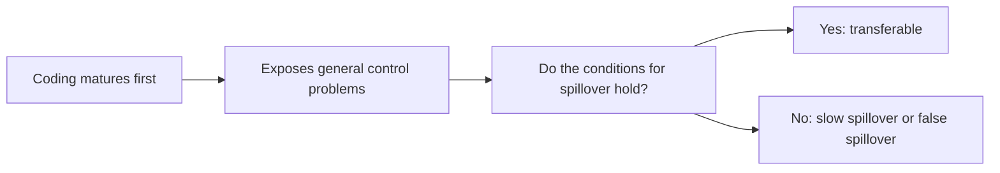
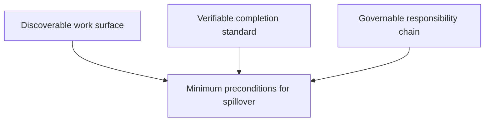
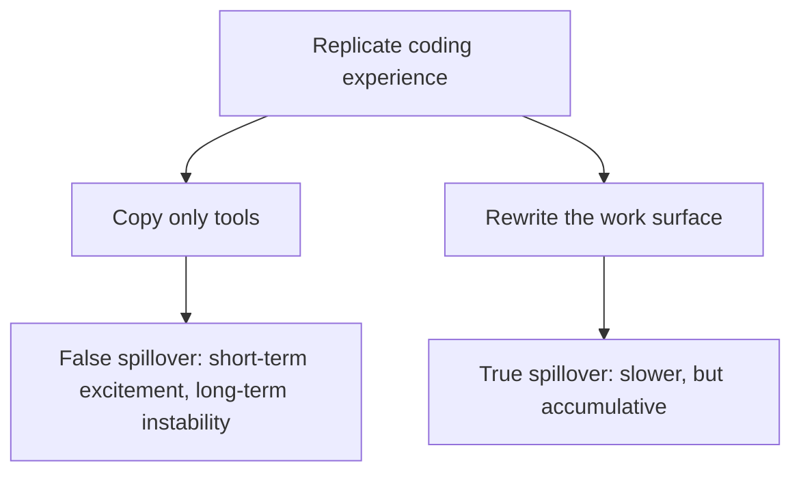

# Part VI: Beyond Coding: Generalization

Once organizational and governance issues are brought under control, the next question is how far this experience can really travel. Code is the first place where this change has taken on a clear shape.

That is not because programmers understand agents earlier than everyone else, but because code is naturally easier to version, test, diff, and roll back. Coding therefore exposed the core questions of harness engineering earlier than other fields.

But once we leave coding, the question has to be asked differently. The issue is no longer simply whether agent practice will spill outward, but under what conditions it will spill outward, under what conditions it will not, and under what conditions it will spill outward more slowly, more heavily, and more institutionally than coding did.

This chapter is not an optimistic manifesto that “everything can be harnessed.” It is a conditional analysis.

See Figures 6-1 through 6-3 in this part.

**Figure 6-1. From coding as the first template to the conditions of cross-domain spillover**

What matters here is that what spills over is not a surface scene, but a set of conditions already supported by the work environment. Coding is the first template, not the final boundary.

## Evidentiary Skeleton of This Part

| Core claim of this part | Main evidence | Reverse reminder | Judgment this part aims to reach |
| --- | --- | --- | --- |
| Coding exposes a general class of control problems | OpenAI, Anthropic, and LangChain reveal task decomposition, handoff, verification, and improvement, not merely coding tricks | Coding matured first does not mean other industries will copy at the same speed | Coding is a template, not a universal mold |
| Spillover depends on conditions, not slogans | App Server suggests harness will become platformized; Anthropic shows handoff will become skeletonized | Without a verifiable work surface, agents may slow work down rather than speed it up; METR is the counterexample | What spills over is not “the agent is strong,” but “the environment is formalized enough” |
| Outside coding, the hardest part is usually the environment, not intelligence | High-risk fields generally lack coding's native advantages of versioning, diffing, testing, and replay | If governance, audit, and responsibility chains are ignored, “generalization” becomes misuse | What will truly be scarce is domain-specific harness, not generic enthusiasm |

This part does not claim that research, customer support, law, finance, or medicine have already been proven as fully as coding. A more careful judgment is that coding first made a general set of engineering problems visible. Whether other domains can absorb these lessons depends on whether they can first make their own work surfaces sufficiently clear.

## 1. What Coding Clarified First—and What It Did Not Prove

Coding did clarify something important: once agents enter real work, they inevitably encounter control problems. How tasks are decomposed, how state is handed off, how tools are integrated, how boundaries are expressed, how completion is determined, and how error is written back into the system—these are not programmer-only issues. Any long-running agent will eventually face them.

But coding did **not** prove that these mechanisms can be copied into every industry at low cost. Coding became the first template because code work naturally has many formalizable properties: diffs, tests, rollback, replay, and versioning.

Coding matured early not only because of model capability, but because the work environment itself was unusually friendly to machine participation.

## 2. The Three Preconditions on Which Spillover Really Depends

If the first half of the book is compressed into one sentence of method, the addition here is simple: **what spills over is not a scene, but a condition.** To move from coding into another field, at least three preconditions must be met.

### 1. The work surface must be discoverable

The work surface means the factual layer on which the agent actually acts: what the task objects are, which knowledge remains valid, which state is current, which boundaries must not be touched, and which document systems the agent can truly find.

If critical knowledge still lives mainly in meetings, chats, oral handoff, and the experience of long-time staff, then the agent has no stable context surface.

### 2. Completion standards must be verifiable

Coding is fortunate because it naturally offers tests, linting, type checks, and replay. Other domains need their own receipt systems.

Research work needs evidence chains and traceable citation. Customer support needs policy consistency and promise boundaries. Legal work needs version accuracy and review mechanisms. Finance needs timeliness, auditability, and authorization consistency. If a domain cannot answer how the system knows it should stop, then it is not ready for large-scale agentization.

### 3. The responsibility chain must be governable

Many industries do not lack tools. They lack responsibility structure. Who can approve? Who can delegate? Who absorbs the consequence of an error? Who defines escalation points? Who holds rollback authority? If these are unclear, agent efficiency turns directly into organizational risk.

**Figure 6-2. The three minimum preconditions for spillover**

These three conditions are jointly necessary. With work surface but no verification, the system keeps doing more without knowing when to stop. With verification but no responsibility chain, the system knows more about problems but no one can act on them. With responsibility but no work surface, the system becomes cautious without becoming useful.

A crucial additional point is that spillover does not happen first by industry, but by task structure.

A legal team may not be ready to put agents into formal signing workflows, but may already be ready to let agents perform clause comparison and citation tracing. A support team may not be ready to let agents autonomously issue compensation, but may already be ready to use agents for knowledge retrieval, ticket summarization, and pre-escalation information assembly.

A practical coarse-grained matrix looks like this:

| Task structure | Probability of early adoption | Most common bottleneck | What agents should take on first |
| --- | --- | --- | --- |
| Stable input, verifiable output, errors can be absorbed internally | High | Default path not yet explicit | Execution, regression, first draft, comparison |
| Distributed input, semi-structured output, errors can be reviewed | Medium | Context and verification | Retrieval, organization, pre-check, handoff |
| Heavy tacit knowledge, output directly creates external consequences | Low | Constraint, responsibility, stopping mechanism | Auxiliary analysis, evidence aggregation, risk hints |

## 3. Why Non-Coding Domains Are Often Slower, Heavier, and More Institutionalized

Once these preconditions are made explicit, it becomes easier to see why non-coding domains do not take off as quickly as coding. The main problem is usually not intelligence. It is the much higher cost of formalizing the environment.

Research work faces messy source material, blurred boundaries between inference and fact, and difficulty in automatic trust evaluation. Customer support faces scattered policy versions, user history across multiple systems, and boundary crossings that can turn a small answer into a compensation or legal promise. Law and finance face an even stronger gap between plausible-looking text and results that are genuinely auditable, actionable, and attributable. Medicine raises the stakes further: error cost is so high that many “let's try it” engineering habits do not survive at all.

This is why non-coding harness is not impossible. It is simply forced to face audit, review, authorization, escalation, and institutional cost much earlier than coding does.

Coding's “good fortune” is precisely that it naturally has five agent-friendly environmental properties: diffability, rollbackability, testability, versionability, and governability. Once those five kinds of luck are made explicit, it becomes much clearer why coding practice cannot be copied lightly into other domains.

## 4. The Same Seven Layers, but Radically Different Implementation Cost

Part II presented harness as seven layers: Intent, Context, Tool, Constraint, Verification, Memory, and Improvement. Part VI adds a crucial point: once those same seven layers enter different domains, the cost structure changes dramatically.

In coding, intent can often be stabilized through tickets, issues, and diff scope. In law or medicine, intent itself may require qualification review and responsibility definition. In code repositories, context at least has version control; in support, research, and operations, knowledge freshness and source consistency are harder. In coding, tools usually mean shell, browser, editor, and CI. In finance, law, and medicine, tools are immediately tied to minimum privilege, approval chains, and log retention. In coding, verification can begin with tests; in high-risk fields, human review may need to enter much earlier and much more heavily.

That means “the same seven layers” does not imply “the same engineering difficulty.” The more universal the model is, the more necessary it becomes to face the implementation friction of each layer in each field.

| Domain | Hardest layer to structure | Why it is hardest | First value released once it works |
| --- | --- | --- | --- |
| Research | Context / Verification | Uneven source quality, blurry line between inference and fact | Stronger evidence chains and less manual source splicing |
| Customer support | Context / Constraint | Fast-changing policy, scattered user history, high overreach risk | More consistent promise boundaries and escalation points |
| Sales | Context / Memory | Rapid opportunity-state change, frequent handoff, drift-prone messaging | More stable follow-up continuity and customer-context inheritance |
| Law | Verification / Constraint | Results must be citable, reviewable, and attributable | Faster draft cycles and clearer responsibility bands |
| Finance | Tool / Constraint / Verification | Permissions, audit, timeliness, and risk must all hold together | Better process traceability and lower overreach cost |
| Medicine | Verification / Constraint | Extremely high error cost, heavy double-sign and guideline constraints | Clearer assistance boundaries and stronger traceability |

## 5. The Most Common False Spillover: Copying Tools Without Copying the Work Surface

When organizations say they want to replicate coding experience into other departments, the most common error is not overreaching in imagination but under-reaching in execution. Many supposed spillovers copy only tool entry points, not the work surface itself.

The three most common forms are these:

1. Treating the agent as a stronger chat interface rather than as part of a working system.
2. Copying tools without copying verification—giving an agent access to systems without completion definitions, escalation points, audit, or replay.
3. Copying the surface form of AGENTS docs, graders, scaffolds, or logs without doing the hard work of converting tacit knowledge into machine-workable structure.

That is why platformization and institutionalization must be discussed together. OpenAI's App Server matters not because it adds one more interface, but because it suggests that harness will rise from team habit to runtime and protocol layer.

**Figure 6-3. True spillover versus false spillover**

## 6. Three Cross-Domain Mini Cases

To make the conditions more concrete, consider three stylized mini cases.

### Mini case 1: Research teams

A research team asks the agent to do competitive scanning and produce a first literature-review draft. Surface-level, this looks very much like coding: lots of text, staged tasks, draft first and review later. But what blocks progress first is not writing quality. It is the evidence chain.

Where did this conclusion come from? Is the citation current? Is the statement factual summary or blended inference? Which parts are citable and which are only retrieval hints? The bottleneck is therefore not Tool, but Context plus Verification.

The first value released in research is rarely “fully autonomous research.” It is faster source-pool assembly, more stable evidence-chain entry points, and a shift in human time from finding sources to judging sources.

### Mini case 2: Customer support teams

Customer support is often misjudged as a pure reply-speed problem. But what matters most is whether the system knows when it must stop replying and escalate.

Policies change, customer history is scattered across systems, apparent permission issues may really touch refund or legal-promise boundaries, and the same sentence can be harmless in one context but dangerous in another. The first bottleneck is therefore Context plus Constraint, not language fluency.

The most valuable spillover is not “replace the support agent,” but turning promise boundaries, policy versions, and escalation points into executable structure.

### Mini case 3: Legal and financial teams

These domains often create the illusion that because agents can draft convincingly, formal integration is only one small step away. In reality the reverse is often true: draft ability matures early; sign-off ability matures slowly.

The real questions are whether the draft can be formally cited, who bears responsibility for the judgment, where the approval chain enters, and whether traceability, audit, timestamping, and version replay are sufficient. The first bottleneck here is usually Verification plus Constraint plus governance responsibility.

The key point is that what these three cases show is not which industry is “harder,” but that the first layer requiring repair is different in each domain.

## 7. How a Team Knows It Has Reached the Spillover Preparation Phase

Organizations need a practical readiness test, not only a theory. A useful first check is whether there is already a minimum viable spillover pilot.

Five questions help:

1. Does this task have sufficiently clear and bounded inputs?
2. Does it have at least one automatable or semi-automatable receipt of completion?
3. If an error occurs, can it be discovered and contained within the organization first?
4. Can the most valuable part of the task be split into retrieval, organization, handoff, or comparison before demanding end-to-end autonomy?
5. Does someone already hold pause authority, escalation authority, and write-back authority?

If three or four of these remain blurry, the right move is usually not “connect an agent and see what happens,” but “first organize the task until it is worth piloting.”

## 8. Which Domains Should Not Be Forced in the Short Term

Discussion of where spillover may succeed must be balanced by discussion of where autonomy should not be forced yet. The least suitable tasks are those that satisfy several of the following conditions simultaneously:

- The work surface depends heavily on tacit knowledge and there is no near-term intention to organize it
- Wrong output directly creates external promises, money movement, medical advice, or compliance risk
- There is no stable pause point, approval chain, or escalation authority
- There are no sufficiently fast verification, replay, or audit mechanisms
- Even the task owner cannot clearly define what “done” means

Once three or four of these hold together, the organization is not yet in the spillover-preparation phase. It is still in the prehistory of environment construction.

## 9. What Will Actually Be Scarce Is Domain-Specific Harness

The coldest conclusion of this part is the most important one. What will truly be scarce in the future is not generic excitement about agents, nor simply early access to the strongest model. It is the ability to reorganize a domain's knowledge, boundaries, verification, and responsibility chain into an environment in which agents can genuinely work.

That means competition will move. Early competition is about models and tool access. Mid-stage competition moves to work-surface formalization, verification reliability, responsibility clarity, and runtime maturity. Long-run competition moves further into the institutional thickness of domain-specific harness.

So the key conclusion is not that harness will rule every industry, but something colder: **what spills over is not a scene, but a condition.** Real spillover does not begin by installing more tools. It begins by remaking the work surface, the verification surface, and the responsibility surface of a domain.

## Part Summary

Coding became the first template for harness engineering not because it represents all work, but because it first possessed the environmental advantages of versioning, verification, replay, and rollback. Whether spillover occurs elsewhere depends not on slogans, but on three preconditions: discoverable work surfaces, verifiable completion standards, and governable responsibility chains.

That is why the hardest part outside coding is usually not model intelligence, but the cost of environmental formalization. The real threshold of cross-domain adoption is not enthusiasm, but domain-specific harness.
