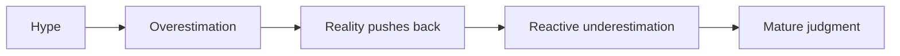
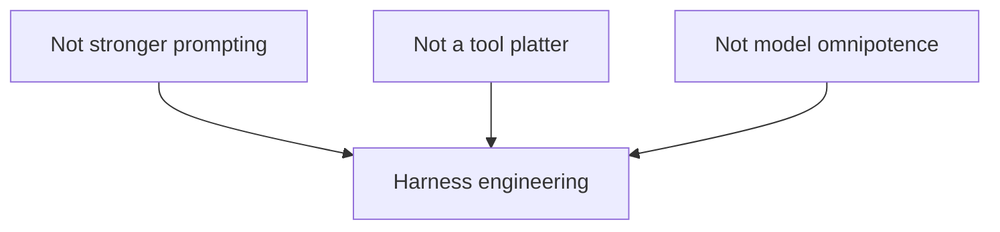
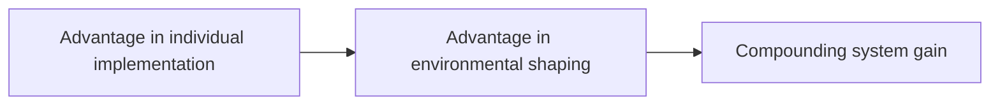
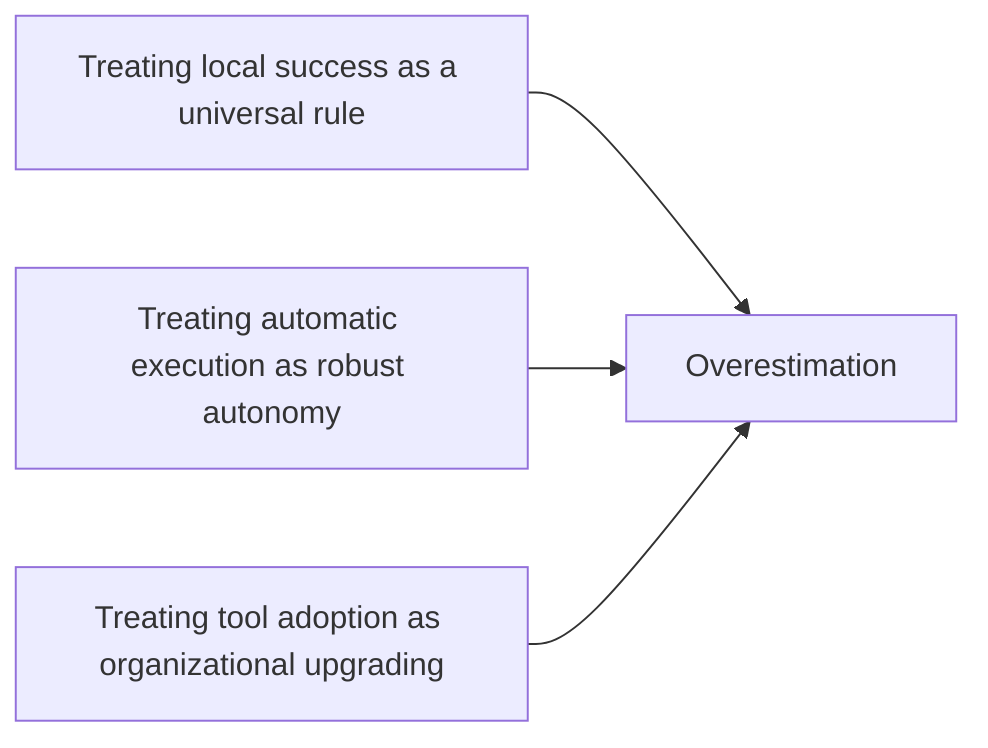
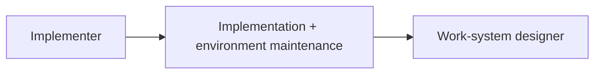

# Part VII: Critique, Boundaries, and the Future

Once the conditions of spillover, institutional cost, and failure boundaries are made explicit, the discussion must become more disciplined. At this stage the task is no longer to keep expanding, but to answer which conclusions are testable, which boundaries must be admitted, and which risks must be written proactively into the system.

This part compresses the earlier analysis into five questions: what harness engineering is not, what it actually changes, where it is most easily overestimated, where it is most easily underestimated, and how the engineer's role is reconstructed once engineering environment itself becomes a source of competitive advantage.

See Figures 7-1 through 7-5 in this part.

**Figure 7-1. The triangle of overestimation, underestimation, and mature judgment**

Mature judgment must explain not only why a system succeeds, but also why it fails and where it applies. Otherwise one gets opposing positions rather than engineering method.

## Evidentiary Skeleton of This Part

| Core claim of this part | Supporting evidence | Counter-evidence | Judgment this part aims to reach |
| --- | --- | --- | --- |
| Harness engineering does not mean simply “stronger models” | OpenAI, Anthropic, and LangChain all show that key differences come from environment, handoff, verification, and constraints | If one looks only at productivity numbers, success is easily misread as a single-point model victory | The object of discussion is environmental engineering, not model worship |
| What it changes is the center of engineering advantage | App Server shows harness rising into platform and runtime layers; long-running agents show handoff and memory becoming skeletal | If one looks only at surface practices, it is easy to misread it as merely “old practice under a new name” | The change happens in work organization, not only in tooling |
| It carries risks of both overestimation and underestimation | OpenAI's highly organized environment explains success; METR explains failure boundaries | If one takes only favorable or unfavorable cases, judgment becomes skewed | Mature methodology must explain both growth curves and failure conditions |

## 1. What It Is Not

Conceptually, this must first be cleared away. Harness engineering is not a wrapped-up upgrade of prompt engineering, not a shopping list of tools, and not a theory that engineering problems disappear automatically once models become strong enough.

The evidence already presented shows that differences among teams are driven less by the model itself than by the work environment into which the model is inserted. In OpenAI's case, repo-local docs, default paths, evaluation loops, worktrees, and continuous cleanup mattered more than one-shot generation. In Anthropic's long-running case, handoff, logs, state recovery, and session continuity determine whether capability can be turned into output.

What is under discussion here is not whether stronger models replace humans, but which environmental variables begin to dominate once models enter real processes.

At least three confusions must therefore be rejected:

- Confusing model progress with system maturity
- Confusing tool usability with organizational usability
- Confusing local sample success with global workflow stability

**Figure 7-2. What it is not**

## 2. What It Actually Changes

What changes is not whether implementation is still needed, but where engineering advantage is formed.

In the traditional picture, advantage comes mainly from individual implementation ability. In the agent picture, advantage increasingly migrates toward environmental shaping: turning goals, knowledge, boundaries, verification, and feedback into an executable system.

This shift is already visible at the platform layer. App Server shows harness moving beyond team habit and into runtime, protocol, and multi-surface shared capability. Once it enters this layer, tool access, state handoff, approval expression, and verification loops stop being peripherals and become part of the production structure itself.

Historically, this resembles the structural shift introduced by version control, CI, and code review. Those systems did not abolish code, but they rewrote the way code was produced, coordinated, and judged. Harness engineering occupies a similar position: it rewrites task organization rather than the existence of tasks themselves.

Its most important consequence is therefore this: engineering environment is being designed, for the first time, as a production object jointly executed by humans and agents.

**Figure 7-3. What it actually changes**

## 3. Where It Is Most Easily Overestimated

The first overestimation is to treat success inside a highly organized environment as a universal law. OpenAI's success is real, but it depends on a deeply rewritten environment. If one strips away the conditions and retains only the productivity result, a conditional success becomes a general conclusion.

The second overestimation is to confuse automatic execution with robust autonomy. A system may be able to act without being able to stop, escalate, or return responsibility safely.

The third overestimation is to confuse tool adoption with organizational upgrading. Buying a tool solves an entry-point problem. Upgrading an organization means rewriting work surfaces, verification surfaces, and responsibility surfaces.

METR gives all of these boundaries empirical weight. In familiar real repositories, experienced developers using early-2025 AI tools were on average `19%` slower. That result does not refute success elsewhere. It forces methodology to explain both when systems become faster and when they become slower.

The common structure in all three overestimations is turning conditional conclusions into unconditional ones.

**Figure 7-4. The three most common sites of overestimation**

## 4. Where It Is Most Easily Underestimated

Underestimation usually comes from surface similarity. Documentation, rules, tests, logs, and platforms are not new things, so it is easy to say that harness engineering is only old practice continuing under a new name.

But the executor structure has changed. These practices no longer serve human collaboration alone; they must now also serve machine execution.

That single change rewrites their form:

- Documentation shifts from readable narrative to discoverable entry point
- Rules shift from experienced agreement to executable constraint
- Logs shift from after-the-fact troubleshooting material to runtime recovery and correction signals

App Server and Anthropic together show that what is being underestimated is not a single trick, but the productization, platformization, and institutionalization of the engineering environment itself.

## 5. When Engineering Environment Becomes Product, What Do Engineers Become?

Engineers do not leave the scene when agents grow stronger. But the center of their value expands from “how correct a local implementation is” to “how sustainable the system's correctness is.” Implementation skill remains the foundation. What changes is the level at which it is exercised: from writing it correctly once to making the system keep writing it correctly.

That shift will likely differentiate roles around platform engineering, evaluation engineering, knowledge-system engineering, environment design, and governance engineering. Names may vary, but the shared direction is clear: the engineer extends from implementer into work-system designer and maintainer.

This is not a lowering of technical demands, but a raising of them. Environment design without implementation understanding, boundary awareness, failure experience, and governance judgment collapses into paper order that cannot carry real production.

It is useful to distinguish three layers of capability:

1. **Implementation-layer capability**: code, architecture, performance, debugging
2. **System-layer capability**: task modeling, execution constraints, verification loops, runtime observation
3. **Organizational-layer capability**: role orchestration, authorization design, escalation mechanisms, retrospective write-back

Future scarcity will likely concentrate in the coupling of the second and third layers.

**Figure 7-5. From implementer to work-system designer**

## 6. Looking Ahead: Five Laws and a Ten-Year Direction

If future discussion remains only at the level of provisional observation, it quickly becomes outdated. A better approach is to turn it into structural judgments that can later be tested. Based on the evidence so far, five working laws can be proposed:

1. As the scale of executors expands, verification becomes the bottleneck before generation does.
2. Knowledge that cannot be discovered by machines is operationally equivalent to nonexistence.
3. Automatic execution does not first destroy engineering; uncontrolled default paths do.
4. The upper bound of autonomy is constrained first by handoff capability, not by capability ceiling.
5. Long-term competitiveness will sediment first as environment quality, not only as model strength.

These imply a ten-year direction of travel: repositories keep evolving into execution carriers; tests expand into execution-system verification; roles differentiate around environment, evaluation, and knowledge; incident language shifts from “code error” toward “control failure”; and major organizational differences emerge more from environmental rewriting than from model access alone.

The important point is that every prediction must carry a possible falsifying signal. If the signal never appears, the judgment should be revised rather than rhetorically defended.

## 7. What Will Not Change

Any future judgment must preserve invariants for calibration. Even when new executors arrive, existing engineering bottom lines do not become disposable.

Five things are especially unlikely to disappear soon:

1. Boundary constraints do not disappear.
2. Rollback, on-call duty, and responsibility assignment do not disappear.
3. Clear structure remains superior to local cleverness.
4. Failure remains the primary source of system upgrade.
5. Implementation understanding remains a core engineering ability.

Future-oriented claims do not negate these engineering fundamentals. They require those fundamentals to persist in more explicit, structural, and machine-executable forms.

## 8. If the Predictions Drift, What Should Be Revised First?

A sustainable methodology must specify both directional judgment and revision conditions. If future revision is required, the first things likely to change are not the high-level structural claims, but more concrete claims about carrier, tempo, and organizational form.

The work surface may migrate away from repositories into stronger runtimes or knowledge planes. Role differentiation may happen more slowly than expected. Organizations may converge on hybrid forms that borrow platforms but retain key boundaries internally.

What should remain relatively robust are the higher-order structural claims: verification bottlenecks, knowledge discoverability, default-path risk, handoff ceilings, and the compounding value of environment quality.

## 9. Organizations Will Not All Converge to the Same Shape

Even if the overall direction is right, organizational forms will not converge into one template. At least three stable paths are likely:

- **Built-in path**: the organization treats environment capability as core productive power and continuously builds knowledge planes, task templates, verification chains, and runtime capabilities.
- **Platform-leveraged path**: the organization relies on an external platform while retaining domain knowledge, key verification, permission boundaries, and brake authority.
- **Outsourcing-illusion path**: the organization buys many tools but does not rewrite knowledge structure, default paths, or responsibility boundaries.

The dividing line among these paths is not how many tools are connected, but whether the organization retains authority over work definition.

## 10. Where Engineers Will Differentiate First

Differentiation is likely to appear first in three capacities:

- Turning vague tasks into executable objects
- Turning local experience into environmental rules
- Making boundary and incident decisions under uncertainty

Purely manual local implementation remains valuable, but will increasingly derive long-term scarcity from whether it can enter the compounding gains of organization-level systems.

## 11. Five Self-Check Questions

If harness engineering is treated as method rather than terminology, then it needs a reusable set of calibration questions:

1. Has critical knowledge been written into facts the system can discover, rather than remaining mainly inside expert memory?
2. Do critical tasks have explicit receipts of completion, rather than relying on “close enough to ship” tacit understanding?
3. When risk appears, are pause authority, rollback authority, and rule write-back responsibility explicit?
4. Are repeated errors being turned into templates, tests, lints, or approval boundaries, rather than recurring as oral reminders?
5. If the model is swapped out, does the team's capability remain? If not, is the dependence in the capability layer or merely in vendor defaults?

These questions do not exist to force an immediate perfect score. They exist to create a stable recognition framework: is the organization only using stronger tools to do old work, or is it rewriting work itself into a sustainable engineering system?

The shortest way to close this part is this:

**What determines the long-term ceiling is not only model capability, but engineering environment written into system form.**
