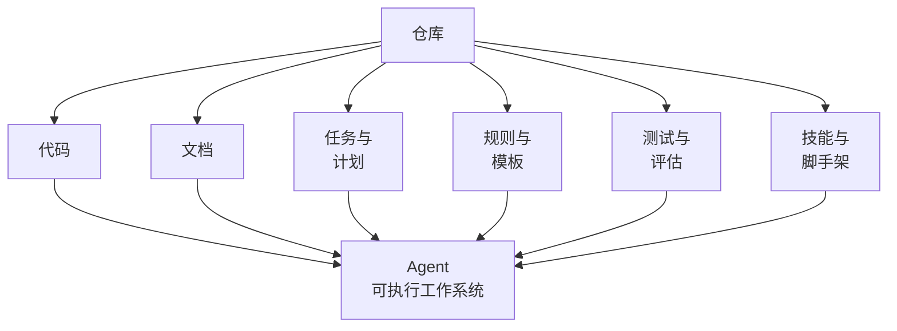
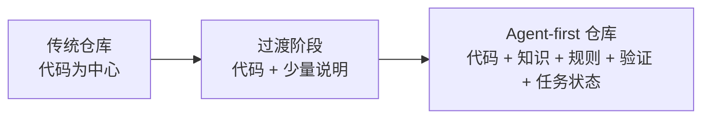
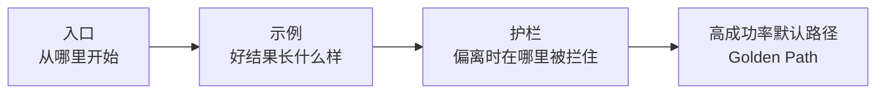
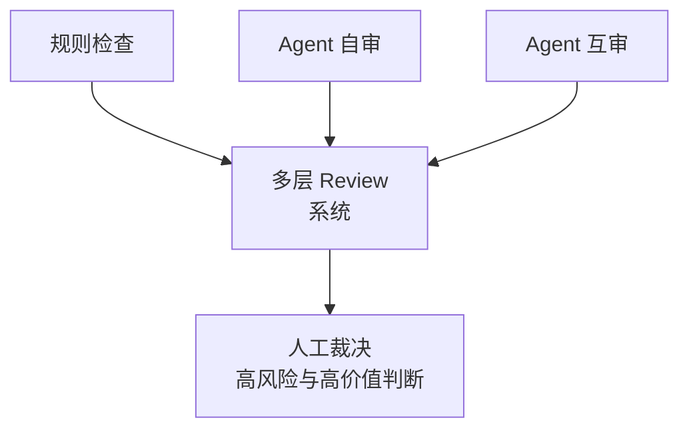
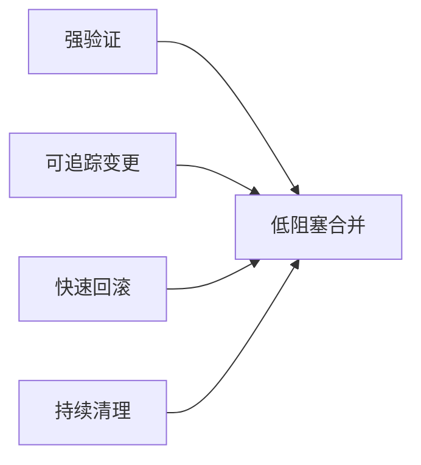
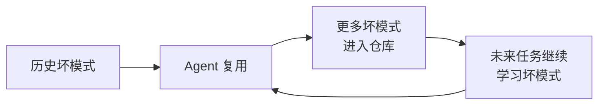
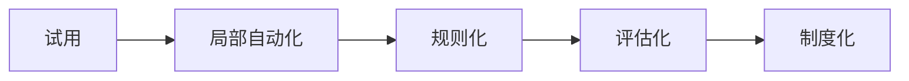

# 第三篇：Agent-First 软件工程

当 harness 不再只是概念，而开始变成结构，软件工程现场就不会保持原样。仓库怎么组织，架构怎么划边界，review 怎么分层，默认路径怎么设计，过去这些看起来更像工程治理或团队习惯的问题，都会突然获得新的中心地位。

因为一旦 agent 真正进入工作流，软件团队面对的就不再只是“代码该怎么写”，而是“现场该怎么被写”。

问题一旦落进真实代码库，软件团队真正要重写的就不再只是实现，而是工程现场本身。

这里关心的，不是 agent 能不能写代码，而是仓库、架构、review 和默认路径会因此发生什么变化。

本篇图示见图 3-1 至图 3-7。

**图 3-1 仓库如何变成 agent 的操作系统**

这张图概括了本篇的起点：在 agent-first 环境里，仓库不再只是代码容器，而是多种工程资产的聚合体。只有当代码、文档、规则、计划、测试与模板共同进入同一个可发现空间，仓库才会演化成 agent 的“操作系统”。

## 本篇证据骨架

| 本篇核心命题 | 主要证据 | 反向提醒 | 本篇要得出的判断 |
| --- | --- | --- | --- |
| 仓库正在变成 agent 的操作系统 | OpenAI 把 docs、计划、评分、状态和可观测性都纳入 repo/worktree | 如果知识仍散落在口头沟通里，agent 仍会迷路 | repo-first 已从整洁习惯变成生产力基础设施 |
| golden path 比局部高手更重要 | Anthropic 用 initializer agent、progress log、feature list 建默认工作路径 | 没有默认路径时，长时程 agent 会失忆或过早收工 | agent-first 团队的竞争力来自默认路径设计 |
| review、merge、slop 治理必须系统化 | OpenAI 高吞吐 PR 场景逼出 lint、评分器、background cleanup | 吞吐一高，人工逐行审稿和“以后再清理”都会失效 | 软件工程治理会前移、自动化并制度化 |

## 1. 仓库如何变成 Agent 的操作系统

在传统协作中，仓库主要保存代码；在 agent-first 环境中，仓库越来越像工作操作系统。它不只是代码所在之地，更是事实来源、导航入口、规则承载体和执行环境的一部分。设计文档、执行计划、知识索引、技能文件、脚手架、测试规则、评估样例、结构约束，越来越多地被收纳进仓库，因为只有进入仓库、被版本化、被发现，它们才会进入 agent 的可用世界。

OpenAI 在内部用 Codex 做产品时，几乎把这件事演成了教科书式案例。他们很快发现，一份不断膨胀的 `AGENTS.md` 并不能真正解决问题，于是把文档拆进 repo，把计划、评分、技术债、任务状态和架构说明都纳入版本控制；同时让每个 worktree 都能独立启动，再把日志、指标和 DevTools 暴露给 agent。这个案例说明，所谓“仓库变成操作系统”，不是一句比喻，而是代码库真的开始承担启动、导航、验证和状态管理这些过去散落在工程师脑中的职能（见参考文献[1]）。

这意味着仓库设计不再只是工程美学问题，而成为生产力问题。一个对 agent 不友好的仓库，即使对人类团队尚可，也会导致 agent 频繁迷路、重复试错、误判边界。相反，一个拥有清晰入口和层级的仓库，会显著降低任务启动成本。

过去我们会说“代码才是真相”，而在 agent-first 世界里，这句话需要被重新理解。代码仍然是系统行为的最终表达，但对 agent 来说，只有代码并不足以支撑可靠行动。它需要知道从哪里开始、哪些文档可信、哪些目录是边界、哪些脚本是标准入口、哪些规则是硬约束、哪些历史决策仍然有效。于是，仓库从代码集合变成了知识与行动的复合空间。

因此，越来越多团队会把计划文件、任务记录、设计说明、评估配置和技能文档纳入版本控制。它们并不是附属材料，而是 agent 工作所需的事实层。对人类来说，这些信息分散在脑中也许尚可勉强补足；对 agent 来说，若它们不在仓库中被发现，就等于不存在。

因此，仓库设计的目标也发生了变化。过去的重点是让人类协作者容易理解；现在还要加上一条，让机器协作者容易导航。一个成熟的仓库会像一座设计良好的城市，不只有建筑，还有路牌、功能区、公共设施和行为规则。

对一个普通团队来说，这种变化往往不是从“我们决定建设 agent-first 仓库”开始的，而是从几次非常具体的失败开始的：agent 总去错目录、总忘记某个设计约束、总从旧 README 启动、总要人类反复贴同一段背景。于是，仓库的最小升级顺序慢慢浮出来。通常最先被补上的，不是宏大的知识平台，而是四类最小工件：

- 一个真正可信的入口文件，告诉系统先从哪里开始
- 一张目录和模块地图，避免它每次都从树顶重新摸索
- 一组标准运行与验证命令，让行动链路能闭环
- 一份持续更新的任务状态，让下一轮协作者不是接残局

仓库之所以会从“代码存放地”变成“工作操作系统”，不是因为团队突然热爱文档，而是因为所有没有被写进仓库的隐性知识，都会在 agent 介入后迅速暴露为反复返工的成本。

一个很典型的失败现场是这样的：同一条邀请链路，代码在 `apps/web`，旧接口说明在 `docs/legacy`，真正还有效的迁移约束躺在一份几个月前的 PR 讨论里。人类老成员大致知道这些碎片分别意味着什么，agent 却只能先抓住最容易发现的文件。它没有“理解错业务”，它只是进入了一个没有被整理成工作面的仓库。

**图 3-2 从传统仓库到 agent-first 仓库的演化**

## 2. 代码可读性的新对象

我们早已习惯讨论代码可读性，但那通常意味着“新同事是否容易读懂”。现在还要再加一个问题：未来的 agent 是否能从代码和文档中恢复正确意图。所谓 agent legibility，并不是让代码迎合模型，而是承认：如果 agent 是长期协作者，那么代码结构就必须支持它稳定导航。

这会改变一部分风格判断。过度隐式的约定、为人类捷径设计的复杂技巧、含混的命名和跨层耦合，在 agent 语境下会被放大为系统风险。相反，清晰边界、显式依赖、可搜索命名、稳定模式和高质量文档，会成为更关键的可维护性资产。

需要强调的是，“给 agent 读”并不意味着牺牲“给人读”。高质量的可读性通常对两者都有利。一个命名明确、边界清楚、模式稳定的系统，本来就更适合新同事加入，也更适合 agent 介入。问题出在那些对熟手来说“懂的都懂”的局部技巧上：它们对少数人很高效，对大多数人不透明，对 agent 则尤其脆弱。

这会让我们重新理解许多传统最佳实践。比如显式接口、少魔法、少跨层、少隐式副作用，过去主要被视为维护性要求；在 agent-first 环境中，它们同时也是执行效率要求。因为 agent 越能从结构里读出意图，就越少需要靠猜测行动。

因此，代码可读性正在从一种审美争论，转向一种系统工程要求。写给未来的人，也是在写给未来的 agent。

这件事在真实代码里往往比在文档里更容易看出来。人类熟手最能容忍的，通常是那些“知道的人都知道”的隐式写法：一个函数名并不准确，但团队知道它其实承担两层职责；一个目录名看似通用，但实际默认只服务某条业务链路；一个对象字段明明承载策略含义，却没有任何显式注释。对人类来说，这些都可以靠长期经验补齐；对 agent 来说，它会把这些模糊当成结构事实。

于是，可读性开始出现新的最低标准。不是把每一行都写成教程，而是尽量减少“只有熟手才知道”的暗门。能显式写出的边界就不要靠默会规则维持，能拆开的职责就不要继续塞在方便的人类捷径里，能通过命名表达的意图就不要交给阅读者猜。所谓 agent legibility，说到底不是讨好模型，而是在逼团队清理那些原本就不该长期存在的工程含混。

一个常见的失败瞬间是：agent 读到一个叫 `normalizeUser` 的函数，就把它当成纯格式整理工具；老成员却知道这个函数历史上还顺便承担了“遇到受邀用户时补一段组织状态”的副作用。于是它在一次看似无害的重构里把这段副作用拆走，代码表面变干净了，邀请流程却在边界条件上开始掉链子。这里出问题的不是推理能力，而是代码本身长期在向新协作者撒谎。

## 3. 架构不再只是“优雅”

对许多团队来说，架构规则往往在规模变大以后才被认真对待。但在 agent-first 世界里，架构边界常常是起步阶段就必须建立的生产基础设施。清晰的层次、依赖方向、领域边界和横切接口，能够大幅降低 agent 在系统中误走的概率。

这类约束过去常被理解为长期治理成本，现在却变成短期速度收益。因为 agent 的问题不只是“会不会写”，而是“会不会在正确的地方写”。架构规则越明确，导航越稳定，回归验证越有效，自动修复就越可行。架构不只是为了优雅，也是为了大规模自治。

很多团队在手工编码时代，可以靠少数核心工程师记住系统的真实边界，并通过 code review 人工纠偏。但 agent 的吞吐会迅速放大这种隐性治理的局限。没有被明确表达、没有被规则化、没有被检测器执行的架构，在 agent 时代几乎等于不存在。

因此，agent-first 环境天然偏爱更“刚性”的架构。这里的刚性不是僵硬，而是边界明确。领域层、应用层、接口层、基础设施层的依赖方向，某些目录不得互相引用，某些模块只能通过标准接口访问，这些都不再只是架构文档里的建议，而要变成能够被检查的规则。

一旦架构被机械化，agent 就不再需要每次都重新推理“我该不该这样改”，而可以把更多资源放在任务本身。架构由此从品味问题，变成吞吐基础设施。OpenAI 公开提到他们会把品味和结构要求继续往 custom lints、评分器和后台清理任务里沉，这恰好说明：agent-first 团队里的“好架构”，不是一份人人点头的文档，而是一套会真的拦路、真的打分、真的逼人回正轨的执行机制（见参考文献[1]）。

一个普通团队最先值得机械化的，通常不是所有架构原则，而是那几条一旦被违反就会立刻放大返工成本的规则：

- 哪些目录可以相互引用，哪些绝不应跨层直连
- 哪些共享模块只允许局部修补，不允许顺手重构
- 哪些高风险路径一旦被触碰，就必须升级人工审查

这类规则一旦没有被写成可执行边界，agent 就会天然沿着“局部最省事”的方向行动。因为对它来说，最显眼的代码位置常常就是最先动手的位置，而最显眼并不等于最合适。

架构层失效时，最让人头疼的不是一次性的大崩溃，而是那种不断横向蔓延的小改动。团队本来只想改登录与邀请，却发现 agent 顺着依赖链一路改到了共享鉴权、用户状态聚合、甚至一个与计费兼容相关的老接口。每一处改动单看都不荒唐，合起来却把一个局部任务拖成了一场系统级清扫。这里真正缺的，不是更强的 review 意志，而是更早的结构边界。

## 4. 从“写实现”到“设计 Golden Path”

人类工程师最擅长在模糊空间里临场创造，agent 更擅长沿着清晰路径高吞吐执行。因此，agent-first 团队的一个重要转向，是从“依赖高手写对关键实现”变成“设计一条默认就不太容易走错的生产路径”。

这条路径可以体现为模板、脚手架、示例实现、技能、目录约定、默认验证、常见错误修复手册。它的目的不是限制创造，而是让大多数任务落在高概率成功的通道里。Golden path 的价值，在于把分散的工程经验压缩成低摩擦的默认选择。

很多团队过去把模板视为初级化、把规范视为束缚，把能力理解为“遇到什么都能现写”。但当执行者的一部分变成 agent 时，默认路径就会成为生产力核心。因为 agent 的强项不是在无边界空间里发明流程，而是在明确路径上极快地推进。

成熟的 golden path 往往包含三种东西。第一是入口，告诉 agent 从哪里开始。第二是示例，告诉 agent 好结果长什么样。第三是护栏，告诉 agent 偏离后会在哪里被拦住。入口减少启动成本，示例减少理解成本，护栏减少返工成本。三者共同决定系统的平均质量。

Anthropic 为长时程 coding agent 设计 harness 时，给出的其实就是一个非常典型的 golden path。他们不让 agent 每次从一片混沌中重新开工，而是先由 initializer agent 建立 `init.sh`、progress log、feature list 和可恢复状态；后续 coding agent 则一轮只推进一个 feature，并在每轮结束时留下明确交接信息。这种设计看上去不像“炫技”，却非常说明问题：golden path 的本质，不是让 agent 更自由，而是让它默认走进一条可交接、可验证、可恢复的生产路径（见参考文献[9]）。

因此，golden path 不是文档附录，而是组织生产力的主通道。它的本质是把少数高手脑中的判断，沉淀为多数任务都能复用的环境设计。

对大多数团队来说，golden path 也不是一夜之间设计出来的。它通常会先以一些看似零碎的东西出现：一份“从这里开始”的启动说明，一套默认脚手架，一个规范化的任务模板，一组收口前必须跑的命令，一条写明升级条件的检查表。后来团队才会发现，这些东西加在一起，其实已经构成了默认路径。

一条真正有用的 golden path，至少要解决四个问题：

- 如何开工：从哪份文件、哪个命令、哪张地图开始
- 如何模仿：仓库里哪里有足够好的参考实现
- 如何收口：什么证据出现时，系统才允许自己说做完了
- 如何求助：什么情况必须停下并升级给人

没有这些东西时，团队很容易陷入一种假象：agent 看上去每天都在忙，但每次都像第一次。它会重新找入口，重新猜边界，重新摸索命令，重新决定何时停下。表面是高频行动，底层却没有路径复利。

一个失败现场通常很短：团队让 agent 修一条邀请流程里的 bug，仓库里也确实有前人写过的类似实现；但那个示例藏在旧目录里，没有任何入口说明，新的默认脚手架又没补这类任务模板。于是 agent 没走已有的好路径，而是重新拼出一条临时路径。它不是不会模仿，而是仓库没有把该模仿的东西变成默认可达。

**图 3-3 Golden Path 结构图**

## 5. Review 的重构

如果 agent 的产出速度显著超过人类 review 的速度，那么传统的人工 review 模式就会成为瓶颈。于是，review 被重构为多层系统：规则检查负责结构性问题，agent 自审负责显性缺陷，agent 互审负责补充视角，人类 review 则更多用于处理价值判断、边界争议与高风险变更。

OpenAI 那个几个月里产出上千个 PR 的内部案例，最能说明这一点。只要吞吐一上来，人类逐行 review 就不再是默认中心，而只能成为整个质量系统里的最后一层。真正可扩展的做法，只能是把越来越多问题前移到 lint、测试、评分器、结构规则和 agent 自检里。否则团队不是在做 agent-first 软件工程，而是在用更快的方式把资深工程师拖进更重的审稿劳动（见参考文献[1]）。

这不是削弱 review，而是把 review 从单点人工劳动升级为分层质量系统。变化在于，人类不再承担所有问题的第一发现者，而转向最终裁决者和规则设计者。

这种变化会带来 review 文化的重写。过去，一次高质量 review 常常表现为资深工程师逐行审阅、指出设计偏差、补充边界条件、修正文风与命名。未来，高质量 review 更可能表现为：哪些问题已经前移到 lint 和测试，哪些问题交给 agent 自检，哪些问题通过模板被避免，哪些问题保留给人类做高价值判断。

这里的核心不是“让机器代替人审查”，而是让人工注意力集中到真正值得人工关注的地方。凡是可以被明确规则描述的问题，都不应反复消耗资深工程师的时间；凡是涉及业务价值、架构取舍、跨团队协调和高风险边界的问题，才是人类 review 应重点保留的空间。

Review 因此从“发现所有错误”转向“设计错误发现系统”。这是一种更高层的质量管理，也是一种更难但更可扩展的工程能力。

这会逼团队重新设计问题分流。一个更成熟的 review 系统，通常会把问题按层次拆开：

- 结构性问题交给 lint、类型系统、结构测试和规则检查
- 可复述的实现问题交给 agent 自检和固定检查清单
- 横向比较和补充视角交给 agent 互审
- 真正高价值的人类判断，保留给架构取舍、风险例外和业务边界

如果这四层没有分开，人类 review 就会重新被最机械的问题拖住。团队名义上引入了 agent，实际却只是把资深工程师的时间从写代码换成了审大量本可前移发现的问题。

因此，review 重构不是为了减少人工存在感，而是为了提高人工稀缺判断的密度。一个团队真正成熟的标志，不是 agent 能写多少，而是高价值的人类注意力是否被留给了真正值得人类做判断的地方。

**图 3-4 多层 Review 系统图**

## 6. Merge 哲学为什么会变化

在高吞吐 agent 系统中，等待有时比修正更昂贵。许多团队因此会倾向于缩短 PR 生命周期、减少不必要阻塞，并把一部分传统上“必须合并前完成”的工作转移到快速后续修复。这样的流程并不天然危险，但它成立的前提非常苛刻：必须有足够强的验证、追踪、回滚与持续清理能力。

没有这些条件，所谓快速合并只会制造债务；拥有这些条件，快速修正反而可能是更优策略。重要的不是模仿表面流程，而是理解支撑这一流程的系统能力。

这背后的变化其实是风险控制方式的变化。传统流程倾向于把尽可能多的风险在合并前压平，因为修复速度有限，变更频率也有限；agent 环境下，修复速度和变更频率都显著上升，于是系统开始更依赖“快速发现、快速回退、快速修正”的能力。

这并不意味着严谨性下降。相反，只有当验证、可观测性和责任边界足够成熟时，系统才有资格缩短阻塞路径。否则，快速合并只是把问题更快地传播出去。

所以，merge 哲学的改变不是一种态度上的冒险，而是一种系统能力被重新配置后的结果。不能只学表面速度，而不建设背后的恢复力。

也因此，并不是所有团队都适合一开始就追求低阻塞合并。下面几种情形里，合并门槛反而应该更高：

- 回滚仍然缓慢，且回滚步骤主要依赖个别人记忆
- 关键链路的验证仍以人工冒烟为主，没有稳定自动信号
- 日志与灰度指标无法快速定位“是哪里坏了”
- ownership 模糊，出了问题没人有权第一时间拉闸

这些条件如果不满足，快合并并不会带来高吞吐，只会把返工和事故更快地扩散出去。

一个很具体的失败现场是：agent 在灰度分支里合并了一次看似局部的登录改动，PR 本身不大，测试也过了，于是团队选择快速合入；可真正的邀请接受路径只有在线上相近负载和真实历史数据下才暴露异常，而此时负责回滚的人正在别的会议里。问题不在“合并太快”这个抽象判断上，而在于团队误把一种需要强恢复力支撑的流程，当成了随手可抄的速度技巧。

**图 3-5 低阻塞合并的成立前提**

## 7. AI Slop、复制性错误与系统熵增

Agent 最大的长处之一是复制模式，最大的风险之一也是复制模式。仓库中已经存在的写法，无论优劣，都会成为未来产出的训练环境。局部坏模式一旦进入可见空间，就可能被多次、跨任务、跨模块复用。久而久之，系统会出现一种特殊的熵增：不是随机混乱，而是有组织地复制不良结构。

这就是 AI slop 的工程学本质。它不是风格问题，而是反馈不足导致的模式扩散问题。治理它不能依赖定期情绪化清扫，而必须依赖持续收敛：规则化、模板化、自动修复、背景 refactor 和质量评分。

人类写烂代码，通常受限于个人时间和局部影响范围；agent 写烂代码，则可能因为吞吐巨大而迅速形成系统性污染。尤其是在一个已经存在不少历史债务的仓库里，agent 会天然把“已有模式”当作合理样例。于是，历史问题不再只是遗留问题，而会变成未来产出的模板。

因此，agent-first 团队必须把“垃圾回收”视为常规生产的一部分。它包括识别坏模式、清理历史样例、建立更强的结构规则、用脚手架取代脆弱拷贝、在后台持续做整理性重构。系统越高产，清理越不能靠情绪，而要靠制度。OpenAI 在公开材料里直接承认，他们需要专门做 background cleanup，持续回收 AI slop。这一点非常重要，因为它说明“以后再重构”在 agent 时代会更快破产。吞吐一高，坏模式扩散的速度会超过很多团队的直觉（见参考文献[1]）。

AI slop 的出现并不意味着 agent 不适合工程，它提醒我们：一切大规模复制系统都需要更强的质量闭环。高速复制必然要求高速纠偏。

很多团队第一次感受到 slop，不是因为仓库突然变得惨不忍睹，而是因为熟悉的轻微坏味道开始以前所未有的速度复制：同样的目录绕行、同样的命名含混、同样的“先这样写着”的临时模式，突然在几个 sprint 里扩散到多个模块。对人类写作来说，这类坏味道会慢慢积累；对 agent 来说，它们会迅速变成可学习样例。

因此，slop 治理最好不要等到“已经烂到看不下去”才开始。更有效的做法通常是盯住几个很早的信号：

- 同一类小问题在多处以近似形式重复出现
- 新生成代码越来越频繁地模仿旧债务而不是新模板
- review 里反复出现相同提醒
- 背景整理任务永远被挤到“以后再说”

一旦这些信号开始稳定出现，团队其实就已经需要把清理从情绪劳动变成制度劳动了。否则，吞吐越高，历史债务就越容易变成未来默认值。

**图 3-6 AI slop 扩散回路图**

## 8. 案例：一个 agent-first 仓库是怎样长出来的

一个健康的 agent-first 仓库，通常不是一次设计完成的，而是在连续任务中逐步生长出来的。最开始，团队也许只有一个简单的 AGENTS 文件和几条运行命令；很快他们会发现，需要更稳定的任务模板、更清晰的知识导航、更快的测试反馈、更细的权限边界。之后又会发现，仅有这些还不够，还需要计划文件、质量评分、清理脚本和背景维护任务。

这个案例想表达的是：harness 不会在 PPT 里诞生，它只能在真实任务与真实失败中长出来。好的团队不是因为一开始就知道答案，而是因为它们能把每一次失败转化为仓库里的新能力。OpenAI 的内部产品实践、Anthropic 的长时程 agent 实验，其实都在走这条路。不同的是，一个更像高吞吐产品团队，一个更像把多轮执行拆成稳定班次；相同的是，两者都不是先设计出完美系统，再开始工作，而是在工作中被失败逼着长出系统（见参考文献[1]、[9]）。

一个典型的演化路径大致如此。第一阶段，团队主要在试探模型能力，仓库对 agent 只有最基础的说明。第二阶段，随着任务增多，失败开始重复出现，于是出现更明确的入口文档、目录说明和最小执行规则。第三阶段，团队开始意识到问题不只是“信息不足”，而是“默认路径不足”，于是模板、脚手架和技能被建立起来。第四阶段，验证与评估成为瓶颈，团队开始系统建设测试、grader、日志和 trace。第五阶段，组织治理问题浮现：谁有权审批，哪些路径必须人工升级，谁来清理历史 slop，谁来维护规则。

一个 agent-first 仓库并不是从“会写点提示词”直接跳到“高度自治系统”，而是经历了从试用、局部自动化、规则化、评估化到制度化的过程。这个过程本身，就是 harness engineering 最真实的成长轨迹。

普通团队在这里最容易犯的错误，是把后面阶段的样子误当成起步阶段的要求。看见成熟团队拥有完整脚手架、严格 lint、自动 review、评估流水线和清理任务，就误以为自己也要一次性全配齐。结果往往不是更快成熟，而是建设成本先把团队拖住。

更现实的路径通常更朴素：先让仓库有可信入口，再让任务有默认路径，再让高频问题变成规则，最后才把这些规则扩成更完整的评估和制度。agent-first 仓库真正的成长顺序，从来不是“先设计完美系统再开始工作”，而是“先让一条路径稳定，再让第二条路径复用这份稳定”。

**图 3-7 agent-first 仓库演化阶段图**

## 9. 一个团队最先会被改写的工程习惯

第三篇谈到这里，真正被改写的其实不只是仓库，而是一组基础习惯。

第一，知识不再主要以“谁知道”来组织，而要以“系统能否发现”来组织。过去很多团队把信息掌握在熟手脑中，最多靠飞书、口头和 PR 评论维持；agent 介入后，这种组织方式会迅速表现为执行成本。

第二，好的工程实践不再只以“长期维护性”辩护，还会以“短期吞吐率”辩护。清晰边界、显式命名、稳定模板、脚手架、结构测试，过去常被误解成慢工；现在它们会直接决定系统能否大规模稳定产出。

第三，团队对“默认值”的态度会变化。以前默认值更多体现为代码风格和目录习惯；以后默认值会延伸到任务模板、验证门槛、升级条件、审批边界和背景清理。默认值设计得越清楚，人类和 agent 的协作成本就越低。

第四，工程现场会越来越像一套共同维护的环境，而不是一组各自聪明的个人实践。局部高手当然仍然重要，但真正被放大的，是谁更会把自己的判断写成别人和系统都能复用的路径。

## 本篇小结

这一章讨论的，不是“agent 能不能写代码”，而是“软件工程现场要怎样被重写，agent 才能持续写出可合并、可维护、可治理的代码”。

仓库、可读性、架构、golden path、review、merge 和 slop 治理，都会因此从传统治理议题变成 agent 时代的生产力基础设施。下一篇会把这些现场重新放回验证、评估与控制系统里理解；如果想看这些判断背后的集中证据，可以回看案例篇中的 OpenAI、Anthropic 与 LangChain。
